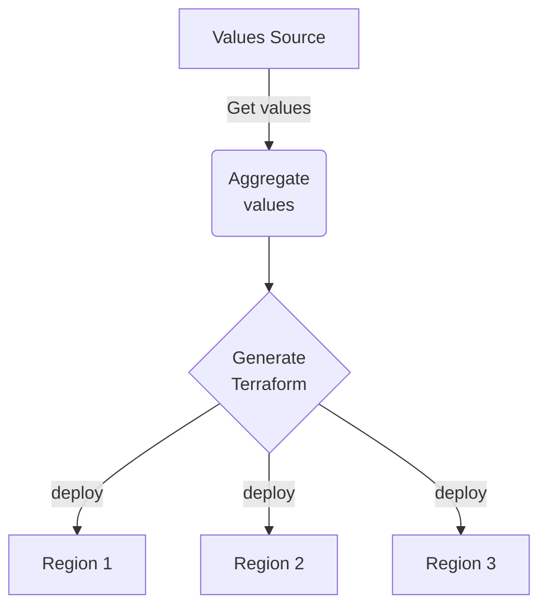

## Introduction
Recently, I worked on a project that required to write several Terraform definition files, including resources, locals and variables. Each resource and values are fetched from an existing Cloud Service, and need to be inserted in a Terraform file which is specific to a given production regional environment.

The high-level flow is similar to this:


The code presented in this tutorial is found [here](https://github.com/SRodi/hclwrite-example)

## Problem
Normally this can be done manually without any issues, but if the Terraform in question refers to numerous resources (in my case thousands of secrets stored in a remote Secrets Manager instance), automation is necessary to prevent human-errors, provide scalability, validation, and more.

## Plan
In this tutorial I will not cover any ground on what problem I am trying to solve (I will do that in another post), but I will rather focus on HOW I approached the problem of programmatically create Terraform resources with Go. This means, regardless of your use-case, you should have good pointers on how to programmatically write Terraform files after reading this post.

The example presented uses the IBM Cloud Terraform provider.

## Expected result
In short, what I am trying to write is this:
```terraform
locals {
  secrets = {
    # secret name is fetched from Cloud Service
    secret-0 = {
      fields = {
        # field name and field value (crn) are fetched from Cloud Service
        field-1  = "crn:v1:bluemix:4682732733858120752"
        field-2 = "crn:v1:bluemix:4248608067497110033"
        field-3 = "crn:v1:bluemix:3116270700360128712"
        field-4 = "crn:v1:bluemix:4879033439716857034"
        field-5  = "crn:v1:bluemix:5367536513612748087"
      }
    }
  }
}

resource "ibm_container_ingress_secret_opaque" "ingress-secret" {
  for_each         = local.secrets
  cluster          = "" # regional value
  secret_name      = each.key
  secret_namespace = "" # regional value
  dynamic "fields" {
    for_each = local.secrets[each.key].fields
    content {
      field_name = fields.key
      crn        = fields.value
    }
  }
}
```

## Tutorial
In order to create Terraform files in Go, we leverage the Package `hclwrite`, which __".. deals with the problem of generating HCL configuration and of making specific surgical changes to existing HCL configurations"__ [see docs](https://pkg.go.dev/github.com/hashicorp/hcl/v2@v2.19.1/hclwrite)


We will perform the following steps:
1. Write a function to create a Terraform `main.tf` with the resource definition
2. Write a function to create a Terraform `locals.tf` with the map of secrets values
3. Run go code
4. Run a `terraform plan` to validate Terraform files format

### Step 1: Write a function to create main.tf
In this step we write a function to create a `main.tf` with the resource definition.

As per `hclwrite` package docs: __"The hclwrite API follows a similar principle to XML/HTML DOM, allowing nodes to be read out, created and inserted, etc. Nodes represent syntax constructs rather than semantic concepts"__

To start, initialize a new go module:

```bash
go mod init
```

The resource definition pictured in the [expected result](#expected-result) can be considered a non-trivial Terraform resource definition, since it also includes `for_each` meta argument, as well as dynamic expressions with references to named values, for example `each.key` or `each.value`.

The `for_each` meta-argument allows to manage several similar objects without writing a separate block for each one, while `each.key` and `each.value` provide access to the values of the map (or other data type) that `for_each` refers to.

Create a `main.go` file which will include all our code described in this tutorial:

```bash
touch main.go
```

This function shows how we can generate the `resource "ibm_container_ingress_secret_opaque" "ingress-secret"` with Go leveraging `hclwrite`, add it to `main.go`.

```go
func createTerraformMain() {
	hclFile := hclwrite.NewEmptyFile()
	makeDir(tfDir)
	tfFile := createFile(tfMainFileName)

	resource := hclFile.Body().AppendNewBlock("resource", []string{"ibm_container_ingress_secret_opaque", "ingress-secret"})
	resourceBody := resource.Body()

	resourceBody.SetAttributeTraversal("for_each", hcl.Traversal{
		hcl.TraverseRoot{Name: "local"},
		hcl.TraverseAttr{Name: "secrets"},
	})
	resourceBody.SetAttributeValue("cluster", cty.StringVal(os.Getenv("CLUSTER_ID")))
	resourceBody.SetAttributeTraversal("secret_name", hcl.Traversal{
		hcl.TraverseRoot{Name: "each"},
		hcl.TraverseAttr{Name: "key"},
	})
	resourceBody.SetAttributeValue("secret_namespace", cty.StringVal(os.Getenv("NAMESPACE")))

	dynamicBlock := resourceBody.AppendNewBlock("dynamic", []string{"fields"})
	dynamicBlockBody := dynamicBlock.Body()

	dynamicBlockBody.SetAttributeTraversal("for_each", hcl.Traversal{
		hcl.TraverseRoot{Name: "local.secrets[each.key]"},
		hcl.TraverseAttr{Name: "fields"},
	})

	contentBlock := dynamicBlockBody.AppendNewBlock("content", nil)
	contentBlockBody := contentBlock.Body()

	contentBlockBody.SetAttributeTraversal("field_name", hcl.Traversal{
		hcl.TraverseRoot{Name: "fields"},
		hcl.TraverseAttr{Name: "key"},
	})
	contentBlockBody.SetAttributeTraversal("crn", hcl.Traversal{
		hcl.TraverseRoot{Name: "fields"},
		hcl.TraverseAttr{Name: "value"},
	})

	tfFile.Write(hclFile.Bytes())
}
```

> __Package cty (pronounced see-tie) provides some infrastructure for a type system that might be useful for applications that need to represent configuration values provided by the user whose types are not known at compile time, particularly if the calling application also allows such values to be used in expressions.__ Reference [cty package documentation](https://pkg.go.dev/github.com/zclconf/go-cty/cty)
{: .prompt-info }


Add dependencies for packages or upgrade it to their latest version as follows:

```bash
go get "github.com/hashicorp/hcl/v2"
go get "github.com/zclconf/go-cty/cty"
```

### Step 2: Write a function to create locals.tf
In this function we implement a logic to programmatically generate the values of `locals.tf` file. The file `locals.tf` (an example of which can be seen [here](#expected-result)), holds one single value `secrets`, which is a nested map containing secrets details. Each secret has a name and a map of fields.

The `secrets` nested map is read by Terraform to create multiple Terraform resources of type `"ibm_container_ingress_secret_opaque"`. This is achieved using the `for_each` implementation discussed in the previous step.

> In this example I am using the built-in random int generator function to generate 5 secrets, where names, field keys and CRN values have a random strings. However, in real-life the values will be fetched from an actual data source, in my case this is IBM Cloud Secrets Manager.
{: .prompt-info }

```go
func createTerraformLocals() {
	hclFile := hclwrite.NewEmptyFile()
	makeDir(tfDir)
	tfFile := createFile(tfLocalsFileName)

	terraformLocals := hclFile.Body().AppendNewBlock("locals", nil)

	// NOTE: Instead of using random values
	// we implement functions to call IBM Cloud Secret Manager API
	// to build real secrets field and CRN values

	secretsMap := make(map[string]cty.Value)
	indexSecret := 0
	for indexSecret < 5 {
		indexField := 0
		fieldsMap := make(map[string]cty.Value)
		crnMap := make(map[string]cty.Value)
		for indexField < 5 {
			crnMap["field-"+fmt.Sprint(fmt.Sprint(rand.Int()))] = cty.StringVal("crn:v1:bluemix:" + fmt.Sprint(rand.Int()))
			indexField++
		}
		fieldsMap["fields"] = cty.ObjectVal(crnMap)
		secretsMap["secret-"+fmt.Sprint(indexSecret)] = cty.ObjectVal(fieldsMap)
		indexSecret++
	}

	terraformLocals.Body().SetAttributeValue("secrets", cty.ObjectVal(secretsMap))
	tfFile.Write(hclFile.Bytes())
}
```

### Step 3: Write main, supporting functions and run go code
In this step we implement the 2 supporting functions to create a directory and file, while also providing the list of imports for this simple application. Then we run the go application that creates the Terraform files. The application execution command will not provide any outputs, unless there are errors, which are not handled as we simply call `panic(error)`. This will stop the execution and unwind the call stack, then the program crashes, and prints a stack trace. This is not a recommended approach to error handling, but for the sake of simplicity, I will avoid talking about better ways to handle errors, as that is out of the scope for this tutorial.

```go
package main

import (
	"fmt"
	"math/rand"
	"os"

	"github.com/hashicorp/hcl/v2"
	"github.com/hashicorp/hcl/v2/hclwrite"
	"github.com/zclconf/go-cty/cty"
)

const (
	tfDir            = "terraform"
	tfLocalsFileName = "locals.tf"
	tfMainFileName   = "main.tf"
)

func makeDir(path string) {
	if _, err := os.Stat(path); os.IsNotExist(err) {
		os.Mkdir(path, os.ModeDir|0755)
	} else if err != nil {
		panic(err)
	}
}

func createFile(fileName string) *os.File {
	file, err := os.Create(tfDir + "/" + fileName)
	if err != nil {
		panic(err)
	}
	return file
}

func createTerraformLocals() {
    ...
}

func createTerraformMain() {
    ...
}

func main() {
	createTerraformLocals()
	createTerraformMain()
}
```

Run go application on the terminal:
```bash
go run main.go
```

### Step 4: Run a `terraform plan` to validate Terraform files format
In this step we move to the newly created `terraform` directory, we view the files created, and we test the validity with a dry run, by running a `terraform plan`.


_View Terraform files created_

Once verified that the terraform files have been generated, we need to MANUALLY create the `providers.tf` file, with the configuration of the Terraform provider.

> I have purposely omitted the programmatic creation of `providers.tf`, but this could easily be added to the codebase, in a separate function. One reason why I would suggest NOT to create it programmatically, is because the version of the provider is a critical value, and I prefer to have manual control over it.
{: .prompt-info }

In my case, `providers.tf` looks similar to this:
```terraform
# providers.tf
terraform {
  required_version = ">=1.3.0, <2.0"
  required_providers {
    ibm = {
      source  = "IBM-Cloud/ibm"
      version = "1.60.0"
    }
  }
}
```

To initialize the working directory containing configuration files, and install plugins for required providers run `terraform init`

```bash
terraform init
```

Finally, we can validate the Go-generated Terraform is compliant, and valid by running `terraform plan`.


_Terraform plan_

## Conclusions
In this short tutorial we created a simple go application to generate Terraform code programmatically. In the example presented we generate nested maps of "fictional" secrets represented by random strings to show how multiple values can be generated in iterative loops. However, in reality, and depending on the specific use case, it is required to implement a custom logic, or use existing libraries to dynamically fetch real values. Those values will then be used to write Terraform resources, supporting variables and/or locals.

In another post I will talk specifically about our use case, and the awesome integration between [IBM Cloud Secrets Manager and IBM Cloud Kubernetes Services](https://cloud.ibm.com/docs/containers?topic=containers-secrets-mgr).

## References
* [Tutorial's code](https://github.com/SRodi/hclwrite-example)
* [Hashicorp HCL main repo](https://github.com/hashicorp/hcl/)
* [Go hclwrite package](https://pkg.go.dev/github.com/hashicorp/hcl/v2@v2.19.1/hclwrite)
* [hclwrite example](https://github.com/hashicorp/hcl/blob/main/hclwrite/examples_test.go)
* [cty package documentation](https://pkg.go.dev/github.com/zclconf/go-cty/cty)
* [Terraform for_each Meta-Argument](https://developer.hashicorp.com/terraform/language/meta-arguments/for_each)
* [References to Named Values](https://developer.hashicorp.com/terraform/language/expressions/references)
* [IBM CLoud Terraform privider ibm_container_ingress_secret_opaque resource](https://registry.terraform.io/providers/IBM-Cloud/ibm/latest/docs/resources/container_ingress_secret_opaque)