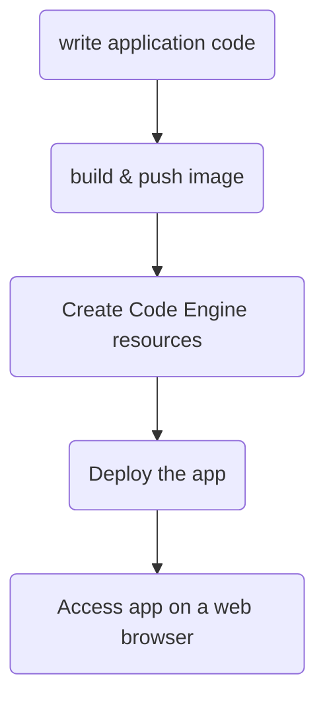

## Introduction
Last year I have worked on a project to improve the efficiency of a release to production process. This process took 7hrs to complete, for each production region. This was a major pain during our go live process.
While investigating, I have realized that the process was running sequential operations and implementing concurrency would highly improve efficiency. In addition, there was an opportunity to greatly reduce costs with the use of a serverless approach.

Serverless allows provisioning compute resources required to execute a job on demand, and once the job is completed the computing resources are released, avoiding unnecessary costs. Serverless also allows deployment of applications, including the ability to scale as the traffic increases or diminishes.

In this tutorial I will build a simple foundational framework to deploy a web server in a container as a serverless app on IBM Cloud Code Engine

## Flow

The high-level flow is similar to this:


The code presented in this tutorial is found [here](https://github.com/SRodi/e2e-serverless-deployment)

## Problem
Creating a serverless app is a trivial task on most cloud service providers, it can be done via API, on the UI or CLI. However, there is a little more involved in creating a repeatable deployment for a serverless application, including the ability to make code changes, update container images and/or change the serverless service configuration, for instance to allocate more resources or auto-scale based on traffic load.

## Plan
In this tutorial I would provide a simple framework to include all major steps required to make an application code available online as a serverless app.

## Expected result
In short, the expected results is 
```bash
❯ curl https://ce-serverless-app.1e89nllvdtjo.eu-gb.codeengine.appdomain.cloud
Here is a simple web-server!%
```

## Tutorial
The steps involved are the following:
1. Write a simple web app with go
2. Create a Dockerfile to containerize the web app
3. Create the Terraform resource definitions for Code Engine Serverless deployment
4. Write the GitHub Actions CI pipeline to create Docker image and Push to registry
5. Create script with Schematics helpers functions
6. Write the GitHub Actions CI pipeline to create a Terraform plan job for Code Engine resources
7. View GitHub Action jobs
8. Deploy Serverless app via Schematics

Schematics workspaces deliver Terraform as a service to automate the provisioning and configuration management of your IBM Cloud resources, and rapidly build, duplicate, and scale complex, multi-tiered cloud environments [see IBM Cloud docs](https://cloud.ibm.com/docs/schematics?topic=schematics-sc-workspaces).

### Step 1: Write a simple go web server
This step involves setting up a new go project for the web server which will be published using a serverless approach.

```bash
go mod init https://github.com/SRodi/e2e-serverless-deployment
```

Create the web app by adding the following code to a new file named `go/go_http.go`

```go
package main

import (
	"fmt"
	"log"
	"net/http"
)

func handler(w http.ResponseWriter, r *http.Request) {
	fmt.Fprintf(w, "Here is a simple web-server!")
}

func main() {
	http.HandleFunc("/", handler)
	log.Fatal(http.ListenAndServe(":8080", nil))
}
```

Run locally as follows:

```sh
go run go_http.go
```

To test you can send a curl request from your terminal as follows:

```sh
❯ curl localhost:8080
Here is a simple web-server!%
```

### Step 2: Create Dockerfile
This step goal is to create the Dockerfile so that our web app can be containerized and portable.

Write the following to a new file named `docker/Dockerfile`

```docker
# Specifies a parent image
FROM golang:1.21.7-bullseye AS build-stage
 
WORKDIR /app
COPY ./go/go.mod ./
RUN go mod download
COPY ./go/*.go ./
RUN CGO_ENABLED=0 GOOS=linux go build -o /go_http


# Create a new release build stage
FROM scratch AS build-release-stage
# Set the working directory to the root directory path
WORKDIR /
# Copy over the binary built from the previous stage
COPY --from=build-stage /go_http /go_http
EXPOSE 8080
ENTRYPOINT ["/go_http"]
```

The docker image can be built locally as follows:

```sh
docker build . -f docker/Dockerfile -t my-local-test:0.0.1
```

To run your container locally:
```sh
docker run --rm -p 3000:8080 my-local-test:0.0.1
```

Send a request to your server running in the Docker container locally:
```sh
❯ curl localhost:3000
Here is a simple web-server!%
```

### Step 3: Create Code Engine Terraform resources
In this step we create Code Engine Terraform resources to deploy our app in IBM Cloud using a serverless approach.

Write the following to a new file named `terraform/main.tf`

```hcl
locals {
    prefix = "ce-serverless"
    image  = "srodi/go_http:latest"
}
resource "ibm_resource_group" "resource_group" {
  name = "${local.prefix}-resource-group"
}

resource "ibm_code_engine_project" "code_engine_project_instance" {
  name              = "${local.prefix}-project"
  resource_group_id = ibm_resource_group.resource_group.id
}

resource "ibm_code_engine_app" "code_engine_app_instance" {
  project_id          = ibm_code_engine_project.code_engine_project_instance.project_id
  name                = "${local.prefix}-app"
  image_reference     = local.image
  scale_min_instances = 1
}

output "app_url" {
  value = ibm_code_engine_app.code_engine_app_instance.endpoint
}
```

Create `provider.tf` in the same directory

```hcl
provider "ibm" {
  region = var.ibmcloud_region
}

terraform {
  required_version = ">=1.3.0, <2.0"
  required_providers {
    ibm = {
      source  = "IBM-Cloud/ibm"
      version = "1.62.0"
    }
  }
}
```

Finally, create the variable declaration in a file named `variables.tf`

```hcl
variable "ibmcloud_region" {
    description = "IBM Cloud region where Code Engine resources will be deployed."
    type        = string
    default     = "eu-gb"
}
```

To run the code locally:

```sh
export IC_API_KEY=# your own IBM Cloud ApiKey
terraform init
terraform plan
terraform apply
```

To destroy all resources:

```sh
terraform destroy
```

### Step 4: Write Docker image build pipeline
This step involves creating the GitHub Actions configuration to automatically build a new Docker image when web app code changes and a commit is pushed to the GitHub repo.

Create the following configuration in a new file `.github/workflows/main.yml`

```yml
name: ci

on:
  push:
    branches:
      - "main"

env:
  IBM_CLOUD_API_KEY: ${{ secrets.IBM_CLOUD_API_KEY }}
  IBM_CLOUD_REGION: eu-de
  SCHEMATICS_WS_ID: eu-de.workspace.ce-serverless-workspace.62cf517a

jobs:
  docker:
    runs-on: ubuntu-latest
    steps:
      -
        name: Checkout
        uses: actions/checkout@v4
      -
        name: Login to Docker Hub
        uses: docker/login-action@v3
        with:
          username: ${{ secrets.DOCKERHUB_USERNAME }}
          password: ${{ secrets.DOCKERHUB_TOKEN }}
      -
        name: Set up Docker Buildx
        uses: docker/setup-buildx-action@v3
      - 
        name: Set sha_short
        id: vars
        run: echo "sha_short=$(git rev-parse --short HEAD)" >> $GITHUB_OUTPUT
      -
        name: Build and push
        uses: docker/build-push-action@v5
        with:
          context: .
          file: ./docker/Dockerfile
          push: true
          tags: ${{ secrets.DOCKERHUB_USERNAME }}/go_http:sha-${{ steps.vars.outputs.sha_short }} , ${{ secrets.DOCKERHUB_USERNAME }}/go_http:latest
```


### Step 5: Create Schematics helpers functions
This step involves the creation of a script to provide helpers functions to communicate with IBM Cloud Schematics in the automated GitHub Actions pipeline that we will write in Step 6.

Create a new file `schematics/ops.sh`

```sh
#!/bin/bash

WORKSPACE_ID="$SCHEMATICS_WS_ID"

function ws_status() {
    RCVAR=255
    TRYCOUNT=0
    while [[ $RCVAR != 0 ]] && [[ $TRYCOUNT -le 10 ]]; do
        printf $(ibmcloud schematics ws action --id "$WORKSPACE_ID" --output json | jq -r '.jobs[0].status.workspace_job_status.commands[].outcome') && RCVAR=$? || RCVAR=$?
        if [ $RCVAR != 0 ]; then sleep 10; fi
        TRYCOUNT=$((TRYCOUNT+1))
    done
}

function job_status(){
    action_id="$1"
    RCVAR=255
    TRYCOUNT=0
    while [[ $RCVAR != 0 ]] && [[ $TRYCOUNT -le 10 ]]; do
        printf $(ibmcloud schematics job get --id "$action_id" --output json | jq -r '.status.workspace_job_status.status_code') && RCVAR=$? || RCVAR=$?
        if [ $RCVAR != 0 ]; then sleep 10; fi
        TRYCOUNT=$((TRYCOUNT+1))
    done
}

function ws_update() {
    ibmcloud schematics ws update --id "$SCHEMATICS_WS_ID" --pull-latest
    action_status=$(ws_status)
    while [[ "$action_status" != "COMPLETED" ]]; do echo "The Schematics WS Status is $action_status"; action_status=$(ws_status); sleep 5; done
    echo "Schematics WS update done"
}

function plan(){
    action_id=$(ibmcloud schematics plan --id "$WORKSPACE_ID" --output json | jq -r .activityid)
    while [[ ! $(ibmcloud schematics job get --id "$action_id") ]]; do job_status=$(job_status "$action_id"); done
    while [[ "$job_status" == "job_pending" && "$job_status" != "job_finished" ]]; do
        job_status=$(job_status "$action_id")
        echo "Schematics plan status for WS $WORKSPACE_ID: $job_status"
        if [[ "$job_status" == "job_failed" ]]; then exit 2; fi
    done
}
```

Make this file executable

```sh
chmod +x schematics/ops.sh
```

> Note: you will need to create a Schematics workspace in order to have the automation working for the next step. I have shared the instructions, including a basic config and script, on this tutorial repo. Link [here](https://github.com/SRodi/e2e-serverless-deployment/tree/main/schematics)
{: .prompt-info }

### Step 6: Write Terraform plan pipeline
This step is adding to the GitHub action configuration an additional `job` to perform a Terraform plan using IBM Cloud Schematics.

Add the following code to `.github/workflows/main.yml` under `jobs`:

```yml
  schematics:
    needs: docker
    runs-on: ubuntu-latest
    steps:
      -
        name: Checkout
        uses: actions/checkout@v4
      - 
        name: Install IBM Cloud CLI
        run: |
          curl -fsSL https://clis.cloud.ibm.com/install/linux | sh
          ibmcloud --version
          ibmcloud config --check-version=false
          ibmcloud plugin install -f schematics
      -
        name: Authenticate with IBM Cloud CLI
        run: |
          ibmcloud login --apikey "${IBM_CLOUD_API_KEY}" -r "${IBM_CLOUD_REGION}" -g Default
      - 
        name: Schematics update
        run: |
          source ./schematics/ops.sh
          ws_update
        shell: bash
      - 
        name: Schematics plan
        run: |
          source ./schematics/ops.sh
          plan
        shell: bash
```

### Step 7: GitHub Actions
The following prerequisites must be satisfied prior enabling automation with GitHub Actions:
1. Create a DockerHub access token [see Docker docs: Create an access token](https://docs.docker.com/security/for-developers/access-tokens/#create-an-access-token)

2. Create `DOCKERHUB_USERNAME` and `DOCKERHUB_TOKEN` secrets in your GitHub repository [see Docker docs: Get started with GitHub Actions](https://docs.docker.com/build/ci/github-actions/#step-one-create-the-repository)

3. Create `IBM_CLOUD_API_KEY` secret in your GitHub repository

With all the above correctly configured, you can now push your code to your remote GitHub repository on the `main` branch and GitHub Actions jobs will be automatically executed.

When code is pushed to `main`, access the GitHub action view to validate all jobs are completed.


_GitHub Action example_

### Step 8: Deploy the app via Schematics
In this final step we access IBM Cloud Schematics to apply the Terraform plan job that has been triggered by GitHub Actions. The Terraform plan job was saved on Schematics workspace and the details can be seen under the `jobs` tab in the main workspace menu.

After analyzing the diff by expanding the plan job window, the job can be applied directly on the Schematics UI so that Code Engine resources defined with Terraform in step 3 are deployed on IBM Cloud.


_Schematics example_

Note the output of our Terraform apply is the `app_url`. You can test the Serverless deployment by accessing the URL on the browser or sending a curl request via the terminal:

```sh
❯ curl https://api.eu-gb.codeengine.cloud.ibm.com/v2/projects/4131b8cb-2054-400e-a327-8f1dd41c14e6/apps/ce-serverless-app
Here is a simple web-server!%
```

As you can see, the response is the same as the one received in step 1 and step 2 when we tested the app locally by running the go application and Docker container locally. However, this time the app is running in IBM Cloud as a Serverless application on Code Engine! 🚀 

> Note: The above URL is no longer working, as I have destroyed all resources after testing.
{: .prompt-info }

## Conclusions
In this quick tutorial we created a very simple framework to support the full lifecycle of a serverless application on IBM Cloud Schematics using Terraform, Go, GitHub Actions, Schematics and some supporting Bash scripts.

Of course this is far from a production-grade solution, but it can provide a starting point on how to integrate production-grade IBM Cloud technologies and mainstream solutions like GitHub and Docker to efficiently deploy a serverless application.

## References
* [Code Repository](https://github.com/SRodi/e2e-serverless-deployment)
* [IBM Cloud Code Engine](https://www.ibm.com/products/code-engine)
* [IBM Cloud Schematics Workspaces](https://cloud.ibm.com/docs/schematics?topic=schematics-sc-workspaces)
* [GitHub Actions](https://github.com/features/actions)
* [Terraform IBM Cloud Code Engine docs](https://registry.terraform.io/providers/IBM-Cloud/ibm/latest/docs/resources/code_engine_project)
