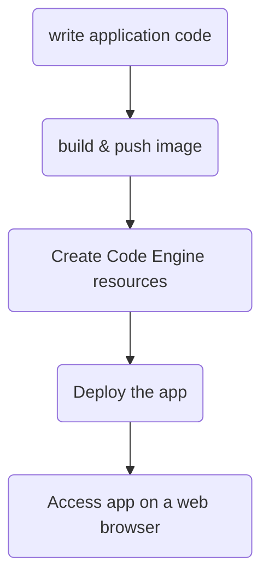

## Introduction
Last year I have worked on a project to improve the efficiency of a release to production process. This process took 7hrs to complete, for each production region. This was a major pain during our go live process.
While investigating, I have realized that the process was running sequential operations and implementing concurrency would highly improve efficiency. In addition, there was an opportunity to greatly reduce costs with the use of a serverless approach.

Serverless allows provisioning compute resources required to execute a job on demand, and once the job is completed the computing resources are released, avoiding unnecessary costs. Serverless also allows deployment of applications, including the ability to scale as the traffic increases or diminishes.

In this tutorial I will build a simple foundational framework to deploy a web server in a container as a serverless app on IBM Cloud Code Engine

## Flow

The high-level flow is similar to this:


The code presented in this tutorial is found [here](https://github.com/SRodi/e2e-serverless-deployment)

## Problem
Creating a serverless app is a trivial task on most cloud service providers, it can be done via API, on the UI or CLI. However, there is a little more involved in creating a repeatable deployment for a serverless application, including the ability to make code changes, update container images and/or change the serverless service configuration, for instance to allocate more resources or auto-scale based on traffic load.

## Plan
In this tutorial I would provide a simple framework to include all major steps required to make an application code available online as a serverless app.

## Expected result
In short, the expected results is 
```bash
❯ curl https://ce-serverless-app.1e89nllvdtjo.eu-gb.codeengine.appdomain.cloud
Here is a simple web-server!%
```

## Tutorial
We will write the following steps:
1. A simple web app with go
2. The Dockerfile to containerise the app
3. Terraform resource definitions for Code Engine
4. CI pipeline to create Docker image and Push to registry
5. CI pipeline to create a Plan job for Code Engine Terraform resources

In addition, I will provide some scripts to facilitate the interaction with IBM Cloud Schematics. Schematics workspaces deliver Terraform as a service capabilities to automate the provisioning and configuration management of your IBM Cloud resources, and rapidly build, duplicate, and scale complex, multi-tiered cloud environments [see IBM Cloud docs](https://cloud.ibm.com/docs/schematics?topic=schematics-sc-workspaces).

### Step 1: Write a simple go web server
This step involves setting up a new go project for the web server which will be published using a serverless approach.

```bash

```


## Conclusions


## References
* 