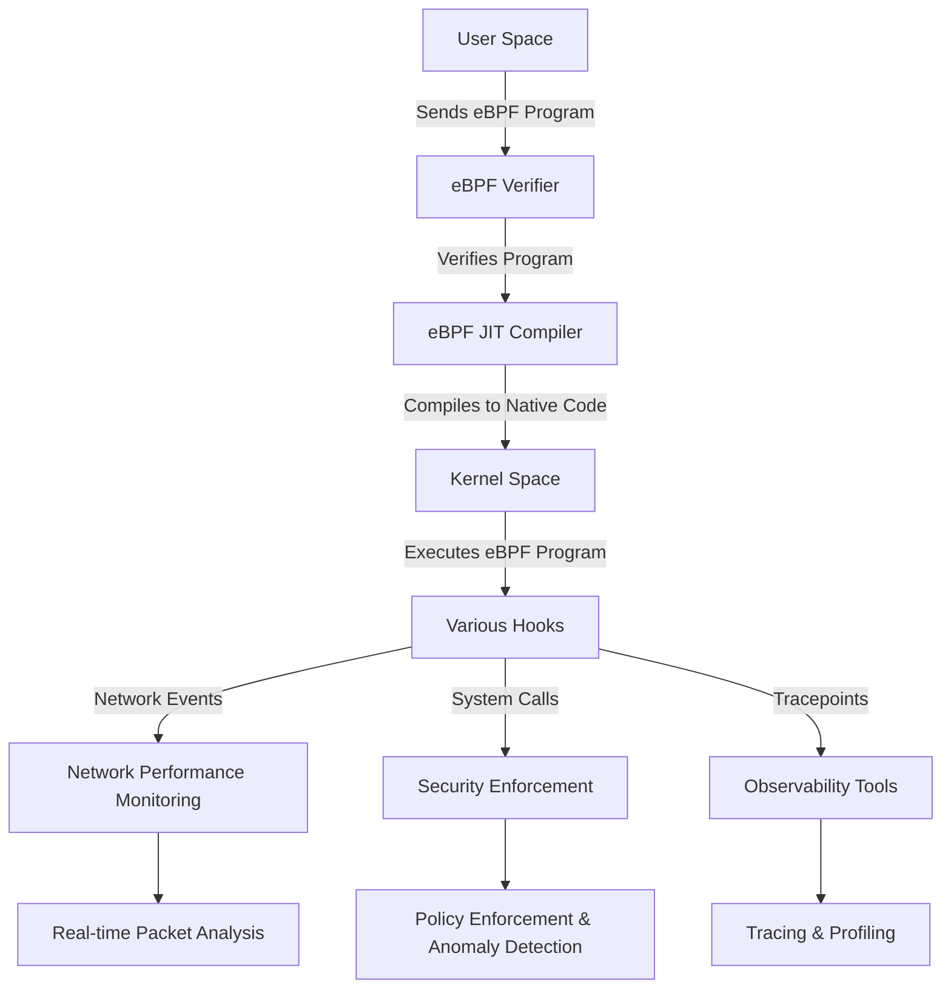

## Introduction
[eBPF](https://ebpf.io/) (Extended Berkeley Packet Filter) is a powerful and flexible technology that allows for the execution of custom bytecode within the Linux kernel. Originally designed for packet filtering, eBPF has evolved into a general-purpose infrastructure for running sandboxed programs in the kernel space. These programs can be attached to various hooks, such as network events, system calls, and tracepoints, enabling developers to extend kernel functionality without modifying the kernel source code. This capability makes eBPF a versatile tool for performance monitoring, security enforcement, and network traffic analysis.



The importance of eBPF lies in its ability to perform high-performance, low-overhead operations directly within the kernel. By running code in the kernel space, eBPF programs can access and manipulate kernel data structures efficiently, leading to significant performance improvements over traditional user-space solutions. Use cases for eBPF include network performance monitoring, where it can track and analyze network packets in real-time, and security applications, where it can enforce policies and detect anomalies at the kernel level. Additionally, eBPF is used in observability tools like tracing and profiling, providing deep insights into system behavior with minimal impact on system performance.

## Plan
In this tutorial, we’ll take you through a step-by-step approach to creating your first eBPF program and running it on a Linux system. Whether you’re new to eBPF or have some experience with Linux internals, this guide will help you understand the basics and get hands-on experience with eBPF. We'll cover everything from setting up the environment to writing, loading, and running a simple eBPF program, allowing you to harness the power of this technology for real-world use cases. By the end of this tutorial, you’ll have a solid foundation for building and experimenting with eBPF on your own.

The project we create demonstrates the use of eBPF to trace file deletion events on a Linux system. The eBPF program is loaded from an ELF file and attached to the appropriate kernel hooks to monitor file deletions.

## Prerequisites
- Go (version 1.16 or higher)
- Linux system with eBPF support (this prgram was developed and tested on kernel version 5.15)
- `clang` and `llvm` for compiling eBPF programs
- `libbpf` library
- `bpftool` command-line tool to inspect and manage BPF objects

## Installation
1. **Install Go**: Follow the instructions on the [official Go website](https://golang.org/doc/install). In Ubuntu/Debian you can also install go as follows:
    ```sh
    sudo apt install golang-go
    echo 'export GOPATH=$HOME/go' >> ~/.profile
    echo 'export PATH=$GOPATH/bin:$PATH' >> ~/.profile
    source ~/.profile
    ```
2. **Install clang and llvm**:
    ```sh
    sudo apt-get install clang llvm
    ```
3. **Install libbpf**:
    ```sh
    sudo apt-get install libbpf-dev
    ```

## Create vmlinux.h
This command uses [bpftool](https://github.com/libbpf/bpftool), a powerful utility for inspecting and manipulating eBPF programs and maps, to dump the BTF (BPF Type Format) information from the vmlinux file into a C header file named `vmlinux.h`. BTF is a metadata format that describes the types used in eBPF programs, making it easier to understand and debug these programs. The BTF information is essential for eBPF programs to understand the data structures and types used in the kernel.

The file `/sys/kernel/btf/vmlinux` specifies the source of the BTF data. The file vmlinux contains the BTF information for the running kernel. This file is typically generated by the kernel build process and includes type information for all the kernel's data structures

```sh
bpftool btf dump file /sys/kernel/btf/vmlinux format c > vmlinux.h
```

The `vmlinux.h` header file can then be included in eBPF programs to facilitate their development and ensure compatibility with the kernel's data structures.

In summary, the above command extracts the BTF data from the running kernel, formats it as C code, and saves it to a header file. This header file can then be included in eBPF programs to ensure they are using the correct kernel data structures, facilitating easier development and debugging of eBPF programs.

## Write the eBPF program
The provided code is an eBPF program written in C. eBPF programs are used for various purposes, including network monitoring, security, and performance analysis. This specific program is designed to trace the `sys_enter_unlinkat` syscall, which is invoked when a file is being deleted.

The code begins by defining some constants and including necessary headers for kernel structures and BPF-specific functions. It then defines a structure named `event` to hold the data that will be sent to user space, including the process ID, command name, and filename being deleted. A BPF map named `events` is also defined to facilitate communication between the kernel and user space.

The core of the program is the `trace_unlinkat` function, which is attached to the `sys_enter_unlinkat` tracepoint. This function initializes an `event` structure, retrieves the current process ID and command name, and reads the filename argument from user space. Finally, it outputs the event data to user space using the `bpf_perf_event_output` function. The function returns 0 to indicate successful execution. This setup allows user space programs to receive notifications whenever a file is deleted, providing valuable insights for monitoring and security purposes.


Create file `trace_file_delete.c` with the following content:

```c
#define __TARGET_ARCH_x86
#define MSG_SIZE 128

// Include the vmlinux.h header for kernel structures and definitions
#include "vmlinux.h"

// Include the BPF-specific functions
#include <bpf/bpf_helpers.h>
#include <bpf/bpf_tracing.h>
#include <bpf/bpf_core_read.h>

// Define the structure for the event data that will be sent to user space
struct event {
    __u32 pid;          // Process ID
    char comm[16];      // Command name (process name)
    char filename[256]; // Filename being deleted
};

// Define a BPF map to send events to user space
struct {
    __uint(type, BPF_MAP_TYPE_PERF_EVENT_ARRAY); // Type of BPF map
    __uint(max_entries, 1024);                   // Maximum number of entries in the map
    __type(key, int);                            // Type of the key
    __type(value, int);                          // Type of the value
} events SEC(".maps");                           // Place the map in the "maps" section

// Tracepoint for the sys_enter_unlinkat syscall
SEC("tracepoint/syscalls/sys_enter_unlinkat")
int trace_unlinkat(struct trace_event_raw_sys_enter* ctx) {
    struct event evt = {}; // Initialize an event structure

    // Get the current process ID
    evt.pid = bpf_get_current_pid_tgid() >> 32;

    // Get the current command name (process name)
    bpf_get_current_comm(&evt.comm, sizeof(evt.comm));

    // Read the filename argument from user space
    bpf_probe_read_user_str(&evt.filename, sizeof(evt.filename), (void *)(ctx->args[1]));

    // Output the event to user space
    bpf_perf_event_output(ctx, &events, BPF_F_CURRENT_CPU, &evt, sizeof(evt));

    return 0; // Return 0 to indicate success
}

// Define the license for the eBPF program
char _license[] SEC("license") = "GPL";
```

## Write the User Space application
This Go program sets up an eBPF program to monitor and prevent file deletions on a system. The main function performs several key steps to achieve this. First, it sets the RLIMIT_MEMLOCK resource limit to allow locking memory for eBPF, which is necessary for the program to function correctly. It then loads a precompiled eBPF program from an ELF file and creates a new eBPF collection from this loaded program. The program attaches the eBPF program to the "sys_enter_unlinkat" tracepoint, which is triggered when a file deletion is attempted. This allows the eBPF program to monitor file deletions.

The program also sets up a perf event reader to read events generated by the eBPF program. These events include details such as the PID, command, and filename of the process attempting to delete a file. The program handles system signals for graceful shutdown, ensuring that resources are properly released when the program exits. In a loop, it reads and prints the output from the eBPF program, providing real-time monitoring of file deletion attempts. This setup is useful for security and auditing purposes, as it allows administrators to track and potentially prevent unauthorized file deletions.

Create file `main.go` with the following content:

```go
package main

import (
	"bytes"
	"encoding/binary"
	"errors"
	"fmt"
	"log"
	"os"
	"os/signal"
	"syscall"

	"github.com/cilium/ebpf"
	"github.com/cilium/ebpf/link"
	"github.com/cilium/ebpf/perf"
	"golang.org/x/sys/unix"
)

const bpfProgPath = "./trace_file_delete.o"
const memLockLimit = 64 * 1024 * 1024 // 64 MiB
// main sets up an eBPF program to monitor and prevent file deletions.
// It performs the following steps:
// 1. Sets the RLIMIT_MEMLOCK resource limit to allow locking memory for eBPF.
// 2. Loads the compiled eBPF program from an ELF file.
// 3. Creates a new eBPF collection from the loaded program.
// 4. Attaches the eBPF program to the "sys_enter_unlinkat" tracepoint to monitor file deletions.
// 5. Sets up a perf event reader to read events generated by the eBPF program.
// 6. Handles system signals for graceful shutdown.
// 7. Reads and prints the output from the eBPF program, which includes the PID, command, and filename of the process attempting to delete a file.
func main() {
	// Set the RLIMIT_MEMLOCK resource limit
	var rLimit unix.Rlimit
	rLimit.Cur = memLockLimit
	rLimit.Max = memLockLimit
	if err := unix.Setrlimit(unix.RLIMIT_MEMLOCK, &rLimit); err != nil {
		log.Fatalf("Failed to set RLIMIT_MEMLOCK: %v", err)
	}

	// Load the compiled eBPF program from ELF
	spec, err := ebpf.LoadCollectionSpec(bpfProgPath)
	if err != nil {
		log.Fatalf("Failed to load eBPF program: %v", err)
	}

	// Create a new eBPF Collection
	coll, err := ebpf.NewCollection(spec)
	if err != nil {
		log.Fatalf("Failed to create eBPF collection: %v", err)
	}
	defer coll.Close()

	// Attach the eBPF program to a tracepoint
	tp, err := link.Tracepoint("syscalls", "sys_enter_unlinkat", coll.Programs["trace_unlinkat"], nil)
	if err != nil {
		log.Fatalf("Failed to attach tracepoint: %v", err)
	}
	defer tp.Close()

	// Set up a perf event reader to read the output from the eBPF program
	eventsMap, ok := coll.Maps["events"]
	if !ok {
		log.Fatalf("Failed to find events map in eBPF collection")
	}
	rd, err := perf.NewReader(eventsMap, os.Getpagesize())
	if err != nil {
		log.Fatalf("Failed to create perf event reader: %v", err)
	}
	defer rd.Close()

	// Handle signals for graceful shutdown
	sig := make(chan os.Signal, 1)
	signal.Notify(sig, syscall.SIGINT, syscall.SIGTERM)

	// Goroutine to handle graceful shutdown on receiving a signal
	go func() {
		<-sig
		rd.Close()
		tp.Close()
		os.Exit(0)
	}()

	// Read and print the output from the eBPF program
	var event struct {
		Pid      uint32
		Comm     [16]byte
		Filename [256]byte
	}

	for {
		record, err := rd.Read()
		if err != nil {
			if errors.Is(err, perf.ErrClosed) {
				break
			}
			log.Printf("Failed to read from perf event reader: %v", err)
			continue
		}

		if err := binary.Read(bytes.NewReader(record.RawSample), binary.LittleEndian, &event); err != nil {
			log.Printf("Failed to parse perf event: %v", err)
			continue
		}

		fmt.Printf("File deletion by PID %d (%s): %s\n", event.Pid, event.Comm, event.Filename)
	}
}
```

## Usage
1. **Compile the eBPF program**:
    ```sh
    clang -O2 -g -target bpf -c trace_file_delete.c -o trace_file_delete.o
    ```
2. **Run the Go program**:
    ```sh
    sudo go run main.go
    ```

## Test the eBPF program
To test the eBPF program, once the user space application is running, you can open a new terminal window, create a file and delete a file. The user space application should show a log of the file deletion trace capture.

```sh
# Run the following in a new terminal
touch test_file
rm test_file
```

Here is a short video demo to show the eBPF program in action.



## Code Explanation
The implementation for the eBPF program is found in `trace_file_delete.c` and the implementation for the user space application is in `main.go`.

## Trace File Delete eBPF Program
This eBPF program is designed to trace the `unlinkat` system call, which is used to delete files in the Linux operating system. The program captures and logs details about the process performing the deletion and the file being deleted. Below is a detailed description of the key components and functionality of the program:

1. **Header Inclusions**:
    - `vmlinux.h`: Includes kernel structures and definitions.
    - `bpf_helpers.h`, `bpf_tracing.h`, `bpf_core_read.h`: Include BPF-specific functions and helpers.

2. **Event Structure**:
    - Defines a structure `event` to hold the data that will be sent to user space. This includes:
        - `pid`: Process ID of the process performing the deletion.
        - `comm`: Command name (process name).
        - `filename`: Name of the file being deleted.

3. **BPF Map**:
    - Defines a BPF map `events` of type `BPF_MAP_TYPE_PERF_EVENT_ARRAY` to send events to user space. This map can hold up to 1024 entries.

4. **Tracepoint**:
    - Attaches to the `sys_enter_unlinkat` tracepoint, which is triggered when the `unlinkat` system call is invoked.
    - In the tracepoint handler `trace_unlinkat`:
        - Initializes an `event` structure.
        - Retrieves the current process ID and command name.
        - Reads the filename argument from user space.
        - Outputs the event to user space using `bpf_perf_event_output`.

5. **License**:
    - Specifies the license for the eBPF program as GPL.

## Main Go File for eBPF Program
This Go file sets up an eBPF program to monitor and prevent file deletions. The program performs the following steps:

1. **Set RLIMIT_MEMLOCK Resource Limit**:
    - Adjusts the RLIMIT_MEMLOCK resource limit to allow locking memory for eBPF.
    - Uses `unix.Setrlimit` to set the RLIMIT_MEMLOCK resource limit to memLockLimit which is set to 64 MiB.

2. **Load eBPF Program**:
    - Loads the compiled eBPF program from an ELF file specified by `bpfProgPath`.
    - Uses `ebpf.LoadCollectionSpec` to load the eBPF program from the specified ELF file.

3. **Create eBPF Collection**:
    - Creates a new eBPF collection from the loaded program.
    - Uses `ebpf.NewCollection` to create a new eBPF collection from the loaded program.

4. **Attach eBPF Program to Tracepoint**:
    - Attaches the eBPF program to the `sys_enter_unlinkat` tracepoint to monitor file deletions.
    - Uses `link.Tracepoint` to attach the eBPF program to the `sys_enter_unlinkat` tracepoint.

5. **Set Up Perf Event Reader**:
    - Sets up a perf event reader to read events generated by the eBPF program.
    - Uses `perf.NewReader` to create a perf event reader for the `events` map in the eBPF collection.

6. **Handle System Signals**:
    - Handles system signals (SIGINT, SIGTERM) for graceful shutdown.
    - Uses `os.Signal` and `syscall` to handle SIGINT and SIGTERM signals for graceful shutdown.

7. **Read and Print eBPF Program Output**:
    - Reads and prints the output from the eBPF program (perf event reader), which includes the PID, command, and filename of the process attempting to delete a file.

This file is essential for setting up and running the eBPF program to monitor file deletions on a Linux system.

## Conclusions
In conclusion, setting up and running an eBPF program to monitor file deletions involves several critical steps, including attaching the eBPF program to the appropriate tracepoint, setting up a perf event reader, handling system signals for graceful shutdown, and reading and printing the output from the eBPF program. Each of these steps is essential to ensure that the eBPF program functions correctly and provides the necessary monitoring capabilities. By following the outlined steps, users can effectively monitor file deletions on a Linux system, gaining valuable insights into system activities.

For those interested in exploring the complete implementation and further details, the GitHub code repository is available at [https://github.com/SRodi/ebpf-file-delete-tracer](https://github.com/SRodi/ebpf-file-delete-tracer). This repository contains all the necessary code and instructions to set up and run the eBPF program, making it easier for users to replicate the process and customize it according to their specific requirements. Accessing the repository will provide additional context and examples, facilitating a deeper understanding of eBPF program development and deployment.
