## Slide 1

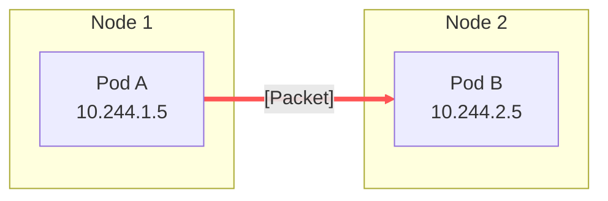

## Slide 4

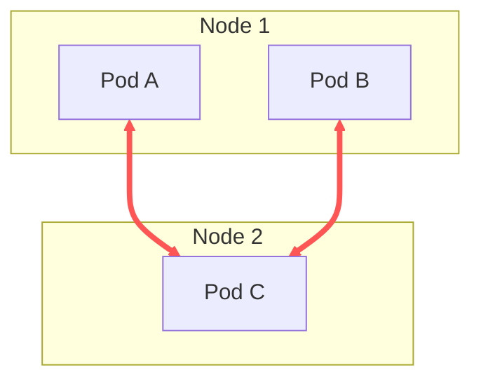

## Slide 5

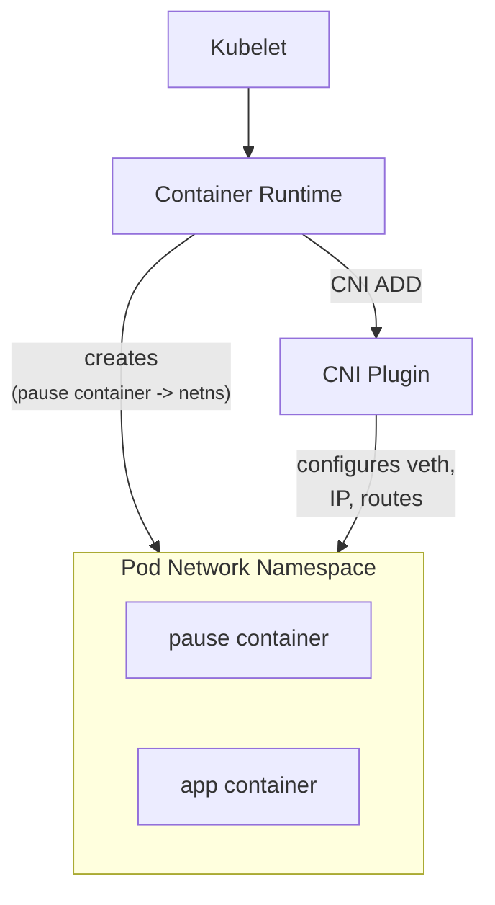

## Slide 6

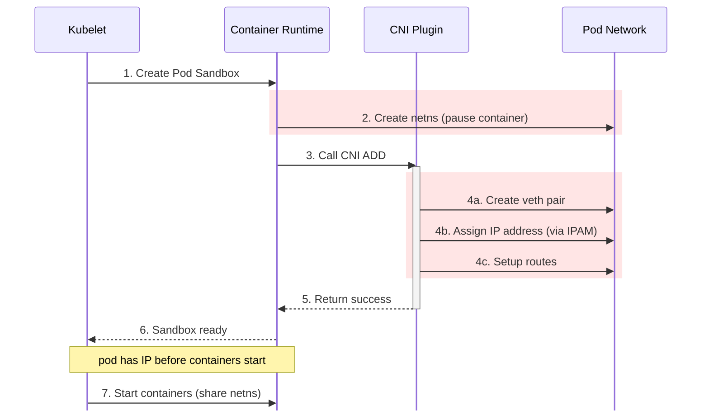

## Slide 7

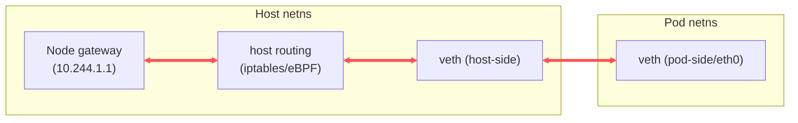

## Slide 8

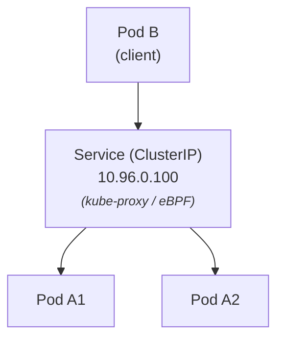

## Slide 9

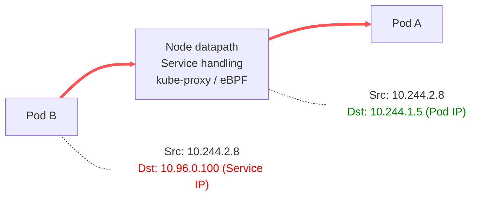

## Slide 10

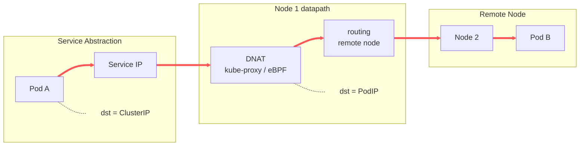

## Slide 11

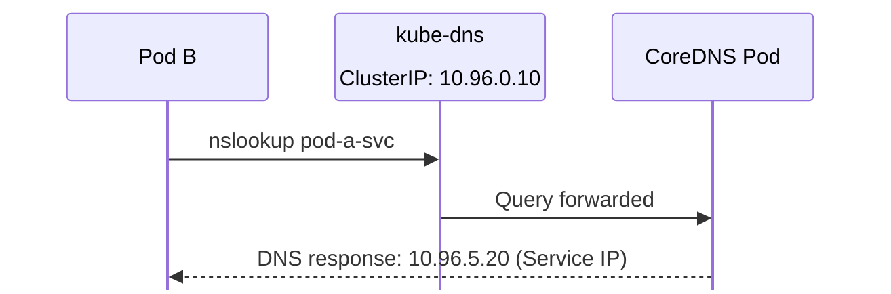

## Slide 13

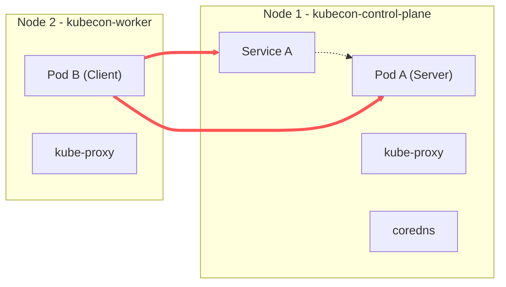

## Slide 14

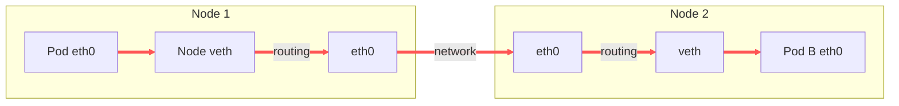

## Demo Architecture

To make this tangible, let's visualize the environment we are debugging.

We have a 2-node cluster. Each node runs `kube-proxy`, and we have a central `coredns` service. We have two application workloads: **Pod A** (Client) on Node 1 and **Pod B** (Server) on Node 2. Both are exposed via Services.

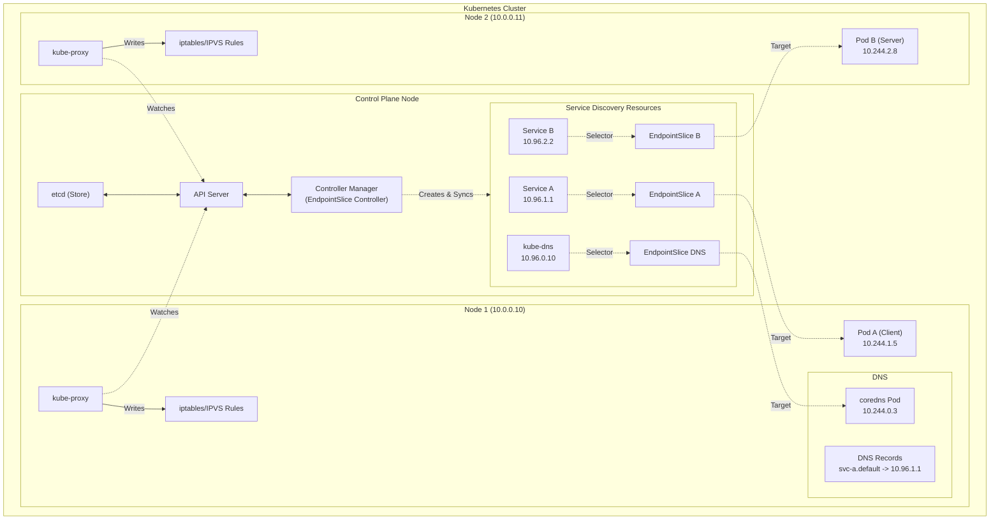
