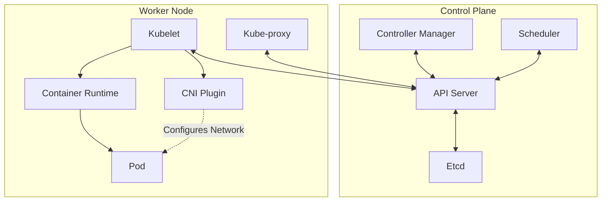
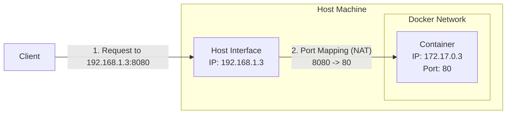
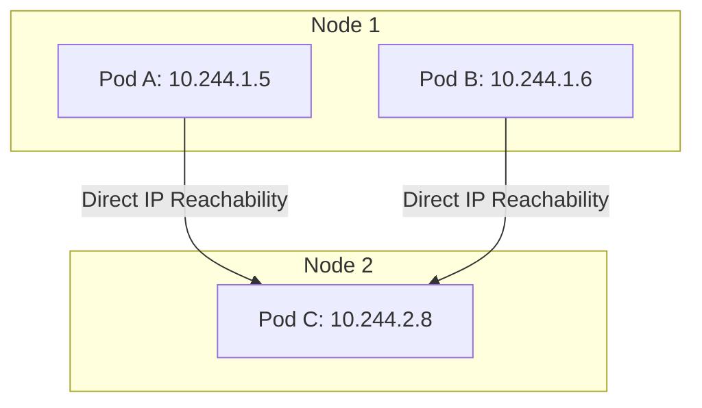
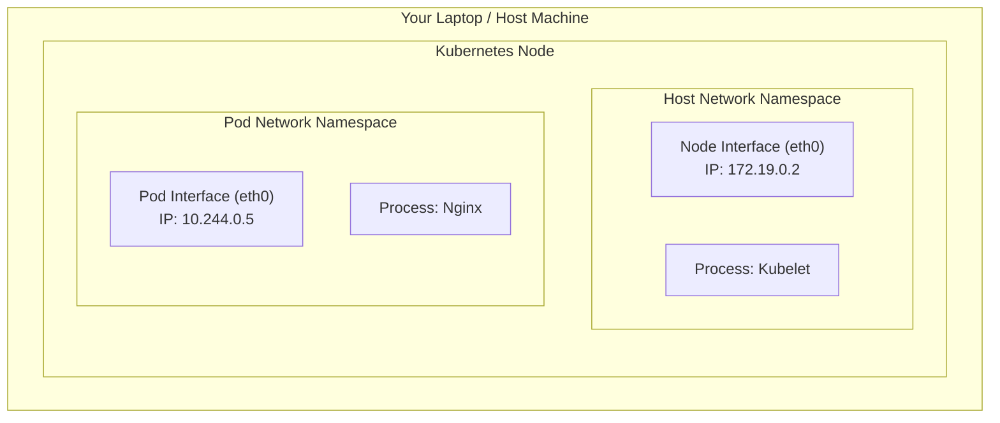
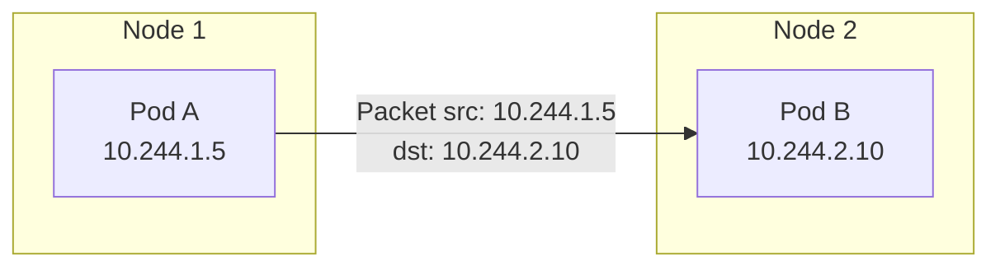
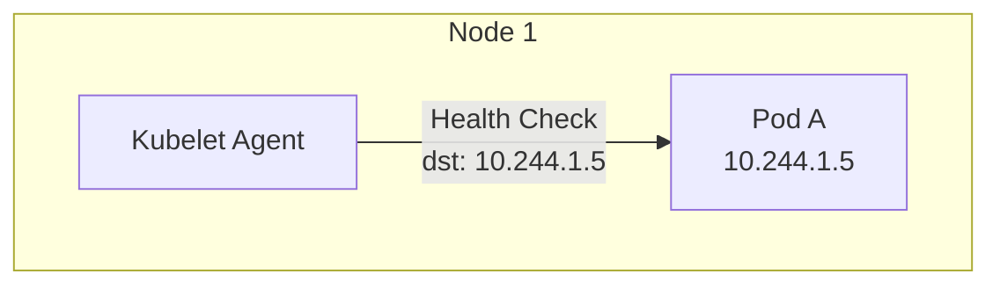
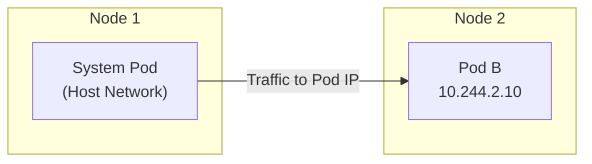

## Introduction

Kubernetes networking is often described as confusing or even “black magic.” For many people, that confusion starts the moment something simple doesn’t work.

### Example 1: Pods that can’t talk to each other

You deploy two Pods in a cluster. They’re running, healthy, and each has its own IP address. From one Pod, you try to connect to the other.
The request hangs. Eventually, it times out.

There are no errors in the Pod status. Nothing is crashing. Yet two Pods inside the same cluster can’t communicate.

### Example 2: Service IPs that don’t exist

Now you try something else. Instead of connecting directly to a Pod IP, your application talks to a Service IP like 10.96.0.10.
That IP isn’t assigned to any network interface. You can’t ping it. You won’t find it on the node.

And yet, somehow, traffic reaches the correct Pods.

These two examples capture the core of Kubernetes networking:
it looks simple on the surface, but it’s built on powerful abstractions that aren’t always obvious.

> When these examples fail, the issue isn’t “Kubernetes networking” in general, it’s a mismatch between the networking model Kubernetes promises and what the cluster is actually enforcing.

This post is Part 1 of a 5-part series based on the talk “Demystifying the Kubernetes Network Stack (Pod to Pod).” The goal of this series is to break Kubernetes networking into clear, manageable pieces that build on each other.

In this first part, we ignore how Kubernetes implements networking. No CNI plugins, no kube-proxy, no eBPF. Instead, we focus on the model.

- What does Kubernetes promise about networking?
- What assumptions can applications safely make?
- What are the rules of the game before any implementation details come into play?

## Kubernetes Architecture: A Networking Perspective

Before diving into the models, let's briefly look at the key components of a Kubernetes cluster and their role in networking.



### Control Plane (The Brain)

- **API Server:** The central hub. All components (nodes, controllers, users) communicate via the API Server.
- **Etcd:** The source of truth. It stores the state of the cluster, including Pod IPs and Service definitions.
- **Controller Manager:** Runs controllers like the **Node Controller**, which assigns IP ranges (CIDRs) to nodes.
- **Scheduler:** Assigns Pods to Nodes.

### Worker Node (The Muscle)

- **Kubelet:** The primary agent. It watches the API Server for new Pods assigned to its node. It instructs the runtime to start the container and the CNI plugin to configure the network.
- **Kube-proxy:** Manages network rules (using `iptables` or IPVS) to implement **Services** (load balancing).
- **Container Runtime:** (e.g., containerd) Creates the containers and the Network Namespaces.
- **CNI Plugin:** Configures the network interface inside the Pod's namespace.

## The "Old" Way: The Docker Model

To appreciate the Kubernetes model, we first need to look at what came before: the standard Docker networking model.

In a traditional Docker setup on a single host, containers are attached to a private bridge network (usually `docker0`). They get an IP address that is only reachable from that specific host. If you want to expose an application to the outside world (or to other hosts), you have to use **Port Mapping**.

Here is a practical example:

```bash
# 1. Run an Nginx container mapping host port 8080 to container port 80
$ docker run -d -p 8080:80 --name web nginx

# 2. Check the port mapping (0.0.0.0 means it binds to all Host IPs)
$ docker port web
80/tcp -> 0.0.0.0:8080

# 3. Verify the container's internal IP (not reachable from outside)
$ docker inspect web | jq -r '.[].NetworkSettings.IPAddress'
172.17.0.3

# 4. Access the app via the Host IP (matching the diagram)
# First, find your host's IP address:
# Linux: hostname -I
# macOS: ipconfig getifaddr en0
# Assuming your Host IP is 192.168.1.3
$ curl -I http://192.168.1.3:8080
HTTP/1.1 200 OK
Server: nginx
```

This maps port `8080` on the host to port `80` inside the container.



### The Problems with Port Mapping

1. **Port Conflicts:** You cannot run two containers that both want to bind to host port `8080`. You have to manage a registry of used ports.
2. **NAT Complexity:** The container is assigned an internal IP (e.g., `172.17.0.3`) that only exists on that host. The outside world only sees the Host's physical IP (e.g., `192.168.1.3`). This translation (NAT) breaks protocols that need to know their public IP.
3. **Service Discovery:** How does Container A find Container B if they are on different hosts? It cannot use B's internal IP. It has to track which Host IP and which Port B is mapped to.

## The Kubernetes Solution: IP-per-Pod

Kubernetes takes a radically different approach. It enforces a "flat" network structure.

**The Big Idea:** Every Pod gets its own unique, routable IP address within the cluster.

This means a Pod looks and feels exactly like a physical Virtual Machine (VM) on the network.

* It has its own IP.
* It can listen on any port it wants (e.g., port 80) without conflicting with a Pod on the same node listening on port 80 (because they have different IPs!).
* It doesn't need to know about NAT.



## Under the Hood: Linux Namespaces

Before we go further, we must understand the technology that makes "Pods" possible: **Linux Namespaces**.

A namespace is a feature of the Linux kernel that partitions kernel resources such that one set of processes sees one set of resources while another set of processes sees a different set of resources.

For networking, the most important one is the **Network Namespace (`netns`)**.

* **Host Namespace:** The default network view of the Node (eth0, localhost, routing table).
* **Pod Namespace:** A completely isolated network stack. It has its own:
  * Network Interfaces (eth0)
  * IP Address
  * Routing Table
  * Localhost (lo)
  * Port Range (0-65535)

### Practical Example: Inspecting IPs with Kind

Realistically, you rarely run Kubernetes directly on your bare metal laptop. You usually run it in VMs or, for local development, using **Kind (Kubernetes in Docker)**. In Kind, every "Node" is actually a Docker container running on your machine.

Let's see this isolation in action:

```bash
# 1. Create a local cluster
$ kind create cluster

# 2. Run a simple Nginx pod
$ kubectl run nginx --image=nginx

# 3. Check the Node IP (The "Host" from the Pod's perspective)
$ kubectl get nodes -o wide
NAME                 STATUS   ROLES           AGE     VERSION   INTERNAL-IP
kind-control-plane   Ready    control-plane   2m15s   v1.32.0   172.19.0.2

# 4. Check the Pod IP (The isolated namespace)
$ kubectl get pods -o wide
NAME    READY   STATUS    RESTARTS   AGE   IP           NODE
nginx   1/1     Running   0          15s   10.244.0.5   kind-control-plane
```

Here, the Node has IP `172.19.0.2`, but the Pod has a completely different IP `10.244.0.5`. They are in different namespaces.



When Kubernetes starts a Pod, the container runtime (like **containerd**) creates a new, empty Network Namespace. It then hands over control to a **CNI Plugin** to "wire up" the network (assigning the IP, connecting it to the bridge, etc.).

This is why a Pod can listen on port 80 even if the Node is already using port 80. They are in parallel universes. (We will cover exactly how CNI works in **Part 2**).

> **Note:** This is where **etcd** comes in. It stores the desired state of the cluster (e.g., "Pod A should exist"). The Kubelet reads this state and instructs the runtime to create the namespaces.

## The 3 Fundamental Rules (The "Golden Rules")

The Kubernetes networking model is defined by three specific requirements. Any networking implementation (CNI plugin) *must* satisfy these rules to be Kubernetes-compliant.

You can find the official definition in the [Kubernetes Documentation](https://kubernetes.io/docs/concepts/cluster-administration/networking/#the-kubernetes-network-model).

### 1. Pod-to-Pod Communication

> **All Pods can communicate with all other Pods on any other node without NAT.**
{: .prompt-info }

If Pod A is on Node 1 with IP `10.244.1.5`, and Pod B is on Node 2 with IP `10.244.2.10`, Pod A can send a packet directly to `10.244.2.10`. The destination sees the packet coming from `10.244.1.5`. No address translation happens in the middle.



### 2. Node-to-Pod Communication

> **Agents on a node (e.g., system daemons, Kubelet) can communicate with all Pods on that node.**
{: .prompt-info }

The Kubelet (the primary "node agent") needs to be able to perform health checks (liveness/readiness probes) against the Pods running on its node. It does this by hitting the Pod's IP directly.



### 3. Host-Network-to-Pod Communication

> **Pods in the host network of a node can communicate with all Pods on all nodes without NAT.**
{: .prompt-info }

Some system pods run in the "host network" namespace (meaning they share the Node's IP address). These pods must still be able to reach other Pods on their Pod IPs.



**What is a System Pod?**
Usually, these are infrastructure components like the CNI agent (e.g., `calico-node`, `cilium-agent`) or `kube-proxy`. They need to manipulate the host's network stack directly, so they run with `hostNetwork: true`.

You can see which pods are running in the host network by checking if their IP matches the Node IP:

```bash
$ kubectl get pods -n kube-system -o wide
NAME               READY   STATUS    IP           NODE
cilium-x866d       1/1     Running   172.19.0.2   kind-control-plane  <-- Matches Node IP
coredns-7db...     1/1     Running   10.244.0.3   kind-control-plane  <-- Pod IP
```

## Key Vocabulary

To navigate the rest of this series, we need to agree on some vocabulary.

* **Pod:** The atomic unit of Kubernetes. It is a group of one or more containers that share a **Network Namespace**. This means they share the same IP address and `localhost`. Container A inside a Pod can talk to Container B inside the same Pod via `localhost:port`.
* **Node:** A worker machine in Kubernetes (VM or physical).
* **Cluster CIDR:** The massive range of IP addresses reserved for *all* Pods in the cluster (e.g., `10.244.0.0/16`).
* **Pod CIDR:** A slice of the Cluster CIDR assigned to a specific Node. For example, Node A might get `10.244.1.0/24`, meaning all Pods on Node A will get IPs from that range.
* **Service CIDR:** A completely separate range of IPs (e.g., `10.96.0.0/12`) used for **Services**. These are virtual IPs that don't exist on any network interface. We will cover this in Part 3.
* **CNI (Container Network Interface):** The plugin system that actually implements these rules. Kubernetes doesn't provide the network; it asks a CNI plugin (like **Calico**, **Cilium**, **Flannel**) to "wire up" the Pods according to the Golden Rules.

## Why This Model?

By enforcing this flat network model, Kubernetes decouples the application from the infrastructure.

* **Simplicity for Apps:** Applications can be ported from VMs to Pods without changing their networking code. They bind to an IP and port, and they are reachable.
* **Simplicity for Humans:** You don't need to maintain a spreadsheet of which port maps to which container.
* **Standardization:** Because the rules are strict, you can swap out the underlying implementation (CNI) without breaking the application's connectivity.

## References

* [Kubernetes Networking Concepts](https://kubernetes.io/docs/concepts/cluster-administration/networking/)
* [Tigera: Kubernetes Networking Guide](https://www.tigera.io/learn/guides/kubernetes-networking/)
* [Spacelift: Kubernetes Networking](https://spacelift.io/blog/kubernetes-networking)

## What's Next?

We have defined the **Model** and the **Promises**. But how does a Pod actually get an IP? How is the "virtual wire" connected?

In **Part 2**, we will dive into **CNI (Container Network Interface)** and see exactly how Pods get onto the network.

<!-- ## Series Navigation

| Part | Topic | Description |
|:---|:---|:---|
| [Part 1](/posts/kubernetes-networking-series-part-1/) | The Model | The IP-per-Pod model and Linux Namespaces. |
| [Part 2](/posts/kubernetes-networking-series-part-2/) | CNI & Pod Networking | How CNI plugins create the network plumbing. |
| [Part 3](/posts/kubernetes-networking-series-part-3/) | Services | Stable IPs and load balancing with Services. |
| [Part 4](/posts/kubernetes-networking-series-part-4/) | DNS | Service discovery and naming with CoreDNS. |
| [Part 5](/posts/kubernetes-networking-series-part-5/) | Debugging | Troubleshooting with Retina and Wireshark. | -->
