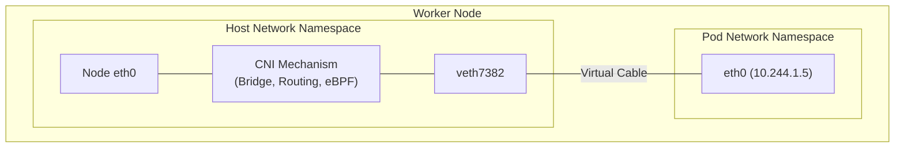
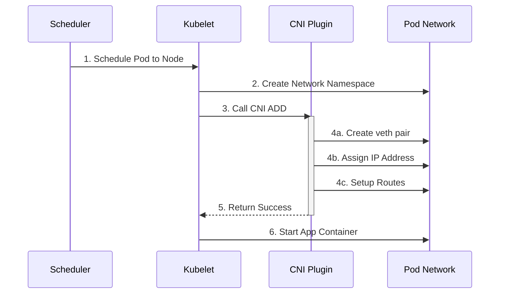
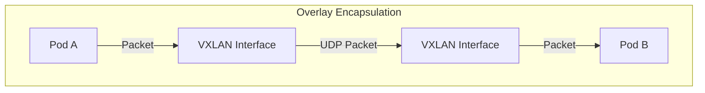
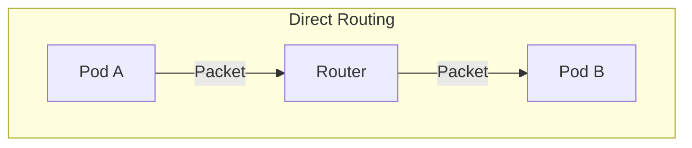
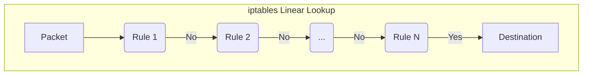
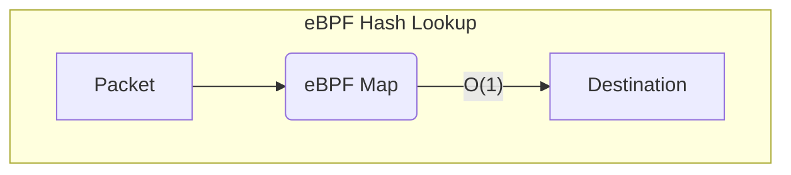

## Introduction

In [Part 1](/posts/kubernetes-networking-series-part-1/), we established the **Model**: the "Golden Rules" of Kubernetes networking. We learned that every Pod gets its own IP address and that NAT is forbidden for Pod-to-Pod communication.

But *how* does this actually happen? When you schedule a Pod, who creates the network interface? Who decides which IP address it gets?

This is **Part 2** of our series, where we dive into the **CNI (Container Network Interface)**. Instead of getting lost in the weeds of specific tools like Calico or Cilium, we will focus on the universal patterns that apply to *every* Kubernetes cluster.

## Terminology

Before we dive in, let's clarify a few terms used throughout this post:

* **Packet:** A unit of data that travels over a network. Think of it as a letter in an envelope.

    ```mermaid
    graph LR
        subgraph Packet [Network Packet]
            direction LR
            Header[IP Header<br>Source: 10.0.0.1<br>Dest: 10.0.0.2] --- Payload[Data Payload<br>Hello World!]
        end
    ```

* **Routable IP:** An IP address that can be reached directly by other machines on the network without needing translation (NAT).
* **IPAM (IP Address Management):** The system responsible for tracking which IPs are available and assigning them to Pods. It ensures no two Pods get the same IP.
* **Network Namespace:** A Linux kernel feature that isolates network resources (interfaces, routing tables). Each Pod gets its own namespace.
* **veth pair (Virtual Ethernet):** A virtual cable with two ends. What goes in one end comes out the other. We use this to connect a Pod's isolated namespace to the Node's network.
* **Bridge:** A virtual network switch that connects multiple network interfaces together.

## 1. The CNI Contract (The Golden Rules)

Kubernetes itself does not handle networking. It offloads that responsibility to a **CNI Plugin**. However, Kubernetes is very strict about what it expects that plugin to do.

Every CNI plugin must satisfy these non-negotiable requirements:

1. **Give the Pod a unique IP:** Every Pod must have an IP address that is unique within the cluster.
2. **Make that IP reachable:** Other Pods must be able to reach this IP without NAT.
3. **Configure routes:** Traffic must be able to leave the Pod and reach the rest of the network.
4. **Clean up:** When the Pod is deleted, the IP and network resources must be freed.

**Key Takeaway:** *How* this is done is up to the CNI (using bridges, routing, eBPF, etc.), but these outcomes must always be true.

## 2. The Universal Pod Networking Pattern

Regardless of which CNI you use, the way a Pod connects to its Node is almost always the same. This is the most important concept to grasp.

* **Pod Network Namespace:** The Pod runs in its own isolated network namespace.
* **eth0:** Inside that namespace, the Pod sees a standard interface named `eth0`.
* **veth pair:** This `eth0` is actually one end of a **Virtual Ethernet (veth) pair**.
* **Node Connection:** The other end of the pair lives in the Node's host network namespace.

**Every CNI uses this pattern.** The differences only start *after* the packet leaves the node side of the veth pair.



### See it in action

You can verify this plumbing yourself on any Kubernetes node using standard Linux tools.

**1. List interfaces on the host:**
You will see the `veth` interfaces, often attached to a bridge (like `cni0`) or just present in the list.

```bash
# On the Kubernetes Node
$ ip link show
...
3: cni0: <BROADCAST,MULTICAST,UP,LOWER_UP> mtu 1450 ...
4: veth7382@if3: <BROADCAST,MULTICAST,UP,LOWER_UP> ... master cni0
5: veth9123@if3: <BROADCAST,MULTICAST,UP,LOWER_UP> ... master cni0
```

**2. Find the other end:**
If you exec into a Pod, you see the other end of the pipe, always named `eth0`.

```bash
$ kubectl exec -it my-pod -- ip link show
1: lo: <LOOPBACK,UP,LOWER_UP> ...
3: eth0@if4: <BROADCAST,MULTICAST,UP,LOWER_UP> ...
```

## 3. What Happens When a Pod Is Created (CNI Lifecycle)

Let's walk through the generic lifecycle of a Pod's network setup. This happens every time a Pod is scheduled.



1. **Pod Scheduled:** The scheduler assigns a Pod to a Node.
2. **Kubelet Calls CNI:** The Kubelet (via the container runtime) calls the configured CNI plugin. It says, "I have created a container; please set up the network."
3. **CNI Actions:** The plugin executes and performs the following:
    * Creates the **veth pair**.
    * Moves one end into the Pod's namespace and names it `eth0`.
    * **Assigns an IP** to that interface (usually via an IPAM sub-plugin).
    * Sets up the **default route** inside the Pod so traffic knows where to go.
    * Connects the node-side veth to the cluster network (via a bridge, routing table, etc.).
4. **Ready:** The CNI returns success, and the application container starts.

### Verifying the Lifecycle

You can observe these steps happening (or failing) using `kubectl`.

**1. Check Scheduling & IP Assignment:**
Watch the Pod status. It transitions from `Pending` (Scheduling) to `ContainerCreating` (CNI is running). Once the IP is assigned, it moves to `Running`.

```bash
$ kubectl get pods -o wide -w
NAME    READY   STATUS              IP           NODE
web-1   0/1     ContainerCreating   <none>       node-1  # CNI is working...
web-1   1/1     Running             10.244.1.5   node-1  # CNI finished!
```

**2. Debugging CNI Failures:**
If the Pod stays in `ContainerCreating`, the CNI might be failing. Check the events:

```bash
$ kubectl describe pod web-1
...
Events:
  Type     Reason                  Age   From               Message
  ----     ------                  ----  ----               -------
  Normal   Scheduled               5s    default-scheduler  Successfully assigned default/web-1 to node-1
  Warning  FailedCreatePodSandBox  1s    kubelet            NetworkPlugin cni failed to set up pod "web-1_default" network: failed to find plugin "bridge" in path [/opt/cni/bin]
```

## 4. Where CNIs Differ

If the Pod-to-Node connection (the veth pair) is standard, where do the differences lie? They mostly concern how packets move *between* nodes and how the cluster enforces rules.

### 4.1. The Data Plane: Overlay vs. Direct Routing

This determines how a packet from a Pod on Node A reaches a Pod on Node B.

#### Overlay Networks (VXLAN, IPIP, Geneve)

* **What:** The CNI wraps the original Pod packet inside a Node packet (Encapsulation). It creates a "tunnel" over the physical network.
* **Why:** It works everywhere. The physical network (AWS VPC, Azure VNet, Google VPC, or your home router) only sees Node IPs. It doesn't need to know that Pod IPs exist.
* **Trade-off:** Slight CPU overhead for wrapping/unwrapping packets.



#### Direct Routing (BGP, Host-Gateway)

* **What:** Pod packets are sent "naked" onto the network. The physical routers are taught (often via BGP) how to route Pod IPs.
* **Why:** Best performance (no overhead) and easier troubleshooting (you can ping Pods from outside).
* **Trade-off:** Requires control over the physical network routers.



#### Which dataplane am I using?

Check the network interfaces and routes on a Node.

```bash
# Check for tunnel interfaces (Overlay)
$ ip -d link show | grep vxlan
# Output: vxlan id 4096 ... (If you see this, you are likely using Overlay)

# Check routes
$ ip route
# Overlay: 10.244.1.0/24 dev vxlan.calico ...
# Direct:  10.244.1.0/24 via 192.168.1.5 dev eth0 ...
```

### 4.2. The Enforcement Mechanism: iptables vs. eBPF

This determines how Kubernetes Services (Load Balancing) and Network Policies (Firewalls) are implemented.

#### iptables (Legacy Standard)

* **What:** Uses the Linux kernel's built-in firewall lists. `kube-proxy` updates thousands of rules to redirect traffic.
* **Why:** It is the default, stable, and works on every Linux kernel.
* **Trade-off:** Gets slow at scale. If you have 10,000 Services, the kernel has to check a massive list of rules for every packet.



#### eBPF (Modern Standard)

* **What:** The CNI loads custom, programmable logic directly into the kernel. It uses efficient hash maps to look up destinations instantly.
* **Why:** Blazing fast at any scale and provides deep observability.
* **Trade-off:** Requires newer Linux kernels.



#### Which Service implementation am I using?

Check if `kube-proxy` is running or if your CNI has replaced it.

```bash
# Check if kube-proxy is running
$ kubectl get pods -n kube-system -l k8s-app=kube-proxy
# If you see pods: You are likely using iptables (or IPVS).
# If empty: Your CNI (like Cilium) has likely replaced it with eBPF.

# If using Cilium, ask it directly:
$ cilium status | grep KubeProxyReplacement
# KubeProxyReplacement: Strict (eBPF is handling everything)
```

## 5. Why This Abstraction Matters

Understanding this universal pattern is crucial for the rest of our journey:

* **Services (Part 3):** Services assume that Pods already have routable IPs. They build load balancing *on top* of this foundation.
* **DNS (Part 4):** DNS relies on Services resolving to these reachable Pod IPs.
* **Debugging (Part 5):** Troubleshooting always starts at the Pod interface (`eth0`) and works outward. If the veth pair isn't working, nothing else matters.

## Summary

We have demystified the plumbing. We know that a CNI plugin is responsible for satisfying the "Golden Rules" and that it uses a standard **veth pair** pattern to connect Pods to the Node.

"Once you understand how a Pod connects to its node, everything else in Kubernetes networking becomes easier, regardless of which CNI your cluster uses."

In **Part 3**, we will tackle the next big challenge: **Services**. Pod IPs are ephemeral—they change when Pods die. How do we reliably route traffic to a moving target?

## References

* **Kubernetes CNI:** [Network Plugins](https://kubernetes.io/docs/concepts/extend-kubernetes/compute-storage-net/network-plugins/)
* **CNI Specification:** [Container Network Interface (CNI)](https://github.com/containernetworking/cni)
* **Cilium:** [GitHub](https://github.com/cilium/cilium)
* **Calico:** [GitHub](https://github.com/projectcalico/calico)
* **eBPF:** [Documentation](https://docs.ebpf.io/)
* **iptables:** [netfilter.org](https://netfilter.org/projects/iptables/index.html)
* **VXLAN:** [RFC 7348](https://datatracker.ietf.org/doc/html/rfc7348)
* **IPIP:** [RFC 2003](https://datatracker.ietf.org/doc/html/rfc2003)
* **BGP:** [RFC 4271](https://datatracker.ietf.org/doc/html/rfc4271)

## Series Navigation

| Part | Topic | Description |
|:---|:---|:---|
| [Part 1](/posts/kubernetes-networking-series-part-1/) | The Model | The IP-per-Pod model and Linux Namespaces. |
| [Part 2](/posts/kubernetes-networking-series-part-2/) | CNI & Pod Networking | How CNI plugins create the network plumbing. |
| [Part 3](/posts/kubernetes-networking-series-part-3/) | Services | Stable IPs and load balancing with Services. |
| [Part 4](/posts/kubernetes-networking-series-part-4/) | DNS | Service discovery and naming with CoreDNS. |
| [Part 5](/posts/kubernetes-networking-series-part-5/) | Debugging | Troubleshooting with Retina and Wireshark. |
