## Introduction

In [Part 1](/posts/kubernetes-networking-series-part-1/), we established the **Model**: the "Golden Rules" of Kubernetes networking. Before exploring *how* connections are made, let's briefly revisit these fundamental design principles. Kubernetes departs from traditional host networking (where ports are mapped to the host IP) to simplify application migration and service discovery.

1. **Every Pod gets its own IP**: Unlike Docker’s default model where containers share the host IP and use dynamic ports, Kubernetes treats Pods like distinct VMs on the network. This means applications can run on well-known ports (like 80 or 443) without conflict, regardless of which node they land on.

2. **Pod-to-Pod communication without NAT**: The network must be flat. A Pod on Node A can reach a Pod on Node B directly using its IP address. The IP address the sender sees and uses is the exact same IP address the receiver sees as its own. The model assumes Pod IPs are directly reachable (no NAT for pod-to-pod traffic).

3. **No Host Networking Dependence**: By decoupling the application network from the underlying host network, Kubernetes creates a consistent environment. Developers don't need to worry about the specific network configuration of the physical servers or cloud instances running their code.

But *how* does this actually happen? When you schedule a Pod, who creates the network interface? Who decides which IP address it gets?

This is **Part 2** of our series, where we dive into the **Container Network Interface (CNI)**. This is the mechanism that implements Part 1’s "no NAT, unique Pod IPs" rule. Instead of getting lost in the weeds of specific tools like Calico or Cilium, we will focus on the universal patterns that apply to *every* Kubernetes cluster.

## Terminology

Before we dive in, let's clarify a few terms used throughout this post:

* **Packet:** A unit of data that travels over a network. Think of it as a letter in an envelope.

    ```mermaid
    graph LR
       classDef payload fill:#e91e63,stroke:#880e4f,stroke-width:2px,color:#fff
       classDef header fill:#2196f3,stroke:#0d47a1,stroke-width:2px,color:#fff
       
       subgraph Packet ["Network Packet"]
         direction LR
         IP["IP Header<br>Src: 10.244.1.5<br>Dst: 10.244.2.5"]:::header ~~~ Data[Payload]:::payload
       end
    ```

* **Routable IP:** An IP that is reachable within the cluster without NAT (i.e., other Pods/nodes can route to it directly).
* **IPAM (IP Address Management):** The system responsible for tracking which IPs are available and assigning them to Pods. It ensures no two Pods get the same IP.
* **Network Namespace:** A Linux kernel feature that isolates network resources (interfaces, routing tables). Each Pod gets its own namespace.
* **veth pair (Virtual Ethernet):** A virtual cable with two ends. What goes in one end comes out the other. We use this to connect a Pod's isolated namespace to the Node's network.
* **Bridge:** A virtual network switch that connects multiple network interfaces together.
* **Routing:** The process of selecting a path for traffic in a network. In Kubernetes, this ensures packets from a Pod on one Node know how to reach a Pod on another Node.
* **Gateway:** The next-hop IP the Pod uses as its default route (typically the node-side of the veth / bridge interface). All traffic leaving the Pod goes here first to be routed to its destination.

## CNI and the OSI Model

To truly understand CNI, it helps to map its responsibilities to the [OSI Model](https://en.wikipedia.org/wiki/OSI_model). While applications (Layer 7) and transport protocols like TCP (Layer 4) are what we interact with, CNI lives a bit lower down the stack.

The CNI plugin is primarily concerned with **Layer 2 (Data Link)** and **Layer 3 (Network)** for connectivity, and may also inspect Layer 4 when enforcing **NetworkPolicies**.

* **Layer 2 (Data Link):** This is the plumbing. It involves creating the virtual ethernet cables (`veth` pairs), attaching them to bridges, and handling ARP/MAC addresses so that ethernet frames can move.
* **Layer 3 (Network):** This is the addressing and routing. It involves assigning IP addresses to Pods (IPAM) and setting up the routes so that packets know where to go.

Here is a visualization of how CNI maps to the OSI layers:

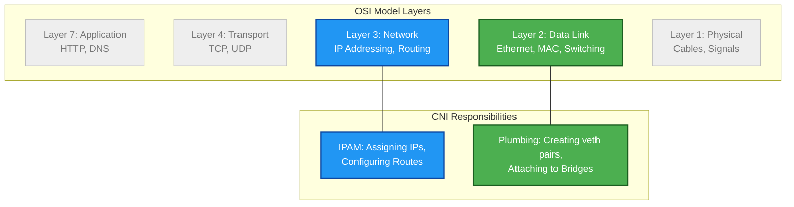

### The Network Packet

When we talk about layers, we are really talking about how data is packaged. A network packet is like a Russian nesting doll.

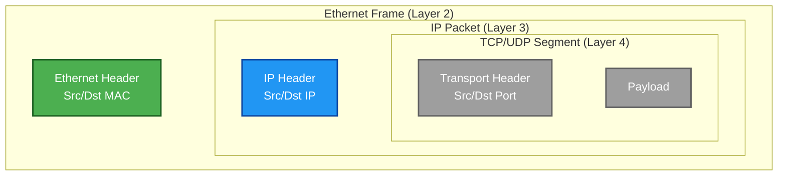

### CNI Focus: The Outer Layers

In the context of CNI, we care most about the **Ethernet Header** and the **IP Header**.

* **Ethernet Header (Layer 2):** Contains MAC addresses. Used for local delivery across the veth pair and between interfaces on the node (and out to the underlay via the node’s NIC).
* **IP Header (Layer 3):** Contains IP addresses. This is the "global" address. The CNI ensures that a packet with a destination IP of a remote Pod gets routed to the correct Node.
* **Transport Header (Layer 4):** Contains Ports (e.g., 80, 443). CNI plugins typically *ignore* this for basic connectivity. However, if you use **NetworkPolicies**, the CNI plugin acting as the enforcer will inspect this header to allow or deny traffic.

## 1. The CNI Contract (The Golden Rules)

Kubernetes itself does not handle networking. It offloads that responsibility to a **CNI Plugin**. It is important to note that **CNI runs independently on every node**, configuring local networking according to cluster-wide expectations. However, Kubernetes has strict expectations about what that plugin must provide.

Every CNI plugin must satisfy these non-negotiable requirements:

1. **Give the Pod a unique IP:** Every Pod must have an IP address that is unique within the cluster.
2. **Make that IP reachable:** Other Pods must be able to reach this IP without NAT.
3. **Configure routes:** Traffic must be able to leave the Pod and reach the rest of the network.
4. **Clean up:** When the Pod is deleted, the IP and network resources must be freed.

**Key Takeaway:** *How* this is done is up to the CNI (using bridges, routing, eBPF, etc.), but these outcomes must always be true.

> **Codebase References:**
* **CNI:** [containernetworking/cni](https://github.com/containernetworking/cni) - The Go library and specification for writing network plugins.
* **CRI:** [kubernetes/cri-api](https://github.com/kubernetes/cri-api) - The definitions for the Container Runtime Interface, which triggers the CNI.
{: .prompt-info }

## 2. The Universal Pod Networking Pattern

Regardless of which CNI you use, the way a Pod connects to its Node is almost always the same. This is the most important concept to grasp.

* **Pod Network Namespace:** The Pod runs in its own isolated network namespace.
* **eth0:** Inside that namespace, the Pod sees a standard interface named `eth0`.
* **veth pair:** This `eth0` is actually one end of a **Virtual Ethernet (veth) pair**.
* **Node Connection:** The other end of the pair lives in the Node's host network namespace.

**Nearly every CNI uses this pattern.** The differences only start *after* the packet leaves the node side of the veth pair.

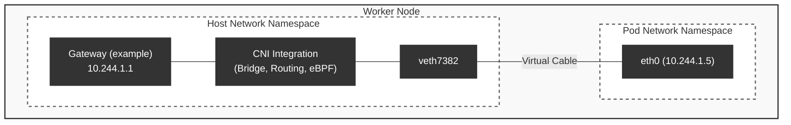

### See it in action

You can verify this plumbing yourself on any Kubernetes node using standard Linux tools.

**1. List interfaces on the host:**
You will see the `veth` interfaces, often attached to a bridge (like `cni0`) or just present in the list.

```bash
# On the Kubernetes Node
$ ip link show
...
3: cni0: <BROADCAST,MULTICAST,UP,LOWER_UP> mtu 1450 ...
4: veth7382@if3: <BROADCAST,MULTICAST,UP,LOWER_UP> ... master cni0
5: veth9123@if3: <BROADCAST,MULTICAST,UP,LOWER_UP> ... master cni0
```

**2. Find the other end:**
If you exec into a Pod, you see the other end of the pipe, always named `eth0`.

```bash
$ kubectl exec -it my-pod -- ip link show
1: lo: <LOOPBACK,UP,LOWER_UP> ...
3: eth0@if4: <BROADCAST,MULTICAST,UP,LOWER_UP> ...
```

## 3. What Happens When a Pod Is Created (CNI Lifecycle)

Let's walk through the generic lifecycle of a Pod's network setup. This happens every time a Pod is scheduled.

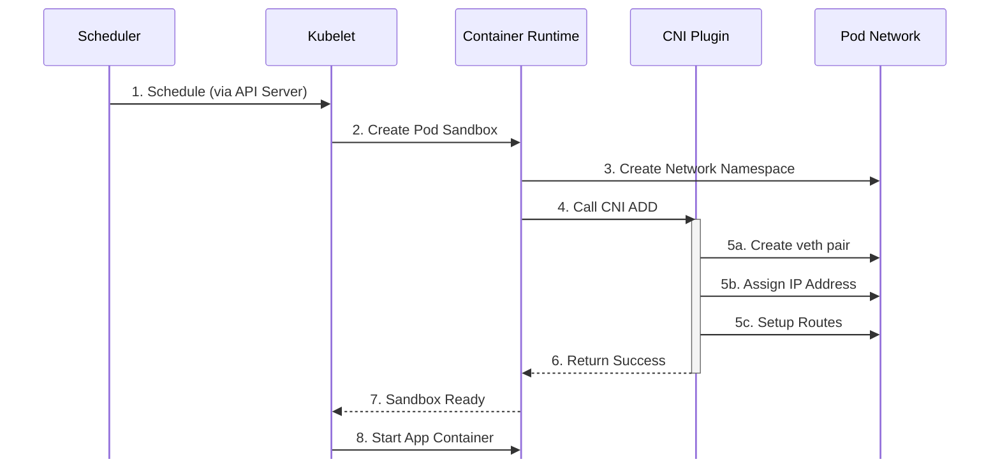

1. **Pod Scheduled:** The scheduler assigns a Pod to a Node.
2. **Kubelet Calls CRI:** The Kubelet instructs the Container Runtime Interface (CRI) to create the Pod sandbox.
3. **CRI Invokes CNI:** The Container Runtime creates the network namespace and then calls the configured CNI plugin to set up the network.
4. **CNI Actions:** The plugin executes and performs the following:
    * Creates the **veth pair**.
    * Moves one end into the Pod's namespace and names it `eth0`.
    * **Assigns an IP** to that interface (usually via an IPAM sub-plugin).
    * Sets up the **default route** inside the Pod so traffic knows where to go.

      ```bash
      $ kubectl exec -it my-pod -- ip route show
      # "default via" means: send everything else to the gateway (10.244.1.1)
      default via 10.244.1.1 dev eth0
      10.244.1.0/24 dev eth0 proto kernel scope link src 10.244.1.5
      ```

    * Connects the node-side veth to the cluster network (via a bridge, routing table, etc.).
5. **Ready:** The CNI returns success to the CRI, which reports back to the Kubelet, and the application container starts.

### Verifying the Lifecycle

You can observe these steps happening (or failing) using `kubectl`.

**1. Check Scheduling & IP Assignment:**
Watch the Pod status. It transitions from `Pending` (Scheduling) to `ContainerCreating` (CNI is running). Once the IP is assigned, it moves to `Running`.

```bash
$ kubectl get pods -o wide -w
NAME    READY   STATUS              IP           NODE
web-1   0/1     ContainerCreating   <none>       node-1  # CNI is working...
web-1   1/1     Running             10.244.1.5   node-1  # CNI finished!
```

**2. Debugging CNI Failures:**
If the Pod stays in `ContainerCreating`, the CNI might be failing. Check the events:

```bash
$ kubectl describe pod web-1
...
Events:
  Type     Reason                  Age   From               Message
  ----     ------                  ----  ----               -------
  Normal   Scheduled               5s    default-scheduler  Successfully assigned default/web-1 to node-1
  Warning  FailedCreatePodSandBox  1s    kubelet            NetworkPlugin cni failed to set up pod "web-1_default" network: failed to find plugin "bridge" in path [/opt/cni/bin]
```

## 4. Where CNIs Differ

If the Pod-to-Node connection (the veth pair) is standard, where do the differences lie? They mostly concern how packets move *between* nodes and how the cluster enforces rules.

### 4.1. The Data Plane: Architectures

This determines how a packet from a Pod on Node A reaches a Pod on Node B.

#### 4.1.1. Overlay Networks (Encapsulation)

* **What:** The CNI wraps the original Pod packet inside a Node packet (Encapsulation). It creates a "tunnel" over the physical network.
* **Why:** It works everywhere. The physical network (AWS VPC, Azure VNet, Google VPC, or your home router) only sees Node IPs. It doesn't need to know that Pod IPs exist.
* **Trade-off:** Slight CPU overhead for wrapping/unwrapping packets and reduced MTU (to make room for the extra headers).

**High-Level View:**

To understand encapsulation, let's start with a high-level view. Imagine **Pod A (10.244.1.5)** on **Node A (192.168.1.10)** wants to send a packet to **Pod B (10.244.2.5)** on **Node B (192.168.1.20)**.

The physical network only knows about Node IPs (192.168.x.x). It doesn't know how to route Pod IPs (10.244.x.x). So, Node A wraps the packet in a "Node envelope" to get it across.

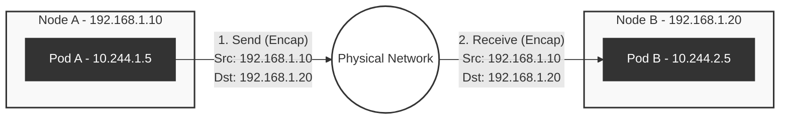

Now, let's look at the specific technologies used to achieve this.

##### VXLAN (Virtual Extensible LAN)

The most common encapsulation protocol.

**1. Encapsulation (Sending at Node A)**

When Pod A sends traffic to Pod B, the CNI and the Node's kernel work together to wrap the packet for transport across the physical network.

1. **Original Packet:** Pod A creates a standard packet addressed to Pod B.
2. **Overlay Header:** The kernel encapsulates the frame with a **VXLAN** header (orange).
3. **Physical Transport:** Node A adds the **UDP** transport (grey) and its own **Outer IP header** (blue) to send it to Node B.

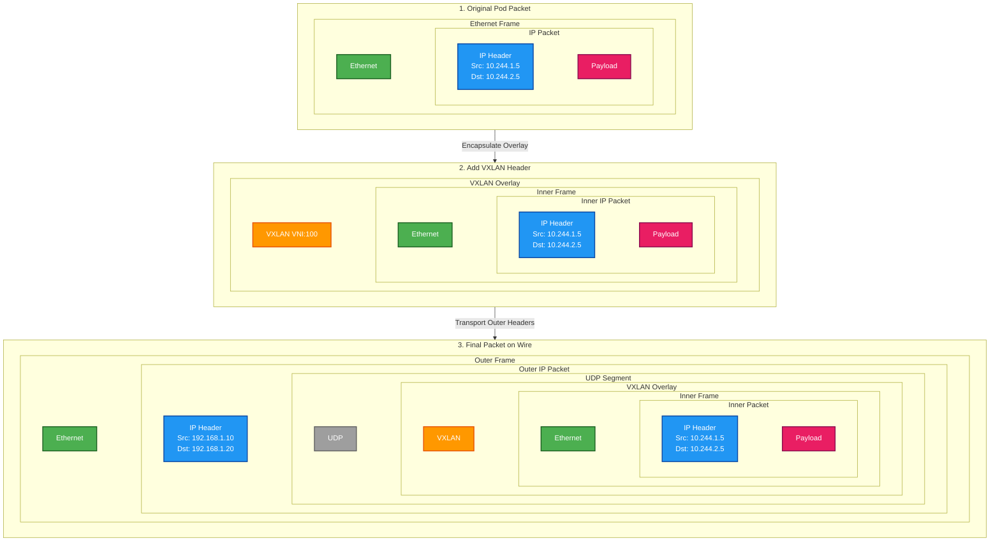

**2. Decapsulation (Receiving at Node B)**

At the destination, the envelope is peeled open layer by layer.

1. **Receive on Wire:** Node B (192.168.1.20) receives the full packet.
2. **Strip Transport:** The Kernel sees the packet is for itself, removes the **Outer IP header** (blue) and **UDP** (grey).
3. **Unwrap:** The VXLAN interface removes the **VXLAN header** (orange).
4. **Deliver:** The original packet (Src: Pod A, Dst: Pod B) is revealed and delivered.

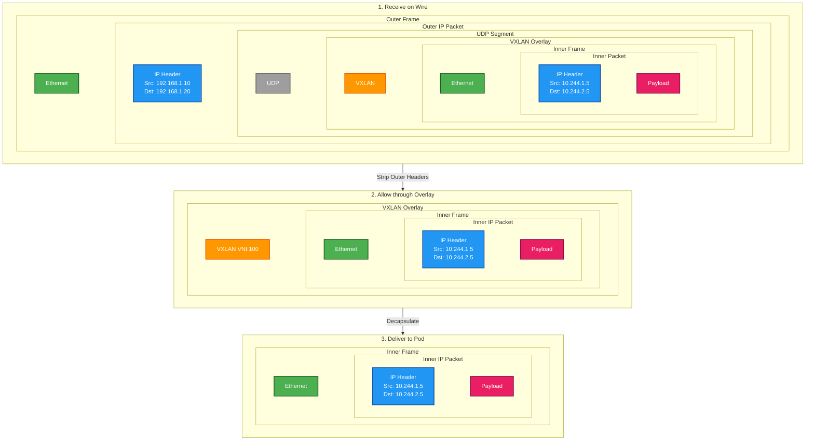

##### Geneve (Generic Network Virtualization Encapsulation)

While VXLAN is the most common example, you often see **Geneve** used in modern CNIs.

* **VXLAN** has a fixed header format with limited space for metadata (just the VNI ID).
* **Geneve** is designed to be extensible. It supports variable-length options (Type-Length-Value or TLV) inside the header.

Advanced CNIs like **Cilium** or **OVN-Kubernetes** use Geneve to embed rich context directly into the packet, such as policy/security metadata, to carry additional metadata alongside the packet.

##### IPIP (IP-in-IP)

**IPIP** is a simpler protocol that encapsulates one IP packet inside another.

* **Pros:** Lower overhead than VXLAN (adds fewer bytes) because it doesn't need an Ethernet or UDP header.
* **Cons:** Carries only IP traffic (no Layer 2 / Ethernet support).

#### 4.1.2. Direct Routing (No Encapsulation)

* **What:** Pod packets are sent "naked" (without encapsulation) onto the physical network. The physical network routers are taught how to route Pod IPs directly to the correct Node.
* **Why:** Best performance (no MTU overhead, no CPU cost for encap/decap) and easier troubleshooting (standard tools like `tcpdump` work everywhere).
* **Trade-off:** Requires configuration of the physical network (BGP Peering) or a flat Layer 2 network.

##### BGP (Border Gateway Protocol)

**How does it work?**

In this model, the CNI plugin runs a routing daemon (like BIRD, commonly used by Calico, or another BGP daemon) on every node. This daemon talks to the physical routers (Top-of-Rack) and announces: *"Hey, I have the subnet `10.244.1.0/24`. Send all packets for those IPs to me (Node A)."*

Because the physical network knows where every Pod IP lives, packets flow natively without any modification.

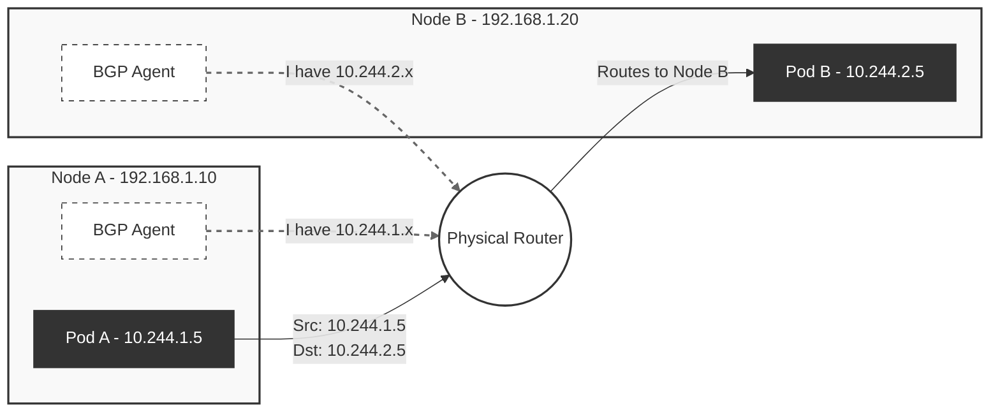

Unlike encapsulation, the packet on the wire looks exactly like the packet that left the Pod. There is no "Outer Header".

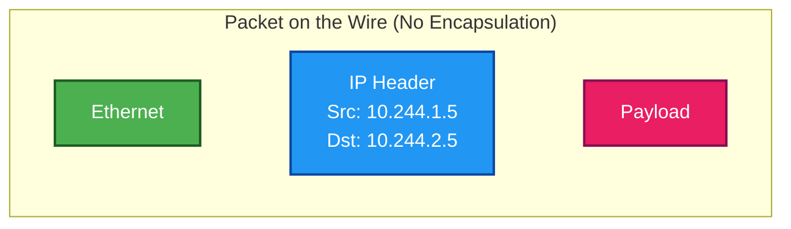

##### Host-Gateway

A simplified form of direct routing for small clusters.

* **Mechanism:** Instead of using BGP to talk to routers, nodes update each other's routing tables.
* **Requirement:** All nodes must be on the same Layer 2 subnet (connected to the same switch/VLAN).
* **Limitation:** It cannot route across different subnets.

#### 4.1.3. Which dataplane am I using?

There are three main ways to check: inspecting the node, asking the CNI, or catching it in the act.

**1. Inspect the Node (Universal)**
Check the network interfaces and routing table.

```bash
# 1. Look for tunnel interfaces (one common case)
$ ip -d link show | grep vxlan
# Output: vxlan.calico ... (Presence usually implies Overlay)

# 2. Check how the Node reaches a Pod subnet (e.g., 10.244.1.0/24)
$ ip route get 10.244.1.5
# Overlay: "dev vxlan.calico" (It goes into a tunnel interface)
# Direct:  "via 192.168.1.10 dev eth0" (It goes directly to the other Node's IP)
```

**2. Ask the CNI (Best Practice)**
Modern CNIs have CLI tools that tell you exactly how they are configured.

* **Cilium:** The CLI on your laptop just shows cluster health. To see the network mode, run the status command *inside* a Cilium Pod:

    ```bash
    $ kubectl -n kube-system exec -ti ds/cilium -- cilium status | grep -i "Tunnel"
    # Example outputs (varies by version):
    # "Routing: Network: Tunnel [vxlan] ..." (Overlay)
    # "Routing: Network: Native ..." (Direct Routing)
    ```

* **Calico:** Check the `Installation` resource (if using the Operator) and `IPPool`.
  * `kubectl get installation default -o yaml` -> Look for `calicoNetwork.linuxDataplane` (values: `Iptables` or `BPF`).
  * `kubectl get ippool -o yaml` -> Check `vxlanMode` (values: `Never`, `Always`, `CrossSubnet`).

**3. The "Ground Truth" (tcpdump)**
If you are still unsure, sniff the traffic on the physical interface (`eth0`) while pinging between Pods.

```bash
# Capture packets on the physical node interface (VXLAN uses port 4789)
$ tcpdump -i eth0 -n port 4789
# If you see packets matching your ping timing, you are using VXLAN (Overlay).
# If you capture nothing but the ping still works, you are likely using Direct Routing.
```

### 4.2. The Enforcement Mechanism: iptables vs. eBPF

This determines how a node implements Service virtual IP translation/load balancing and NetworkPolicy enforcement (iptables/IPVS vs eBPF, depending on the cluster). Before the packet even reaches the Pod, it must pass through this logic.

1. **Services (NAT & Load Balancing):** The packet is destined for a virtual **ClusterIP**. The kernel must intercept it and perform **DNAT** (Destination NAT) to translate the destination IP to a specific real Pod IP. *(We will cover these mechanics in detail in Part 3).*
2. **Firewall (Network Policy):** The kernel checks if the source is allowed to talk to that destination.

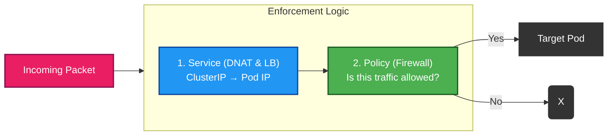

#### iptables (Legacy Standard)

* **What:** Uses the Linux kernel's built-in firewall lists. `kube-proxy` updates thousands of rules to redirect traffic.
* **Why:** It is the default, stable, and works on every Linux kernel.
* **Trade-off:** Gets slow at scale. If you have 10,000 Services, the kernel has to check a massive list of rules for every packet.

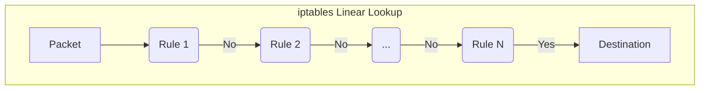

#### eBPF (Modern Approach)

* **What:** The CNI loads custom, programmable logic directly into the kernel. It uses efficient hash maps to look up destinations instantly.
* **Why:** Blazing fast at any scale and provides deep observability.
* **Trade-off:** Requires newer Linux kernels.

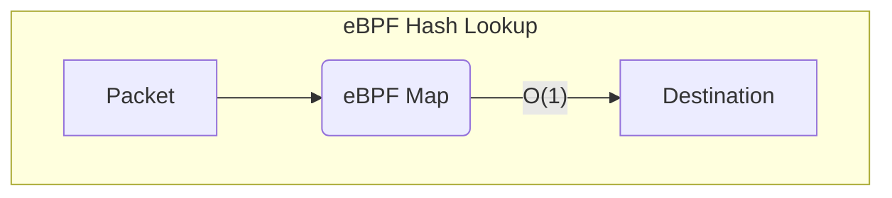

#### Which Service implementation am I using?

Check if `kube-proxy` is running or if your CNI has replaced it.

```bash
# Check if kube-proxy is running
$ kubectl get pods -n kube-system -l k8s-app=kube-proxy
# If you see pods: You are likely using iptables (or IPVS).
# If empty: Your CNI (like Cilium) may have replaced it with eBPF.

# If using Cilium, ask it directly:
$ cilium status | grep KubeProxyReplacement
# KubeProxyReplacement: Strict (eBPF is handling everything)
```

## 5. Why This Abstraction Matters

Understanding this universal pattern is crucial for the rest of our journey:

* **Services (Part 3):** Services assume that Pods already have routable IPs. They build load balancing *on top* of this foundation.
* **DNS (Part 4):** DNS relies on Services resolving to these reachable Pod IPs.
* **Debugging (Part 5):** Troubleshooting always starts at the Pod interface (`eth0`) and works outward. If the veth pair isn't working, nothing else matters.

## Summary

We have demystified the plumbing. We know that a CNI plugin is responsible for satisfying the "Golden Rules" and that it uses a standard **veth pair** pattern to connect Pods to the Node.

"Once you understand how a Pod connects to its node, everything else in Kubernetes networking becomes easier, regardless of which CNI your cluster uses."

## What's Next

At this point, Pods have IPs and can reach each other, but users don’t talk to Pods directly.

In **Part 3**, we’ll tackle the next big challenge: **Services**. Now that we have a flat network where Pods can communicate freely, we face a new problem: Pod IPs are ephemeral and change when Pods are rescheduled or restarted. How do we reliably route traffic to a moving target?

We’ll explore how **Services** and **kube-proxy** build on top of the CNI foundation to provide stable virtual IPs, service discovery, and load balancing.

## References

* **Kubernetes CNI:** [Network Plugins](https://kubernetes.io/docs/concepts/extend-kubernetes/compute-storage-net/network-plugins/)
* **CNI Specification:** [Container Network Interface (CNI)](https://github.com/containernetworking/cni)
* **Cilium:** [GitHub](https://github.com/cilium/cilium)
* **Calico:** [GitHub](https://github.com/projectcalico/calico)
* **eBPF:** [Documentation](https://docs.ebpf.io/)
* **iptables:** [netfilter.org](https://netfilter.org/projects/iptables/index.html)
* **VXLAN:** [RFC 7348](https://datatracker.ietf.org/doc/html/rfc7348)
* **IPIP:** [RFC 2003](https://datatracker.ietf.org/doc/html/rfc2003)
* **BGP:** [RFC 4271](https://datatracker.ietf.org/doc/html/rfc4271)

## Series Navigation

| [Part 1](/posts/kubernetes-networking-series-part-1/) | The Model | The IP-per-Pod model and Linux namespaces. |
| [Part 2](/posts/kubernetes-networking-series-part-2/) | CNI & Pod Networking | How CNI plugins build the Pod network. |
| [Part 3](/posts/kubernetes-networking-series-part-3/) | Services | Stable virtual IPs and in-cluster load balancing. |
| Part 4 | DNS | Name resolution and Service discovery. (Coming soon) |
| Part 5 | Debugging | Tracing packets and diagnosing network issues. (Coming soon) |
