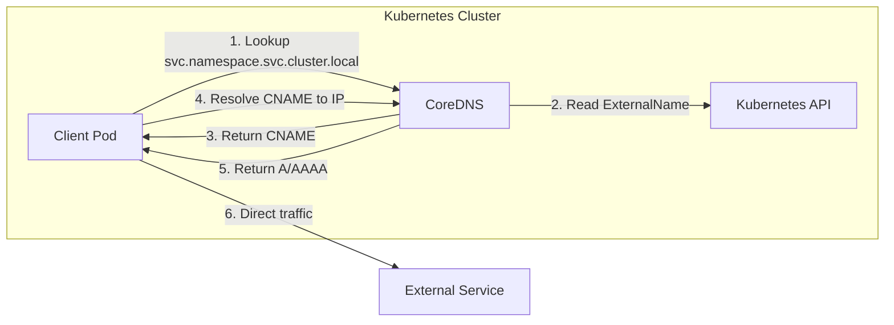

## Introduction

Welcome to **Part 3** of our Kubernetes Networking series.

In [Part 1](/posts/kubernetes-networking-series-part-1/), we defined the **Model**: every Pod gets an IP.
In [Part 2](/posts/kubernetes-networking-series-part-2/), we explored the **CNI**: how those IPs are assigned and how packets flow between Pods.

Now we face a new problem. Pods are ephemeral. They are designed to die. When a Deployment scales up or down, or when a Node fails, Pods are destroyed and recreated. Every time this happens, the new Pod gets a **new IP address**.

If you are a frontend application trying to talk to a backend API, how do you know which IP to connect to? You can't hardcode it. You can't manually update a config file every time a Pod restarts.

This is where **Services** come in.

## The Problem: Chasing Moving Targets

Imagine a backend deployment with 3 replicas.

* Pod A: `10.244.1.5`
* Pod B: `10.244.2.8`
* Pod C: `10.244.3.12`

**Pod IPs are ephemeral.** They die and change. If a client Pod tries to talk directly to another Pod’s IP, that IP may disappear when the Pod is rescheduled.

If Pod A crashes and is replaced by Pod D (`10.244.1.6`), the set of valid IPs changes. This constant **churn** is why we rarely treat Pod IPs as stable identities; we need another abstraction.

We need a **stable address** that doesn't change, regardless of what happens to the Pods underneath. We also need a way to **load balance** traffic across all healthy Pods.

## Kubernetes Services

A Kubernetes **Service** is an abstraction which defines a logical set of Pods and a policy by which to access them.

### Label Selectors

How does a Service know which Pods to send traffic to? It uses **Label Selectors**. When you define a Service, you specify a `selector` that matches the labels on your Pods.

```yaml
apiVersion: v1
kind: Service
metadata:
  name: my-backend
spec:
  selector:
    app: backend  # <--- This matches Pods with label "app: backend"
  ports:
    - protocol: TCP
      port: 80
      targetPort: 9376
```


The Service controller continuously scans for Pods that match `app: backend`. When it finds them, it adds their IPs to the list of valid endpoints.

### Endpoint Slices

In the early days, Kubernetes used an object called `Endpoints` to store this list of Pods IPs. However, as clusters grew, this became a bottleneck. If you had 5,000 Pods in a Service, updating the single `Endpoints` object every time one Pod changed was massive.

Enter **Endpoint Slices**.

Endpoint Slices split the list of backend IPs into smaller, manageable chunks (slices). This allows Kubernetes to scale to hundreds of thousands of Pods efficiently.

* **Service:** The stable front door.
* **EndpointSlice:** The dynamic list of backend IPs (the "targets").
* **Pod:** The actual workload.


> **Reference:** [EndpointSlices](https://kubernetes.io/docs/concepts/services-networking/endpoint-slices/)
{: .prompt-info }

### See it in action

You can inspect these slices yourself. Here is what the `kube-dns` EndpointSlice looks like:

```bash
$ kubectl get endpointslice -n kube-system -l k8s-app=kube-dns
NAME             ADDRESSTYPE   PORTS         ENDPOINTS               AGE
kube-dns-5j92n   IPv4          53,53,9153    10.244.0.3,10.244.0.4   45d
```

## ClusterIP vs. Pod IP

When you create a Service, Kubernetes assigns it a stable virtual IP address, known as the **ClusterIP**. This IP will not change for the lifecycle of the Service. It is crucial to understand the difference between ClusterIP and Pod IP:

| Feature | Pod IP (Normal IP) | ClusterIP (Virtual IP) |
| :--- | :--- | :--- |
| **Realism** | Real IP assigned to an interface (`eth0`). | **Virtual IP**. No interface has this IP. |
| **Reachability** | Pingable. Responds to ARP. | **Not pingable**. Does not respond to ARP. |
| **Lifecycle** | Ephemeral. Dies with the Pod. | Stable. Persists until Service is deleted. |
| **Implementation** | Configured by CNI. | Configured by **kube-proxy** (iptables/IPVS). |

### Demo: Why you can't ping a Service

Because the ClusterIP is a virtual IP implemented via iptables/IPVS rules (specifically for TCP/UDP), it does not respond to ICMP (ping) by default.

```bash
# 1. Curl works (TCP traffic is intercepted and DNATed to a backend Pod)
$ kubectl exec -it client-pod -- curl 10.96.0.100
{ "message": "Hello from Pod A!" }

# 2. Ping fails (There is no network interface with this IP to reply to ICMP)
$ kubectl exec -it client-pod -- ping 10.96.0.100
PING 10.96.0.100 (10.96.0.100): 56 data bytes
^C
--- 10.96.0.100 ping statistics ---
3 packets transmitted, 0 packets received, 100% packet loss
```

## NAT (Network Address Translation)

To understand Services, you must understand **NAT**. NAT is the process of modifying IP address information in packet headers while they are in transit.

There are two main types relevant to Kubernetes:

### 1. SNAT (Source NAT)

Changing the Sender:

* **What:** Replaces the *Source IP* of the packet.
* **Analogy:** A mailroom clerk crossing out your name on the envelope and writing the company's address. The recipient replies to the company, not you.
* **Kubernetes Use Case:** When a Pod talks to the Internet. The outside world sees the Node's IP, not the Pod's IP (Masquerading).


### 2. DNAT (Destination NAT)

Changing the Recipient:

* **What:** Replaces the *Destination IP* of the packet.
* **Analogy:** A forwarding service. You send a letter to a generic address "Support Team", and the mailroom rewrites it to "Alice at Desk 4".
* **Kubernetes Use Case:** **Services!** You send a packet to the Service IP (`10.96.0.100`), and Kubernetes rewrites it to a specific Pod IP (`10.244.1.5`).


### The Glue: Conntrack

You might wonder: "If the destination IP is changed from the Service IP to the Pod IP, how does the Pod know how to reply?"

The answer is **conntrack** (Connection Tracking).

The Linux kernel tracks every connection passing through it. When the DNAT happens, `conntrack` makes a note: "I changed packet X destined for 10.96.0.100 to 10.244.1.5".

When the Pod replies, it sends a packet back to the Client. The kernel sees this reply, looks up its table, and reverses the translation (SNAT). It changes the Source IP from the Pod IP back to the Service IP.

### See it in action

You can inspect the connection tracking table on a node to see these translations in real time.

```bash
# List connections (filtered by the Service IP)
$ conntrack -L -d 10.96.0.100
tcp      6 119 ESTABLISHED    src=10.244.1.5 dst=10.96.0.100 sport=43912 dport=80    src=10.244.2.8 dst=10.244.1.5 sport=80 dport=43912
    [ASSURED] mark=0 use=1
```

This single conntrack entry represents both directions of the same connection:

* **Original Direction:** (Client → Service): `src=10.244.1.5:43912 → dst=10.96.0.100:80` (Client Pod sends traffic to the Service ClusterIP)

* **Reply Direction:** (Backend Pod → Client): `src=10.244.2.8:80 → dst=10.244.1.5:43912` (Selected backend Pod replies directly to the client)

When the reply packet passes back through the node, the kernel uses this conntrack entry to reverse the DNAT, rewriting the source IP from the backend Pod (10.244.2.8) back to the Service IP (10.96.0.100).

**Result:** The client believes it is talking to the Service IP for the entire lifetime of the connection, without ever seeing the backend Pod IP.

## Kube-proxy

You might expect the ClusterIP to be assigned to a network interface somewhere. Surprisingly, **it is not**. If you SSH into a node and run `ip addr`, you won't find the ClusterIP.

**Kubernetes Services provide that stable front door:** a virtual IP that stays the same while backend Pods come and go.

The magic happens via **kube-proxy**, a component running on every node in the cluster. It watches the API Server for changes and programs the Linux kernel to intercept traffic destined for the ClusterIP.

**Kube-proxy implements this using Destination NAT (DNAT).** It rewrites the destination of packets from the Service IP to one of the backend Pod IPs. To the client, it feels like talking to one stable address; behind the scenes, packets are load balanced across healthy Pods.

There are two main modes for `kube-proxy`: **iptables** and **IPVS**.

### Mode 1: iptables (The Standard)

**What is iptables?**
`iptables` is a user-space utility program that allows a system administrator to configure the IP packet filter rules of the Linux kernel firewall. It organizes rules into **Chains** and **Tables**.

In this mode, `kube-proxy` writes thousands of iptables rules to handle routing.

**The Flow:**

1. A client Pod sends a packet to the Service IP (`10.96.0.100`).
2. The packet enters the Node’s network stack.
3. **Netfilter interception:**
   * For traffic originating on the node (Pods or host processes), DNAT occurs in the `nat/OUTPUT` chain.
   * For traffic arriving from another node, DNAT occurs in the `nat/PREROUTING` chain.
4. **DNAT (Destination NAT):** iptables matches the destination IP (`10.96.0.100`) and rewrites it to one of the backing Pod IPs (e.g., `10.244.1.5`).
   * *Note: In iptables mode, kube-proxy uses the `statistic` module to probabilistically select a backend Pod.*
5. The packet is then routed to the selected Pod IP.

**Visualizing Cross-Node Communication:**
Even if the destination Pod is on a different Node, the DNAT happens on the *source* Node.


**Pros:** Built-in to every Linux kernel. Stable.
**Cons:** Performance degrades with thousands of Services. Updating rules is slow (O(N)).

### Mode 2: IPVS (The Scalable Choice)

**What is IPVS?**
**IPVS (IP Virtual Server)** is a transport-layer load balancer built directly into the Linux kernel. It is designed specifically for load balancing, unlike iptables which is a firewall.

**Why is it better?**

1. **Data Structures:** IPVS uses **Hash Tables** instead of linear lists. Looking up a service is O(1) (constant time), whereas iptables is O(N).
2. **Load Balancing Algorithms:** IPVS supports sophisticated algorithms like Least Connections, Locality, and Weighted Round Robin. iptables only supports random.
3. **Health Checks:** IPVS has better mechanisms for backend health.

If you are running a large cluster (1000+ Services), you should be using IPVS mode.

### Can we get rid of kube-proxy? (CNI Replacement)

Yes! Modern CNI plugins like **Cilium** can replace `kube-proxy` entirely using **eBPF**.

Instead of using slow iptables rules or managing IPVS, eBPF programs run directly in the kernel to handle the load balancing. This is significantly faster and more scalable.

* **How it works:** The CNI watches for Service updates and updates eBPF maps (hash tables) in the kernel.
* **Benefit:** O(1) lookups, better visibility, and no need to run the `kube-proxy` component.
* **Constraint:** Kube-proxy replacement works only when the CNI owns the entire datapath — meaning it is responsible for Service load balancing, routing, and policy enforcement, rather than relying on iptables or IPVS.

> **Reference:** [Cilium Kube-Proxy Replacement](https://docs.cilium.io/en/stable/network/kubernetes/kubeproxy-free/)

## Service Types

Kubernetes Services come in different flavors depending on where you want to expose your application.

### 1. ClusterIP (Default)

This is the default Service type. It exposes the Service on a cluster-internal IP. Choosing this value makes the Service only reachable from within the cluster. It is the foundation for internal microservice communication.


### 2. NodePort

This type exposes the Service on each Node's IP at a static port (the NodePort). A ClusterIP Service is automatically created, and the NodePort routes to it. You can contact the Service from outside the cluster by requesting `<NodeIP>:<NodePort>`. It is often used for quick testing or allowing external load balancers to route to Nodes.


### 3. LoadBalancer

This type exposes the Service externally using a cloud provider's load balancer. It automatically creates a NodePort and ClusterIP service, and then configures the cloud (AWS, Azure, GCP) to route traffic to those NodePorts. This is the standard way to expose a production application to the internet.


### 4. ExternalName

This type maps a Service name to the value of the `externalName` field (for example `foo.bar.example.com`) by having cluster DNS return a **CNAME** record. Kubernetes does not create a ClusterIP, Endpoints, or any data-plane proxying.

From the Pod’s point of view, this looks like a normal Service name, but after DNS resolution it connects directly to the external destination.

> Note: Because `ExternalName` is DNS-only, the Pod first receives a **CNAME**, then resolves that hostname to an IP address (A/AAAA record), and only then opens a connection.



## Putting it all together: The Life of a Packet

Now that we have covered Pods, CNIs, and Services, let's trace the full journey of a packet from Pod A to Service B.

**Scenario:** Pod A (Node 1) sends a request to Service B (ClusterIP). Service B is backed by Pod B (Node 2).


1. **Pod A** sends a packet to the Service IP.
2. **Node 1 Kernel** intercepts the packet (`nat/OUTPUT`).
3. **DNAT** changes the destination to Pod B's real IP.
4. **Routing** determines Pod B is on Node 2.
5. **CNI** encapsulates or routes the packet across the physical network.
6. **Node 2 Kernel** receives the packet and forwards it to Pod B's veth interface.
7. **Pod B** receives the packet.

## References

* **Kubernetes Services:** [Official Documentation](https://kubernetes.io/docs/concepts/services-networking/service/)
* **Endpoint Slices:** [Official Documentation](https://kubernetes.io/docs/concepts/services-networking/endpoint-slices/)
* **Kube-proxy:** [Reference](https://kubernetes.io/docs/reference/command-line-tools-reference/kube-proxy/)
* **IPVS vs. Iptables:** [Deep Dive Blog](https://kubernetes.io/blog/2018/07/09/ipvs-based-in-cluster-load-balancing-deep-dive/)
* **Netfilter/Iptables:** [Project Homepage](https://netfilter.org/projects/iptables/index.html)
* **IPVS:** [Official Documentation](https://kb.linuxvirtualserver.org/wiki/IPVS)
* **Cilium:** [Kube-Proxy Replacement](https://docs.cilium.io/en/stable/network/kubernetes/kubeproxy-free/)
* **Conntrack:** [Conntrack tools](https://conntrack-tools.netfilter.org/)

## Summary

* **Pods are ephemeral; Services are stable.**
* **ClusterIP** is a virtual IP that exists only as routing rules (iptables/IPVS).
* **IPVS** is the high-performance alternative to iptables for large clusters.
* **kube-proxy** is the agent that keeps these rules up to date on every node.

In **Part 4**, we will look at how we find these Services by name using **DNS**, completing the mental model of how applications talk to each other.

## Series Navigation

| [Part 1](/posts/kubernetes-networking-series-part-1/) | The Model | The IP-per-Pod model and Linux namespaces. |
| [Part 2](/posts/kubernetes-networking-series-part-2/) | CNI & Pod Networking | How CNI plugins build the Pod network. |
| **[Part 3](/posts/kubernetes-networking-series-part-3/)** | Services | Stable virtual IPs and in-cluster load balancing. |
| Part 4 | DNS | Name resolution and Service discovery. (Coming soon) |
| Part 5 | Debugging | Tracing packets and diagnosing network issues. (Coming soon) |
