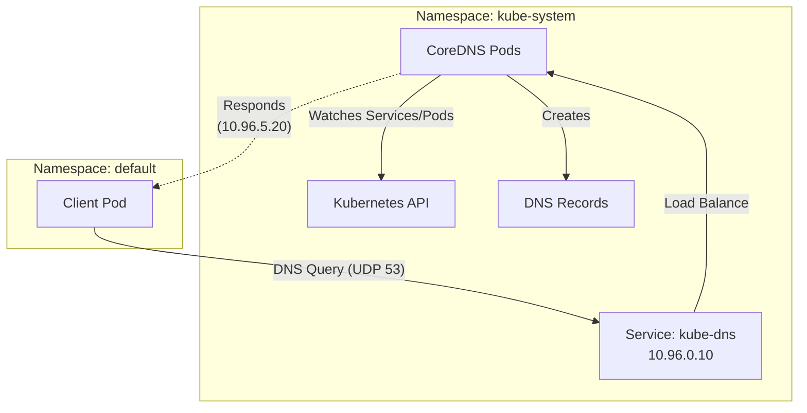
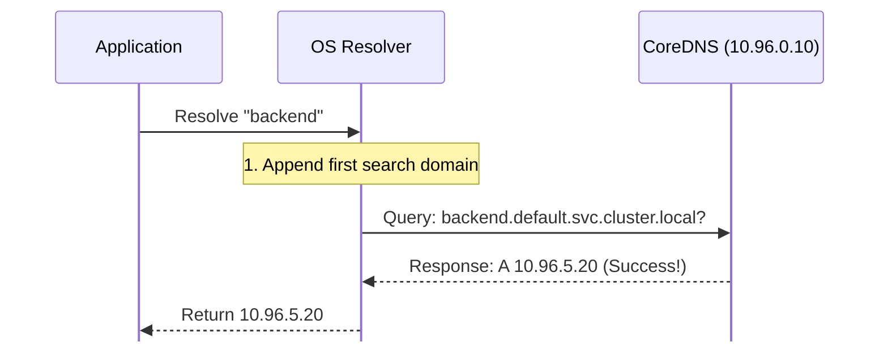
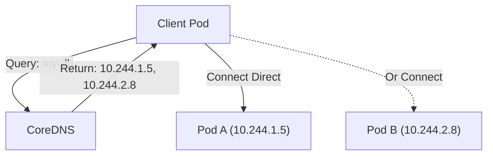
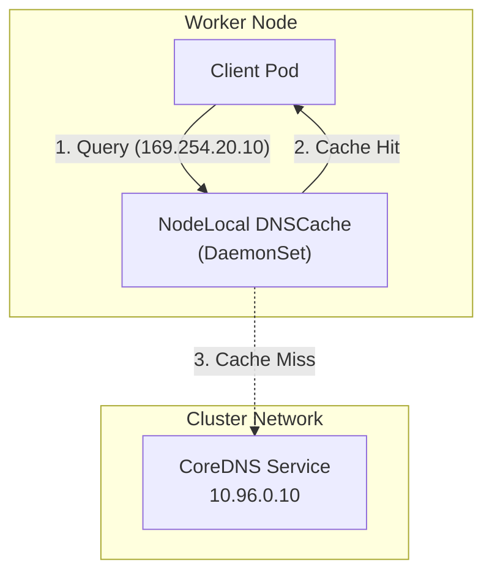

## Introduction

Welcome to **Part 4** of our Kubernetes Networking series.

So far, we have built a solid foundation:

* [Part 1](/posts/kubernetes-networking-series-part-1/): Every Pod gets a unique IP.
* [Part 2](/posts/kubernetes-networking-series-part-2/): CNI plugins connect these Pods.
* [Part 3](/posts/kubernetes-networking-series-part-3/): Services provide stable Virtual IPs for ephemeral Pods.

We have solved the connectivity problem, but we have a usability problem.

In Part 3, we learned that a Service gets a stable IP like `10.96.0.100`. But as a developer, do you want to hardcode `10.96.0.100` into your application config? Probably not. You want to call your backend `my-backend` or `database`.

This is where **DNS (Domain Name System)** comes in. It acts as the cluster's phonebook, translating human-readable names into the IP addresses we discussed in the previous parts.

## 1. The Cluster DNS Architecture: CoreDNS

Every standard Kubernetes cluster comes with a built-in DNS server, usually **CoreDNS**.

**CoreDNS** is a graduated CNCF project. It is a flexible, extensible DNS server that serves as the Service Discovery mechanism for Kubernetes.

It is not magic; it is just another Kubernetes application.

* **Deployment:** It runs as a Deployment (usually 2 replicas for high availability).
* **Service:** It is exposed via a Service named `kube-dns` in the `kube-system` namespace.
* **Config:** It is configured via a ConfigMap named `coredns`.

Its job is simple: watch the Kubernetes API for new Services and Pods, and create DNS records for them.



## 2. The Client Side: Inside the Pod

How does a Pod know *where* to send DNS queries? The Kubelet configures it automatically.

When a Pod starts, the Kubelet populates its `/etc/resolv.conf` file. If you `exec` into a Pod, you will see something like this:

```bash
$ kubectl exec -it my-pod -- cat /etc/resolv.conf
nameserver 10.96.0.10
search default.svc.cluster.local svc.cluster.local cluster.local
options ndots:5
```

Let's break down these critical lines:

1. **`nameserver 10.96.0.10`**: This is the ClusterIP of the `kube-dns` Service. All queries are sent here.
2. **`search ...`**: These are **search domains**. They allow you to use short names (like `my-svc`) instead of the full name (`my-svc.default.svc.cluster.local`).
3. **`options ndots:5`**: This setting controls when the search domains are applied. It is a common source of performance issues (more on this later).

## 3. The Resolution Process

What actually happens when your application tries to connect to `http://backend`?

Because `backend` has fewer than 5 dots (see `ndots:5`), the OS resolver doesn't query `backend` directly. It iterates through the **search domains** defined in `/etc/resolv.conf` until it finds a match.

**Scenario:** A Pod in namespace `default` tries to resolve `backend`.



If the first attempt fails (e.g., you are trying to reach `google.com`), the resolver continues down the list:

1. `google.com.default.svc.cluster.local`? -> NXDOMAIN
2. `google.com.svc.cluster.local`? -> NXDOMAIN
3. `google.com.cluster.local`? -> NXDOMAIN
4. `google.com`? -> Success!

## 4. Service Discovery Records

CoreDNS creates different types of records depending on the Kubernetes object.

### 4.1. Standard Services (ClusterIP)

This is the most common scenario. The DNS name resolves to the **Service ClusterIP**.

* **Name:** `my-svc.default.svc.cluster.local`
* **Record Type:** `A`
* **Result:** `10.96.0.100` (The Virtual IP)

Traffic flows: Pod -> Service IP -> (iptables/IPVS) -> Backend Pod.

### 4.2. Headless Services (Direct Pod IPs)

Sometimes, you don't want load balancing. You want to talk to a specific Pod directly (e.g., for database replication). You achieve this by setting `clusterIP: None` in the Service YAML.

* **Name:** `my-db.default.svc.cluster.local`
* **Record Type:** `A`
* **Result:** `10.244.1.5`, `10.244.2.8` (The actual Pod IPs)

CoreDNS returns **multiple A records**, one for each healthy Pod. The client can then choose which IP to connect to.



### 4.3. Service (SRV) Records

Often overlooked, Kubernetes also creates **Service (SRV)** records for named ports. An SRV record is a type of DNS record that specifies the hostname and port number of servers for a specified service. This is useful if you need to discover the port number dynamically.

* **Format:** `_[port-name]._[protocol].[service].[ns].svc.cluster.local`
* **Example:** `_http._tcp.my-svc.default.svc.cluster.local`

## 5. CoreDNS Performance and Scale

DNS is often the first thing to break at scale. As your cluster grows, the centralized CoreDNS Deployment can become a bottleneck.

### 5.1. The "ndots:5" Performance Trap

You might wonder: *"Why does Kubernetes default to `ndots:5`?"*

It ensures that if you use a name like `a.b.c`, it is treated as internal first. However, this means that **every external domain lookup** (like `google.com`) triggers multiple failed DNS queries before finally resolving the absolute name.

**The Cost:**
Resolving `google.com` generates **4 queries** (3 failed internal searches + 1 success). In high-traffic applications, this can overwhelm CoreDNS.

**The Fix:**
If you are calling external domains frequently, end them with a dot (FQDN) to bypass the search path:
`http://google.com.` (Note the trailing dot).

### 5.2. NodeLocal DNSCache

In large clusters, sending every DNS query across the network to a central CoreDNS Service has two major downsides:

1. **Latency:** Every lookup requires a network hop.
2. **Conntrack Exhaustion:** UDP DNS queries create entries in the Linux conntrack table. High DNS volume can fill this table, causing packet drops.

**NodeLocal DNSCache** is an add-on that runs a DNS caching agent on **every node** (as a DaemonSet).

* **How it works:** It injects a special IP (link-local) into the Pod's `/etc/resolv.conf`.
* **The Flow:** Pod -> Local Agent (on same node) -> CoreDNS (only on cache miss).
* **The Benefit:** Most queries are served locally with <1ms latency, and it bypasses the conntrack table for TCP upgrades, significantly improving stability at scale.



## 6. Debugging DNS

When DNS breaks, it's usually one of three things:

1. **Network:** The Pod cannot reach CoreDNS (check Network Policies).
2. **CoreDNS:** The CoreDNS Pods are down or crashing.
3. **Config:** The Service name or Namespace is wrong.

**The "dnstools" Pattern:**
Don't rely on your application container to debug. Run a dedicated debug pod with tools like `nslookup` and `dig`.

```bash
# 1. Run a temporary debug pod
$ kubectl run -it --rm --restart=Never --image=infoblox/dnstools:latest dns-debug

# 2. Test resolving a Service (Short name)
dnstools# nslookup my-service
# Should return the ClusterIP

# 3. Test resolving a Service (FQDN)
dnstools# nslookup my-service.default.svc.cluster.local

# 4. Test external resolution
dnstools# nslookup google.com
```

## Summary

* **CoreDNS** is the cluster's phonebook, translating names to IPs.
* **`/etc/resolv.conf`** is injected by the Kubelet and controls the search path.
* **Services** get DNS names automatically: `service.namespace.svc.cluster.local`.
* **Standard Services** resolve to a stable ClusterIP.
* **Headless Services** resolve directly to Pod IPs.
* **`ndots:5`** can cause performance issues with external domains; use FQDNs (trailing dot) to optimize.

In **Part 5**, we will wrap up the series by looking at **Debugging**. We will learn how to use tools like `kubectl debug`, `tcpdump`, and `bpftrace` to see the actual packets flowing through the pipes we've built.

## References

* **CoreDNS:** [Official Site](https://coredns.io/)
* **Kubernetes DNS:** [Official Documentation](https://kubernetes.io/docs/concepts/services-networking/dns-pod-service/)
* **Debugging DNS:** [Kubernetes Guide](https://kubernetes.io/docs/tasks/administer-cluster/dns-debugging-resolution/)
* **NodeLocal DNSCache:** [Official Documentation](https://kubernetes.io/docs/tasks/administer-cluster/nodelocaldns/)


