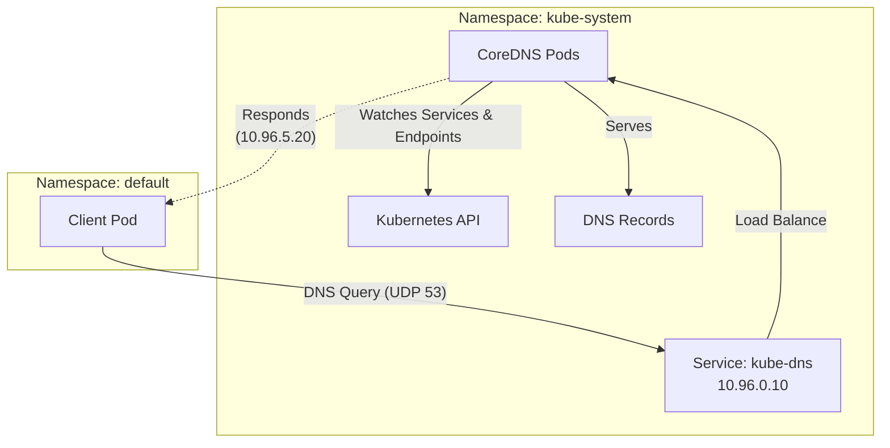
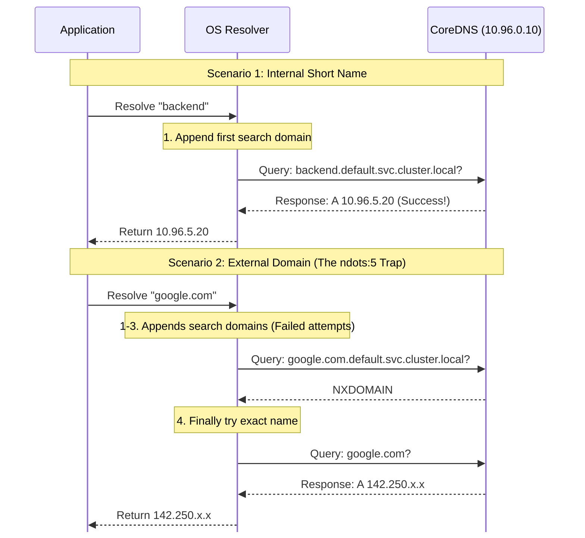
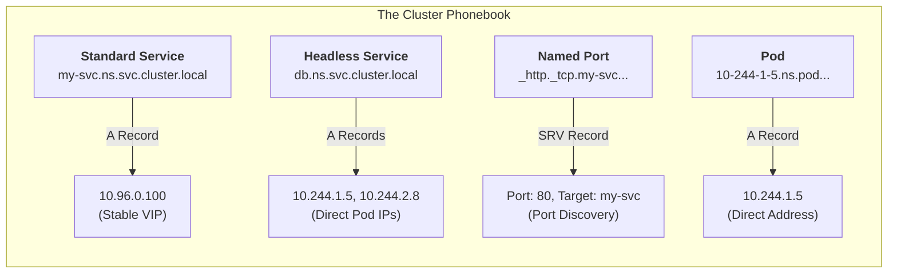
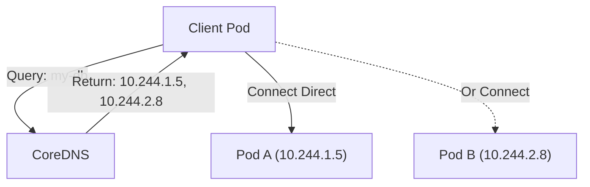
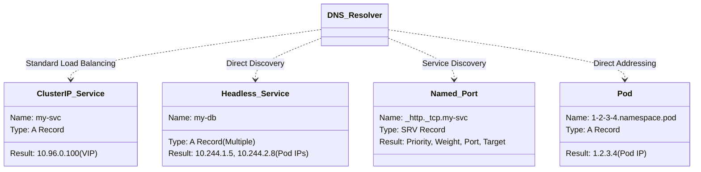
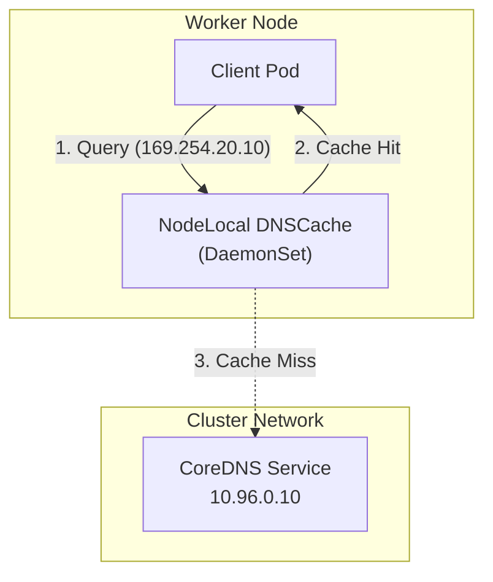

## Introduction

Welcome to **Part 4** of our Kubernetes Networking series.

So far, we have built a solid foundation:

* [Part 1](/posts/kubernetes-networking-series-part-1/): Every Pod gets a unique IP.
* [Part 2](/posts/kubernetes-networking-series-part-2/): CNI plugins connect these Pods.
* [Part 3](/posts/kubernetes-networking-series-part-3/): Services provide stable Virtual IPs for ephemeral Pods.

We have solved the connectivity problem, but we have a usability problem.

In Part 3, we learned that a Service gets a stable IP like `10.96.0.100`. But as a developer, do you want to hardcode `10.96.0.100` into your application config? Probably not. You want to call your backend `my-backend` or `database`.

This is where **DNS (Domain Name System)** comes in. It acts as the cluster's phonebook, translating human-readable names into the IP addresses we discussed in the previous parts. DNS does not replace Services; it makes Service abstractions usable by humans.

## 1. The Cluster DNS Architecture: CoreDNS

Every standard Kubernetes cluster comes with a built-in DNS server, usually **CoreDNS**.

**CoreDNS** is a graduated CNCF project. It is a flexible, extensible DNS server that serves as the Service Discovery mechanism for Kubernetes.

It is not magic; it is just another Kubernetes application.

* **Deployment:** It runs as a Deployment (usually 2 replicas for high availability).
* **Service:** It is exposed via a Service named `kube-dns` in the `kube-system` namespace.
* **Config:** It is configured via a ConfigMap named `coredns`.

> **Pro Tip:** In the `coredns` ConfigMap, the line `forward . /etc/resolv.conf` tells CoreDNS to forward any queries it can't resolve to the upstream resolvers listed in its own `/etc/resolv.conf` (typically the node’s DNS configuration).

Its job is simple: watch the Kubernetes API for Services and their associated Endpoints / EndpointSlices, and dynamically serve DNS records for them.


```mermaid
graph TB
    subgraph KubeSystem [Namespace: kube-system]
        API[Kubernetes API]
        CoreDNS[CoreDNS Pods]
        Records[DNS Records]
        Svc[Service: kube-dns<br>10.96.0.10]
    end
    
    subgraph UserNS [Namespace: default]
        Client[Client Pod]
    end

    CoreDNS -- "Watches Services & Endpoints" --> API
    CoreDNS -- "Serves" --> Records
    Client -- "DNS Query (UDP 53)" --> Svc
    Svc -- "Load Balance" --> CoreDNS
    CoreDNS -. "Responds<br>(10.96.5.20)" .-> Client
```

## 2. The Client Side: Inside the Pod

How does a Pod know *where* to send DNS queries? The Kubelet configures it automatically.

When a Pod starts, the Kubelet populates its `/etc/resolv.conf` file. If you `exec` into a Pod, you will see something like this:

```bash
$ kubectl exec -it my-pod -- cat /etc/resolv.conf
nameserver 10.96.0.10
search default.svc.cluster.local svc.cluster.local cluster.local
options ndots:5
```

Let's break down these critical lines:

1. **`nameserver 10.96.0.10`**: This is the ClusterIP of the `kube-dns` Service. All queries are sent here.
2. **`search ...`**: These are **search domains**. They allow you to use short names (like `my-svc`) instead of the full name (`my-svc.default.svc.cluster.local`).
3. **`options ndots:5`**: This setting controls when the search domains are applied. It is a common source of performance issues (more on this later).

These configurations are generated by the Kubelet from cluster defaults and the Pod's DNS settings, based on cluster-wide flags (`--cluster-domain`, `--cluster-dns`) and can be overridden by the Pod's `dnsPolicy` and `dnsConfig`.

## 3. The Resolution Process

What actually happens when your application tries to connect to `http://backend`?

Because `backend` has fewer than 5 dots (see `ndots:5`), the OS resolver doesn't query `backend` directly. It iterates through the **search domains** defined in `/etc/resolv.conf` until it finds a match.

**Scenario:** A Pod in namespace `default` tries to resolve `backend`.


```mermaid
%%{init: {'sequence': {'mirrorActors': false}}}%%
sequenceDiagram
    participant App as Application
    participant OS as OS Resolver
    participant DNS as CoreDNS (10.96.0.10)

    Note over App, DNS: Scenario 1: Internal Short Name
    App->>OS: Resolve "backend"
    Note over OS: 1. Append first search domain
    OS->>DNS: Query: backend.default.svc.cluster.local?
    DNS-->>OS: Response: A 10.96.5.20 (Success!)
    OS-->>App: Return 10.96.5.20

    Note over App, DNS: Scenario 2: External Domain (The ndots:5 Trap)
    App->>OS: Resolve "google.com"
    Note over OS: 1-3. Appends search domains (Failed attempts)
    OS->>DNS: Query: google.com.default.svc.cluster.local?
    DNS-->>OS: NXDOMAIN
    Note over OS: 4. Finally try exact name
    OS->>DNS: Query: google.com?
    DNS-->>OS: Response: A 142.250.x.x
    OS-->>App: Return 142.250.x.x
```

If the first attempt fails (e.g., you are trying to reach `google.com`), the resolver continues down the list:

1. `google.com.default.svc.cluster.local`? -> NXDOMAIN
2. `google.com.svc.cluster.local`? -> NXDOMAIN
3. `google.com.cluster.local`? -> NXDOMAIN
4. `google.com`? -> Success!

## 4. Service Discovery Records

CoreDNS serves different DNS records depending on the Kubernetes object. Think of it as a phonebook with different sections.


```mermaid
graph LR
    subgraph Phonebook ["The Cluster Phonebook"]
        direction TB
        
        S1["<b>Standard Service</b><br>my-svc.ns.svc.cluster.local"] -->|A Record| R1["10.96.0.100<br>(Stable VIP)"]
        S2["<b>Headless Service</b><br>db.ns.svc.cluster.local"] -->|A Records| R2["10.244.1.5, 10.244.2.8<br>(Direct Pod IPs)"]
        S3["<b>Named Port</b><br>_http._tcp.my-svc..."] -->|SRV Record| R3["Port: 80, Target: my-svc<br>(Port Discovery)"]
        S4["<b>Pod</b><br>10-244-1-5.ns.pod..."] -->|A Record| R4["10.244.1.5<br>(Direct Address)"]
    end
```

### 4.1. Standard Services (ClusterIP)

This is the most common scenario. The DNS name resolves to the **Service ClusterIP**.

* **Name:** `my-svc.default.svc.cluster.local`
* **Record Type:** `A`
* **Result:** `10.96.0.100` (The ClusterIP)

Traffic flows: Pod -> Service IP -> (iptables/IPVS) -> Backend Pod.

### 4.2. Headless Services (Direct Pod IPs)

Sometimes, you don't want load balancing. You want to talk to a specific Pod directly, common for stateful workloads like MongoDB or Kafka. By setting `clusterIP: None`, CoreDNS doesn't return a single ClusterIP; it returns the full list of `A` records for all ready Endpoints backing the Service.

* **Name:** `my-db.default.svc.cluster.local`
* **Record Type:** `A`
* **Result:** `10.244.1.5`, `10.244.2.8` (The actual Pod IPs)

The client can then choose which IP to connect to.


```mermaid
graph TB
    Client[Client Pod]
    DNS[CoreDNS]
    
    Client -- "Query: my-db" --> DNS
    DNS -- "Return: 10.244.1.5, 10.244.2.8" --> Client
    
    Client -- "Connect Direct" --> P1["Pod A (10.244.1.5)"]
    Client -. "Or Connect" .-> P2["Pod B (10.244.2.8)"]
```

**Example:** Verifying a Headless Service

If we create a Headless Service for a three-replica StatefulSet, we can see exactly how CoreDNS responds differently than a standard Service.

```yaml
# A Headless Service (clusterIP: None)
apiVersion: v1
kind: Service
metadata:
  name: my-db
spec:
  clusterIP: None
  selector:
    app: database
  ports:
    - protocol: TCP
      port: 5432
```

Using `dig` from a debug pod, we can see the multiple `A` records returned:

```bash
# Querying a headless service returns all Pod IPs directly
dnstools# dig +short my-db.default.svc.cluster.local
10.244.1.5
10.244.2.8
10.244.3.12
```

In contrast, if this were a **Standard Service**, that same command would only return one IP: the **ClusterIP** (e.g., `10.96.0.100`).

### 4.3. Service (SRV) Records

Often overlooked, Kubernetes also creates **Service (SRV)** records for named ports. An SRV record is a type of DNS record that specifies the hostname and port number of servers for a specified service. This is useful if you need to discover the port number dynamically.

> **Note:** Most standard application libraries (like `curl` or `requests`) only look up `A` or `AAAA` records and won't use `SRV` records automatically. You typically need specialized client code to leverage them.

* **Format:** `_[port-name]._[protocol].[service].[ns].svc.cluster.local`
* **Example:** `_http._tcp.my-svc.default.svc.cluster.local`

### 4.4. Pod DNS Records

Pods also get their own DNS records, typically in the format `10-244-1-5.default.pod.cluster.local` (IP address with dashes). While rarely used directly compared to Services, they allow addressing individual Pods by name without a Headless Service.

### Summary of DNS Record Types

Here is a visual summary of how different Kubernetes objects map to DNS records:


```mermaid
classDiagram
    class ClusterIP_Service {
        Name: my-svc
        Type: A Record
        Result: 10.96.0.100 (VIP)
    }
    class Headless_Service {
        Name: my-db
        Type: A Record (Multiple)
        Result: 10.244.1.5, 10.244.2.8 (Pod IPs)
    }
    class Named_Port {
        Name: _http._tcp.my-svc
        Type: SRV Record
        Result: Priority, Weight, Port, Target
    }
    class Pod {
        Name: 1-2-3-4.namespace.pod
        Type: A Record
        Result: 1.2.3.4 (Pod IP)
    }

    DNS_Resolver ..> ClusterIP_Service : Standard Load Balancing
    DNS_Resolver ..> Headless_Service : Direct Discovery
    DNS_Resolver ..> Named_Port : Service Discovery
    DNS_Resolver ..> Pod : Direct Addressing
```

## 5. CoreDNS Performance and Scale

DNS is often the first thing to break at scale. As your cluster grows, the centralized CoreDNS Deployment can become a bottleneck.

### 5.1. The "ndots:5" Performance Trap

You might wonder: *"Why does Kubernetes default to `ndots:5`?"*

The `ndots:5` setting means: "If a name has fewer than 5 dots, try searching the internal cluster domains first." This allows for complex nested DNS names within the cluster to be resolvable via short names.

**The Cost:**
When you look up external domains like `api.github.com` (2 dots), the resolver first tries to find it inside the cluster: `api.github.com.default.svc.cluster.local`. CoreDNS returns `NXDOMAIN` (Not Found), and the resolver tries the next search domain. This creates unnecessary "DNS noise" and latency before finally resolving the absolute name.

| Attempt | Query Name | Result |
|---|---|---|
| 1 | `google.com.default.svc.cluster.local` | NXDOMAIN |
| 2 | `google.com.svc.cluster.local` | NXDOMAIN |
| 3 | `google.com.cluster.local` | NXDOMAIN |
| 4 | `google.com` | SUCCESS |

**The Fix:**
If you are calling external domains frequently, end them with a dot (FQDN) to bypass the search path:
`http://google.com.` (Note the trailing dot).

### 5.2. NodeLocal DNSCache

In large clusters, sending every DNS query across the network to a central CoreDNS Service has two major downsides:

1. **Latency:** Every lookup requires a network hop.
2. **Conntrack Exhaustion:** UDP DNS queries create entries in the Linux conntrack table. High DNS volume can fill this table, causing packet drops.

**NodeLocal DNSCache** is an add-on that runs a DNS caching agent on **every node** (as a DaemonSet).

* **How it works:** It injects a special IP (link-local) into the Pod's `/etc/resolv.conf`.
* **The Flow:** Pod -> Local Agent (on same node) -> CoreDNS (only on cache miss).
* **The Benefit:** Most queries are served locally with <1ms latency, and it significantly reduces conntrack pressure and DNS-related packet drops, greatly improving stability at scale.


```mermaid
graph TB
    subgraph Node [Worker Node]
        Pod[Client Pod]
        LocalDNS["NodeLocal DNSCache<br>(DaemonSet)"]
    end
    
    subgraph Cluster [Cluster Network]
        CoreDNS["CoreDNS Service<br>10.96.0.10"]
    end

    Pod -- "1. Query (169.254.20.10)" --> LocalDNS
    LocalDNS -- "2. Cache Hit" --> Pod
    LocalDNS -. "3. Cache Miss" .-> CoreDNS
```

## 6. Debugging DNS

When DNS breaks, it's usually one of three things:

1. **Network:** The Pod cannot reach CoreDNS (check Network Policies).
2. **CoreDNS:** The CoreDNS Pods are down or crashing.
3. **Config:** The Service name or Namespace is wrong.

**The "dnstools" Pattern:**
Don't rely on your application container to debug. Run a dedicated debug pod with tools like `nslookup` and `dig`.

```bash
# Run a temporary debug pod
$ kubectl run -it --rm --restart=Never --image=infoblox/dnstools:latest dns-debug
```

Once inside the pod, you can run your queries:

```bash
# Test resolving a Service (Short name)
dnstools# nslookup my-service
# Should return the ClusterIP

# Test resolving a Service (FQDN)
dnstools# nslookup my-service.default.svc.cluster.local

# Test external resolution
dnstools# nslookup google.com
```

## Summary

* **The Cluster DNS Architecture:** CoreDNS acts as the cluster's phonebook, translating names to IPs.
* **The Client Side:** The `/etc/resolv.conf` file is injected by the Kubelet and controls the search path inside the Pod.
* **The Resolution Process:** The OS resolver iterates through search domains until it finds a match.
* **Service Discovery Records:** Services resolve to a stable ClusterIP (Standard) or directly to Pod IPs (Headless).
* **CoreDNS Performance and Scale:** `ndots:5` can cause latency; use FQDNs (trailing dots) or NodeLocal DNSCache to optimize.
* **Debugging DNS:** Diagnose issues by checking Network Policies, CoreDNS health, and Service configuration.

In **Part 5**, we will wrap up the series by looking at **Debugging**. We will learn how to use tools like `kubectl debug`, `tcpdump`, and `bpftrace` to see the actual packets flowing through the networking primitives we’ve built so far.

## References

* **CoreDNS:** [Official Site](https://coredns.io/)
* **Kubernetes DNS:** [Official Documentation](https://kubernetes.io/docs/concepts/services-networking/dns-pod-service/)
* **Services:** [Official Documentation](https://kubernetes.io/docs/concepts/services-networking/service/)
* **EndpointSlices:** [Official Documentation](https://kubernetes.io/docs/concepts/services-networking/endpoint-slices/)
* **Network Policies:** [Official Documentation](https://kubernetes.io/docs/concepts/services-networking/network-policies/)
* **NodeLocal DNSCache:** [Official Documentation](https://kubernetes.io/docs/tasks/administer-cluster/nodelocaldns/)
* **Deployments:** [Official Documentation](https://kubernetes.io/docs/concepts/workloads/controllers/deployment/)
* **DaemonSets:** [Official Documentation](https://kubernetes.io/docs/concepts/workloads/controllers/daemonset/)
* **StatefulSets:** [Official Documentation](https://kubernetes.io/docs/concepts/workloads/controllers/statefulset/)
* **ConfigMaps:** [Official Documentation](https://kubernetes.io/docs/concepts/configuration/configmap/)
* **Namespaces:** [Official Documentation](https://kubernetes.io/docs/concepts/overview/working-with-objects/namespaces/)
* **Kubelet:** [Official Documentation](https://kubernetes.io/docs/reference/command-line-tools-reference/kubelet/)
* **Debugging DNS:** [Kubernetes Guide](https://kubernetes.io/docs/tasks/administer-cluster/dns-debugging-resolution/)

## Series Navigation

| [Part 1](/posts/kubernetes-networking-series-part-1/) | The Model | The IP-per-Pod model and Linux namespaces. |
| [Part 2](/posts/kubernetes-networking-series-part-2/) | CNI & Pod Networking | How CNI plugins build the Pod network. |
| [Part 3](/posts/kubernetes-networking-series-part-3/) | Services | Stable virtual IPs and in-cluster load balancing. |
| **[Part 4](/posts/kubernetes-networking-series-part-4/)** | DNS | Name resolution and Service discovery. |
| Part 5 | Debugging | Tracing packets and diagnosing network issues. (Coming soon) |
