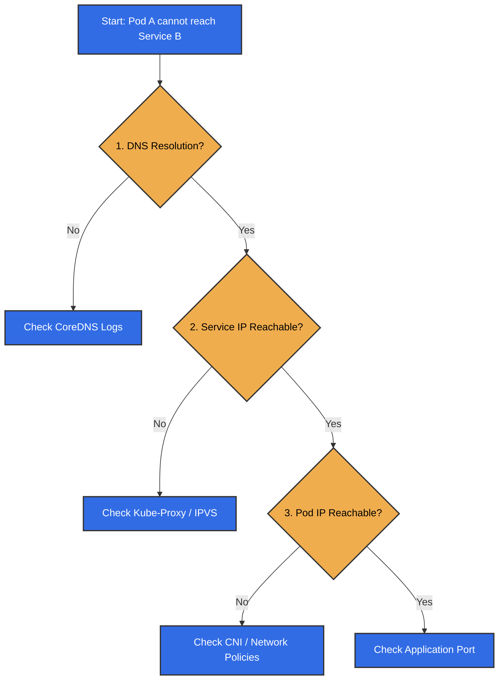

## Introduction

Welcome to **Part 5**, the final chapter of our Kubernetes Networking series.

We have journeyed through the entire stack:

* [Part 1](/posts/kubernetes-networking-series-part-1/): The **Model** (IP-per-Pod).
* [Part 2](/posts/kubernetes-networking-series-part-2/): The **CNI** (Plumbing).
* [Part 3](/posts/kubernetes-networking-series-part-3/): **Services** (Stable IPs).
* [Part 4](/posts/kubernetes-networking-series-part-4/): **DNS** (Service Discovery).

Now, we answer the most important question: **"Why can't my Pod connect to the database?"**

When networking breaks in Kubernetes, it can feel overwhelming. But because we now understand the layers, we can troubleshoot systematically.

## The Debugging Flow: Top-Down

The best way to debug is to follow the packet's journey. I recommend a **Top-Down** approach:



## The Tool: Ephemeral Containers

In the past, we had to install debugging tools like `curl` or `tcpdump` into our production images. This is bad practice (security risk, larger images).

Today, we use **Ephemeral Containers**. This feature allows you to attach a "debug sidecar" to a running Pod without restarting it.

We will use the `netshoot` image, which comes pre-loaded with all the tools we need (`tcpdump`, `ip`, `curl`, `nslookup`, `iptables`, etc.).

```bash
# Attach a debug container to a running pod
kubectl debug -it <target-pod> --image=nicolaka/netshoot --target=<target-container>
```

This drops you into a shell sharing the **network namespace** of the target Pod. You see exactly what the Pod sees.

## Section 1: Debugging Pod Connectivity (The Foundation)

Before checking DNS or Services, verify the basics. Can the Pod talk to the network?

### 1. Check Interfaces and IPs

Inside the debug shell, run:

```bash
ip addr show
```

**What to look for:**

* **`eth0`:** Does it exist?
* **IP Address:** Does it match what `kubectl get pod -o wide` says?

**How to Fix:**

* **Missing Interface/IP:** This is a CNI failure. Check the logs of your CNI pods (e.g., `calico-node`, `cilium-agent`) in the `kube-system` namespace. The Node might be out of IP addresses (IPAM exhaustion).
* **Wrong IP:** If the IP inside the pod doesn't match Kubernetes' record, restart the Pod.

### 2. Check Routes

A common issue is **misconfigured routes**. If the Pod doesn't know where to send packets, they drop.

```bash
ip route show
```

**What to look for:**

* **Default Route:** You should see `default via 10.x.x.1`. This is the gateway (the bridge or CNI interface on the Node).
* **Missing Route:** If the default route is missing, the Pod can only talk to its own subnet.

**How to Fix:**

* **Missing Default Route:** This usually means the CNI plugin failed to configure the network namespace. Check CNI logs and restart the Pod.

## Section 2: Debugging DNS (The Phonebook)

If the Pod has an IP and a route, check if it can resolve names.

### 1. Test Resolution

```bash
nslookup my-service.default.svc.cluster.local
```

* **Success:** Returns an IP (e.g., `10.96.0.100`).
* **Failure (NXDOMAIN):** The name doesn't exist. Check your spelling or Namespace.
* **Failure (Timeout):** The DNS server (`10.96.0.10`) is unreachable.

**How to Fix:**

* **NXDOMAIN:** Verify the Service exists (`kubectl get svc`). Ensure you are using the correct namespace format (`service.namespace`).
* **Timeout:** Check if CoreDNS pods are running (`kubectl get pods -n kube-system -l k8s-app=kube-dns`). Check for NetworkPolicies that might block UDP port 53.

### 2. Check `/etc/resolv.conf`

Ensure the Pod is configured to use the correct nameserver.

```bash
cat /etc/resolv.conf
```

**Common Issue: ndots**
If you see `options ndots:5`, it means every lookup (like `google.com`) will first try `google.com.default.svc.cluster.local`, then `google.com.svc.cluster.local`, etc. This causes 5x the DNS traffic.

* **Fix:** Use Fully Qualified Domain Names (FQDN) ending with a dot (e.g., `google.com.`) to skip the search list.

## Section 3: Debugging Services (The Virtual IP)

If DNS works, check if you can reach the application.

### 1. Test Connectivity

```bash
# Test TCP connection to the Service IP
nc -zv 10.96.0.100 80
```

* **Success:** The Service is working.
* **Failure:** The issue is likely in the `kube-proxy` layer (iptables/IPVS).

**How to Fix:**

* **Connection Refused:** The Service IP is reachable, but no Pod is listening. Check `kubectl get endpoints <service-name>`. If it's empty, check your Pod labels and Readiness Probes.
* **Timeout:** The packet is being dropped. Check NetworkPolicies or Node firewalls.

### 2. Common Issue: Hairpin Traffic

**Hairpinning** is when a Pod tries to talk to *itself* via the Service IP.

* **Scenario:** Pod A (IP `10.1.1.5`) calls Service A (`10.96.0.100`), which resolves back to Pod A (`10.1.1.5`).
* **The Problem:** Some CNIs or bridge configurations fail to route the packet back to the same interface it came from.
* **Diagnosis:** You can connect to *other* Pods, but the Pod cannot connect to the Service that points to itself.

## Section 4: The Packet Level (The Truth)

When logs lie, packets tell the truth. Use `tcpdump` to see what's actually happening on the wire.

### 1. Capture Traffic

Inside the debug container:

```bash
# Capture all traffic on eth0 and write to a file
tcpdump -i eth0 -w /tmp/capture.pcap
```

### 2. Analyze with Wireshark

Copy the file to your local machine.

**Important:** Since the file was created inside the ephemeral debug container, you must specify that container's name using the `-c` flag. You can find the name (e.g., `debugger-xyz`) by running `kubectl describe pod <target-pod>`.

```bash
kubectl cp <target-pod>:/tmp/capture.pcap ./capture.pcap -c <debug-container-name>
```

Open it in **Wireshark**.

**What to look for:**

* **TCP Retransmissions:** The network is dropping packets.
* **TCP Resets (RST):** The destination rejected the connection (port closed).
* **SYN sent, no SYN-ACK:** The packet left the Pod but never got a reply. It was likely dropped by a firewall or Network Policy.

**How to Fix:**

* **Retransmissions:** Check for MTU mismatches (e.g., Overlay MTU vs Physical MTU). Check physical network congestion.
* **No SYN-ACK:** If the packet leaves the source but never arrives at the destination, check the intermediate firewalls or NetworkPolicies. If it arrives but is ignored, check the application logs on the destination.

## Section 5: Advanced Debugging (Node Level)

If the issue isn't in the Pod, it's on the Node. To see `kube-proxy` rules or trace kernel drops, you must debug the **Node**, not the Pod.

### 1. Check iptables (Node Level)

You can use `kubectl debug` to launch a privileged container on the Node itself.

**Note:** You must use the `--profile=sysadmin` flag to get full root privileges on the node.

```bash
# Debug the Node (replace <node-name> with your actual node)
kubectl debug node/<node-name> -it --image=nicolaka/netshoot --profile=sysadmin
```

Once inside the shell, you are in the host network namespace. You can check the NAT table for your Service IP.

**Note:** Many clusters (including `kind`) use `iptables-legacy`. If the standard `iptables` command returns empty chains or a warning, you **must** use `iptables-legacy`.

```bash
# 1. Try standard iptables
iptables -t nat -L -n | grep 10.96.0.100

# 2. If empty or warning, use legacy mode (Common in Kind/older distros)
iptables-legacy -t nat -L -n | grep 10.96.0.100

# 3. If iptables-legacy is missing, use the host's binaries
chroot /host iptables -t nat -L -n | grep 10.96.0.100
```

If you still see no output, `kube-proxy` might be failing to sync rules.

**How to Read the Output:**

If you see output like this:

```text
KUBE-SVC-XYZ...  6    --  0.0.0.0/0            10.96.0.100         /* default/my-service cluster IP */ tcp dpt:80
KUBE-MARK-MASQ   6    -- !10.244.0.0/16        10.96.0.100         /* default/my-service cluster IP */ tcp dpt:80
```

* **`KUBE-SVC-...`**: This is the entry point. It catches traffic destined for your Service IP. It jumps to a chain that load-balances to your Pods.
* **`KUBE-MARK-MASQ`**: This ensures that if you access the Service from outside the Pod network (e.g., from the Node itself), the traffic gets Masqueraded (SNAT) so the return packet knows how to get back to you.

**How to Fix:**

* **Missing Rules:** If `kube-proxy` logs show errors or rules are missing, restart the `kube-proxy` pod on that node.
* **Wrong Rules:** If rules exist but point to the wrong IP, check the Endpoints object (`kubectl get endpoints`).

### 2. Trace with eBPF (bcc/bpftrace)

For complex issues where packets disappear silently (e.g., dropped by the kernel), standard tools like `tcpdump` might miss them.
Tools like `bpftrace` can hook into kernel functions (`kfree_skb`) to tell you exactly *why* and *where* a packet was dropped.

For eBPF tools, it is best to use a specialized image.

```bash
# Launch a debug pod with bpftrace
kubectl debug node/<node-name> -it --image=quay.io/iovisor/bpftrace:latest --profile=sysadmin
```

Once inside:

```bash
# 1. Mount the debug filesystem (Required for bpftrace)
mount -t debugfs debugfs /sys/kernel/debug

# 2. Trace all dropped packets with details
# We print the kernel function where the drop happened (location) and the protocol.
bpftrace -e 'tracepoint:skb:kfree_skb { printf("Dropped at: %s | Proto: %d | Process: %s\n", ksym(args->location), args->protocol, comm); }'
```

**Interpreting the Output:**

You will see a stream of dropped packets. Here is how to spot a real problem versus noise:

* **`sk_stream_kill_queues`**: This is usually **noise**. It happens when a socket closes normally and the kernel cleans up remaining buffers. You can ignore this.
* **`tcp_v4_do_rcv`**: This often indicates a **checksum error** or a packet sent to a closed port. If you see this for your application, check if the application is actually listening on that port.
* **`nf_hook_slow`**: This is the **smoking gun**. It means **Netfilter (iptables/firewall)** dropped the packet. If you see this, a NetworkPolicy or an iptables rule is blocking your traffic.
* **`unix_stream_connect`**: Drops on Unix sockets (like the Docker socket).

**Example of a blocked connection:**

```text
Dropped at: nf_hook_slow | Proto: 2048 | Process: my-app
```

This tells you explicitly: "The firewall dropped an IPv4 packet (Proto 2048) destined for `my-app`."

**How to Fix:**

* **nf_hook_slow:** Check your NetworkPolicies (`kubectl get networkpolicy --all-namespaces`). If you are not using NetworkPolicies, check the Node's own firewall (`ufw`, `firewalld`, or cloud provider security groups).
* **tcp_v4_do_rcv:** Verify the application is listening on the correct port and interface (`0.0.0.0` vs `127.0.0.1`).

## References

* [Kubernetes Debugging Guide](https://kubernetes.io/docs/tasks/debug/)
* [Netshoot](https://github.com/nicolaka/netshoot)
* [Wireshark User Guide](https://www.wireshark.org/docs/wsug_html_chunked/)
* [Tcpdump Manual](https://www.tcpdump.org/manpages/tcpdump.1.html)
* [bpftrace](https://github.com/iovisor/bpftrace)

## Summary

Debugging Kubernetes networking doesn't have to be a mystery.

1. **Follow the Flow:** Pod -> DNS -> Service -> CNI.
2. **Use the Right Tools:** `kubectl debug` with `netshoot` is your Swiss Army Knife.
3. **Go Deep:** When in doubt, capture packets and look at the truth in **Wireshark**.

This concludes our 5-part series on Kubernetes Networking! I hope this journey has demystified the magic behind the cluster.

Happy Debugging!

## Series Navigation

| Part | Topic | Description |
|:---|:---|:---|
| [Part 1](/posts/kubernetes-networking-series-part-1/) | The Model | The IP-per-Pod model and Linux Namespaces. |
| [Part 2](/posts/kubernetes-networking-series-part-2/) | CNI & Pod Networking | How CNI plugins create the network plumbing. |
| [Part 3](/posts/kubernetes-networking-series-part-3/) | Services | Stable IPs and load balancing with Services. |
| [Part 4](/posts/kubernetes-networking-series-part-4/) | DNS | Service discovery and naming with CoreDNS. |
| [Part 5](/posts/kubernetes-networking-series-part-5/) | Debugging | Troubleshooting with Ephemeral Containers and Wireshark. |
