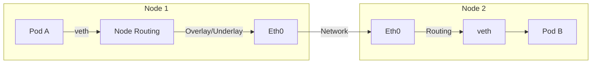
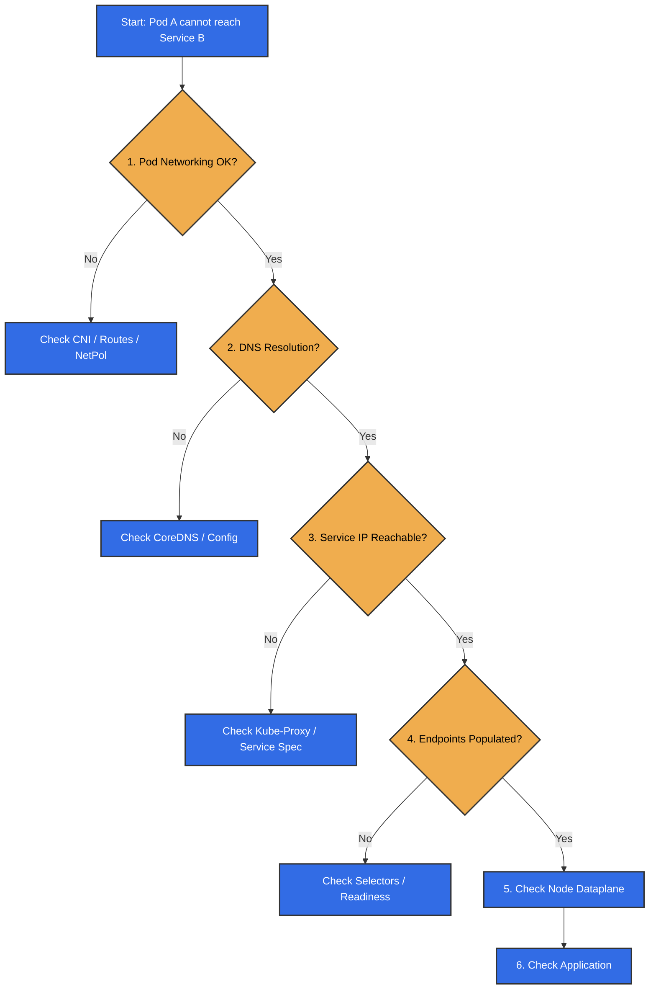

## Introduction

Welcome to **Part 5**, the final chapter of our Kubernetes Networking series.

We have journeyed through the entire stack:

* [Part 1](/posts/kubernetes-networking-series-part-1/): The **Model** (IP-per-Pod).
* [Part 2](/posts/kubernetes-networking-series-part-2/): The **CNI** (Plumbing).
* [Part 3](/posts/kubernetes-networking-series-part-3/): **Services** (Stable IPs).
* [Part 4](/posts/kubernetes-networking-series-part-4/): **DNS** (Service Discovery).

Now, we answer the most important question: **"Why can't my Pod connect to the database?"**

When networking breaks in Kubernetes, it can feel overwhelming. But because we now understand the layers, we can troubleshoot systematically.

**Common pitfalls**:

* Misconfigured routes (Pod routes / node routes)
* DNS delays (ndots/search expansion)
* Hairpin traffic

### Beyond the cluster

Everything shown here applies whether traffic stays on one node, crosses nodes, or leaves the cluster. The same primitives apply: routing, NAT, DNS, and policies; only the next hop changes (remote node, gateway, or cloud load balancer).

## Recap: The Cross-Node Packet Walk

Before we start debugging, let's visualize the "happy path" for a packet traveling between nodes. This simple narrative connects the plumbing (Part 2) with the troubleshooting steps:

1. **Pod A** sends traffic to Pod B's IP.
2. Traffic passes through the **veth pair** to the Node's root namespace.
3. **Node Routing** (configured by CNI) decides the next hop.
4. Traffic leaves the Node via **Overlay** (VXLAN/Geneve) or **Underlay** (BGP/Direct).
5. Packet reaches the **Remote Node**.
6. Remote Node routes traffic into **Pod B's veth**.



## The Debugging Flow: Bottom-Up

The best way to debug is to follow the packet's journey. I recommend a **Bottom-Up** approach starting from the source pod:



## The Tool: Ephemeral Containers

In the past, we had to install debugging tools like `curl` or `tcpdump` into our production images. This is bad practice (security risk, larger images).

Today, we use **Ephemeral Containers**. This feature allows you to attach a "debug sidecar" to a running Pod without restarting it.

We will use the `netshoot` image, which comes pre-loaded with all the tools we need (`tcpdump`, `ip`, `curl`, `nslookup`, `iptables`, etc.).

```bash
# Attach a debug container to a running pod
kubectl debug -n <ns> -it pod/<target-pod> --image=nicolaka/netshoot --target=<target-container>
```

The ephemeral container shares the Pod’s network namespace by default. The --target flag requests joining the target container’s namespaces (notably PID, when supported), which may allow you to see the target container’s processes (`ps aux`).

## Section 1: Debugging Pod Connectivity (The Foundation)

Before checking DNS or Services, verify the basics. Can the Pod talk to the network?

### 1. Check Interfaces and IPs

Inside the debug shell, run:

```bash
ip addr show
```

**What to look for:**

* **`eth0`:** Does it exist?
* **IP Address:** Does it match what `kubectl get pod -o wide` says?

**How to Fix:**

* **Missing Interface/IP:** This is a CNI failure. Check the logs of your CNI pods (e.g., `calico-node`, `cilium-agent`) in the `kube-system` namespace. The Node might be out of IP addresses (IPAM exhaustion).
* **Wrong IP:** If the IP inside the pod doesn't match Kubernetes' record, recreate the Pod.

### 2. Check Routes

A common issue is **misconfigured routes**. If the Pod doesn't know where to send packets, they drop.

```bash
ip route show
```

**What to look for:**

* **Default Route:** You should see a line like `default via 10.244.1.1`. The IP address (`10.244.1.1` in this example) is your **Gateway IP**.
* **Missing Route:** If the default route is missing, the Pod can only talk to its own subnet.

**Verification on the Node:**

You can verify that this gateway exists on the host. SSH into the Node where the Pod is running and check the interfaces using the IP you found above:

```bash
# On the Node
ip addr show | grep <GATEWAY_IP>
# You should see an interface (e.g., cni0, cilium_host) with this IP.
```

**How to Fix:**

* **Missing Default Route:** This usually means the CNI plugin failed to configure the network namespace. Check CNI logs and recreate the Pod.

## Section 2: Debugging DNS (The Phonebook)

If the Pod has an IP and a route, check if it can resolve names.

### 1. Test Resolution

```bash
nslookup my-service.default.svc.cluster.local
```

* **Success:** Returns an IP (e.g., `10.96.0.100`).
* **Failure (NXDOMAIN):** The name doesn't exist. Check your spelling or Namespace.
* **Failure (Timeout):** The DNS server (`10.96.0.10`) is unreachable.

**How to Fix:**

* **NXDOMAIN:** Verify the Service exists (`kubectl get svc`). Ensure you are using the correct namespace format (`service.namespace`).
* **Timeout:** Check if CoreDNS pods are running (`kubectl get pods -n kube-system -l k8s-app=kube-dns`). Check for NetworkPolicies that might block UDP port 53.

### 2. Check `/etc/resolv.conf`

Ensure the Pod is configured to use the correct nameserver.

```bash
cat /etc/resolv.conf
```

**Common Issue: ndots**
If you see `options ndots:5`, it means every lookup (like `google.com`) will first try `google.com.default.svc.cluster.local`, then `google.com.svc.cluster.local`, etc. This causes unnecessary DNS traffic (multiple search-suffix attempts before the real one).

**How to Fix:**

* **Use FQDN:** Use Fully Qualified Domain Names (FQDN) ending with a dot (e.g., `google.com.`) to skip the search list.

## Section 3: Debugging Services (The Virtual IP)

If DNS works, check if you can reach the application.

### 1. Test Connectivity

```bash
# Test TCP connection to the Service IP
nc -zv 10.96.0.100 80
```

* **Success:** The Service is working.
* **Failure:** The issue is likely in the `kube-proxy` layer. If this fails, verify kube-proxy mode (iptables/IPVS/nftables) and endpoints.

**How to Fix:**

* **Connection Refused:** The Service IP is reachable, but no Pod is listening. Check `kubectl get endpoints <service-name>`.

  ```bash
  kubectl get endpointslices -l kubernetes.io/service-name=<service-name>
  ```

  If it's empty, check your Pod labels and Readiness Probes.
* **Timeout:** The packet is being dropped. Check NetworkPolicies or Node firewalls.

### 2. Common Issue: Hairpin Traffic

**Hairpinning** is when a Pod tries to talk to *itself* via the Service IP.

* **Is it allowed?** **Yes.** Kubernetes expects that a Pod can reach itself via its Service IP, but hairpin behavior depends on how the node networking is configured (kubelet + bridge/veth).
* **Scenario:** Pod A (IP `10.1.1.5`) calls Service A (`10.96.0.100`), which resolves back to Pod A (`10.1.1.5`).
  * **Example:** An application configured to access its own API via the Service DNS name (e.g., `my-app.default.svc`) rather than `localhost`. This is common in single-replica deployments or when using a standard configuration for all pods to reach the API.
* **The Problem:** Some CNIs or bridge configurations fail to route the packet back to the same interface it came from.
* **Diagnosis:** You can connect to *other* Pods, but the Pod cannot connect to the Service that points to itself.
* **How to Fix:** Ensure the **Kubelet** is running with `--hairpin-mode=hairpin-veth` (or `promiscuous-bridge`). This instructs the container runtime to configure the veth pair (or bridge) to allow packets to reflect back to the source.

```bash
# On the node (kubelet args vary by distro/managed service)
ps aux | grep kubelet | grep -E "hairpin|--config"
```

If kubelet is configured via `--config`, check the `hairpinMode` field in that config file.

## Section 4: The Packet Level (The Truth)

When logs lie, packets tell the truth. Use `tcpdump` to see what's actually happening on the wire.

### 1. Capture Traffic

Inside the debug container:

```bash
# Capture all traffic on eth0 and write to a file
tcpdump -i eth0 -w /tmp/capture.pcap
```

### 2. Analyze with Wireshark

Copy the file to your local machine.

**Important:** Since the file was created inside the ephemeral debug container, you must specify that container's name using the `-c` flag. You can find the name (e.g., `debugger-xyz`) by running `kubectl describe pod <target-pod>`.

```bash
kubectl cp -n <ns> pod/<target-pod>:/tmp/capture.pcap ./capture.pcap -c <debug-container-name>
```

Open it in **Wireshark**.

**What to look for:**

* **TCP Retransmissions:** The network is dropping packets.
* **TCP Resets (RST):** The destination rejected the connection (port closed).
* **SYN sent, no SYN-ACK:** The packet left the Pod but never got a reply. It was likely dropped by a firewall or Network Policy.

**How to Fix:**

* **Retransmissions:** Check for MTU mismatches (e.g., Overlay MTU vs Physical MTU). Check physical network congestion.
* **TCP Resets:** The destination rejected the connection. Check if the application is actually running and listening on that port.
* **No SYN-ACK:** If the packet leaves the source but never arrives at the destination, check the intermediate firewalls or NetworkPolicies. If it arrives but is ignored, check the application logs on the destination.

## Section 5: Advanced Debugging (Node Level)

If the issue isn't in the Pod, it's on the Node. To see `kube-proxy` rules or trace kernel drops, you must debug the **Node**, not the Pod.

### 1. Check iptables (Node Level)

You can use `kubectl debug` to launch a privileged container on the Node itself.

**Note:** You must use the `--profile=sysadmin` flag to get full root privileges on the node.

```bash
# Debug the Node (replace <node-name> with your actual node)
kubectl debug node/<node-name> -it --image=nicolaka/netshoot --profile=sysadmin
```

Once inside the shell, you are in the host network namespace.

#### Step 1: Identify the Mode

Before analyzing rules, confirm which mode `kube-proxy` is using (iptables, IPVS, or eBPF replacement). This is discussed in [Part 3](/posts/kubernetes-networking-series-part-3/#kube-proxy).

```bash
# Check if IPVS is active (returns a table if yes)
ipvsadm -Ln

# Check if kube-proxy is running as a process
ps aux | grep kube-proxy
```

* **IPVS:** If `ipvsadm` shows tables, use `ipvsadm` to debug.
* **eBPF:** If `kube-proxy` is missing and you use Cilium, use `cilium bpf lb list`.
* **iptables/nftables:** If neither above, you are likely in standard iptables mode.

#### Step 2: Inspect NAT Rules (iptables/nftables)**

If you confirmed you are using iptables, check the NAT table for your Service IP.

**Note:** Linux nodes may use either the `legacy` backend or the newer `nft` backend. You must match the tool to the system configuration to see the rules.

```bash
# What is iptables actually using?
iptables -V

# If your system uses alternatives (common on Debian/Ubuntu):
update-alternatives --display iptables 2>/dev/null || true

# If you have the split binaries, these help confirm:
command -v iptables-nft >/dev/null && iptables-nft -V
command -v iptables-legacy >/dev/null && iptables-legacy -V

# Once you identify the active backend, search for your Service IP
# Use the backend that matches iptables -V / alternatives output.
# Example (if using legacy):
iptables-legacy -t nat -L -n | grep 10.96.0.100

# If tools are missing in the debug container, use the host's binaries:
chroot /host iptables -t nat -L -n | grep 10.96.0.100
```

If you still see no output, `kube-proxy` might be failing to sync rules, or kube-proxy is running in **nftables** mode (then inspect with `nft list ruleset`).

**How to Read the Output:**

If you see output like this:

```text
KUBE-SVC-XYZ...  6    --  0.0.0.0/0            10.96.0.100         /* default/my-service cluster IP */ tcp dpt:80
KUBE-MARK-MASQ   6    -- !10.244.0.0/16        10.96.0.100         /* default/my-service cluster IP */ tcp dpt:80
```

* **`KUBE-SVC-...`**: This is the entry point. It catches traffic destined for your Service IP. It jumps to a chain that load-balances to your Pods.
* **`KUBE-MARK-MASQ`**: This ensures that if you access the Service from outside the Pod network (e.g., from the Node itself), the traffic gets Masqueraded (SNAT) so the return packet knows how to get back to you.

**How to Fix:**

* **Missing Rules:** If `kube-proxy` logs show errors or rules are missing, restart the `kube-proxy` pod on that node.
* **Wrong Rules:** If rules exist but point to the wrong IP, check the Endpoints object (`kubectl get endpoints`).

### 2. Trace with eBPF (bcc/bpftrace)

For complex issues where packets disappear silently (e.g., dropped by the kernel), standard tools like `tcpdump` might miss them.
Tools like `bpftrace` can hook into kernel functions (`kfree_skb`) to tell you exactly *why* and *where* a packet was dropped.

For eBPF tools, it is best to use a specialized image.

```bash
# Launch a debug pod with bpftrace
kubectl debug node/<node-name> -it --image=quay.io/iovisor/bpftrace:latest --profile=sysadmin
```

Once inside:

```bash
# 1. Mount the debug filesystem (Required for bpftrace)
mount -t debugfs debugfs /sys/kernel/debug

# 2. Trace freed SKBs (includes drops + noise) and look for patterns tied to your flow
# We print the kernel function where the drop happened (location) and the protocol.
bpftrace -e 'tracepoint:skb:kfree_skb { printf("kfree_skb at: %s | Proto: %d | Process: %s\n", ksym(args->location), args->protocol, comm); }'
```

**Interpreting the Output:**

You will see a stream of freed SKBs. Some are normal cleanup; some correlate with drops. Here is how to spot a real problem versus noise:

* **`sk_stream_kill_queues`**: This is usually **noise**. It happens when a socket closes normally and the kernel cleans up remaining buffers. You can ignore this.
* **`tcp_v4_do_rcv`**: This often indicates a **checksum error** or a packet sent to a closed port. If you see this for your application, check if the application is actually listening on that port.
* **`nf_hook_slow`**: This is the **smoking gun**. It means **Netfilter (iptables/firewall)** dropped the packet. This is where Kubernetes networking enforces security boundaries; if you see this, a NetworkPolicy or an iptables rule is explicitly blocking your traffic.
* **`unix_stream_connect`**: Drops on Unix sockets (like the Docker socket).

**Example of a blocked connection:**

```text
kfree_skb at: nf_hook_slow | Proto: 2048 | Process: my-app
```

This tells you the skb was freed after passing through netfilter (nf_hook_slow) — often policy/firewall related.

**How to Fix:**

* **nf_hook_slow:** Check your NetworkPolicies (`kubectl get networkpolicy --all-namespaces`). If you are not using NetworkPolicies, check the Node's own firewall (`ufw`, `firewalld`, or cloud provider security groups).
* **tcp_v4_do_rcv:** Verify the application is listening on the correct port and interface (`0.0.0.0` vs `127.0.0.1`).

## References

* **Debug Services:** [Official Documentation](https://kubernetes.io/docs/tasks/debug/debug-application/debug-service/)
* **Debug DNS Resolution:** [Official Documentation](https://kubernetes.io/docs/tasks/administer-cluster/dns-debugging-resolution/)
* **Ephemeral Containers:** [Official Documentation](https://kubernetes.io/docs/concepts/workloads/pods/ephemeral-containers/)
* **Netshoot:** [GitHub Repository](https://github.com/nicolaka/netshoot)
* **bpftrace:** [GitHub Repository](https://github.com/iovisor/bpftrace)

> For advanced debugging, check out **Retina**.
>
> * [Retina Shell](https://retina.sh/docs/Troubleshooting/shell): Allows you to create a privileged container inside a Pod or on a Node, giving you full access to the network namespace.
> * [Retina Capture](https://retina.sh/docs/Troubleshooting/capture): Provides distributed packet capture capabilities, allowing you to automatically capture and download pcap files to your local machine.
>
{: .prompt-info }

## Summary

Debugging Kubernetes networking doesn't have to be a mystery.

1. **Follow the Flow:** Pod networking (IP/routes/policy) → DNS → Service VIP → Endpoints → Node dataplane → App
2. **Use the Right Tools:** `kubectl debug` with `netshoot` is your Swiss Army Knife.
3. **Go Deep:** When in doubt, capture packets and look at the truth in **Wireshark**.

This concludes our 5-part series on Kubernetes Networking! I hope this journey has demystified the magic behind the cluster.

Happy Debugging!

## Series Navigation

| Part | Topic | Description |
| :--- | :--- | :--- |
| [Part 1](/posts/kubernetes-networking-series-part-1/) | The Model | The IP-per-Pod model and Linux Namespaces. |
| [Part 2](/posts/kubernetes-networking-series-part-2/) | CNI & Pod Networking | How CNI plugins create the network plumbing. |
| [Part 3](/posts/kubernetes-networking-series-part-3/) | Services | Stable IPs and load balancing with Services. |
| [Part 4](/posts/kubernetes-networking-series-part-4/) | DNS | Service discovery and naming with CoreDNS. |
| **[Part 5](/posts/kubernetes-networking-series-part-5/)** | Debugging | Tracing packets and diagnosing network issues. |
