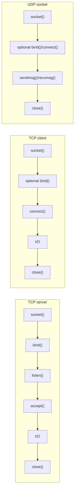
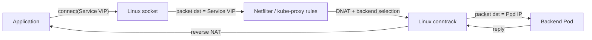
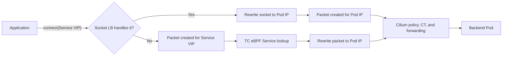
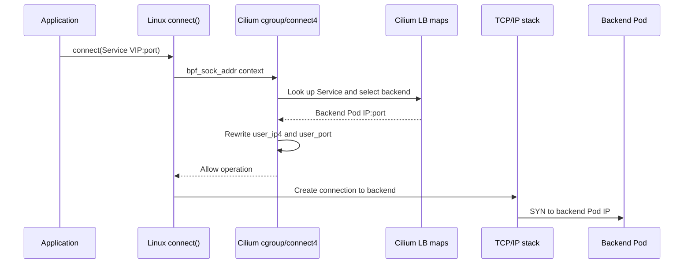
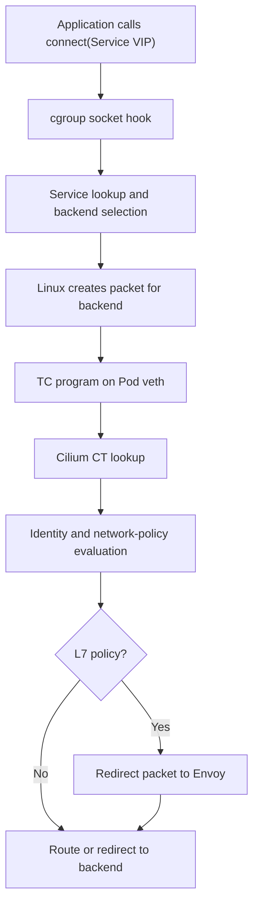

## Introduction

When an application connects to a Kubernetes Service, the first useful interception point can occur before a packet exists. Cilium's socket load balancer attaches eBPF programs to cgroup socket-address hooks and can replace a Service virtual IP (VIP) with a backend Pod IP while the kernel is processing `connect()` or `sendmsg()`.

That early translation is only one part of the datapath. Cilium still handles connection tracking, network policy, routing, and optional L7 proxy redirection in packet-processing programs attached at TC or other hooks. Keeping those layers separate is the key to understanding both the performance benefit and the limits of socket-level load balancing.

This article builds that model from Linux sockets upward and finishes with a test you can run on a Cilium cluster.

> **Version scope:** The Cilium commands, Helm values, map names, and source excerpts in this article were verified against Cilium `v1.20.1` and Cilium CLI `v0.20.0` on a cgroup v2 cluster. The architecture is more stable than the internal names, so recheck version-specific commands when using another release.

## Linux Sockets: The Application's Network Endpoint

The `socket()` system call creates a communication endpoint and returns a file descriptor. Its arguments select an address family such as `AF_INET`, a type such as `SOCK_STREAM`, and a protocol such as TCP.

User space works with the file descriptor. Inside Linux, a file references a `struct socket`, which refers to protocol state represented by `struct sock` or a derived type such as `struct tcp_sock`. It is therefore more precise to call a socket a kernel-managed endpoint than to equate it with one structure. Cilium's connection tracking is separate again: it lives in eBPF maps, not in the socket object.

### Client, Server, and Datagram Lifecycles



`listen()` and `accept()` belong to passive stream servers. An unconnected UDP socket can choose a destination for each message. This matters because Cilium uses `connect` hooks for TCP and connected UDP, and `sendmsg`/`recvmsg` hooks for unconnected UDP.

### Quick Local Test

This standard-library Go program shows the local and peer addresses observed at both ends of one TCP connection:

<!-- markdownlint-disable MD010 -->
```go
package main

import (
	"fmt"
	"io"
	"net"
)

func main() {
	listener, err := net.Listen("tcp4", "127.0.0.1:0")
	if err != nil {
		panic(err)
	}
	defer listener.Close()

	serverResult := make(chan error, 1)

	go func() {
		connection, err := listener.Accept()
		if err != nil {
			serverResult <- err
			return
		}
		defer connection.Close()

		fmt.Printf("server socket: %s <- %s\n",
			connection.LocalAddr(), connection.RemoteAddr())

		_, err = connection.Write([]byte("hello from the server\n"))
		serverResult <- err
	}()

	client, err := net.Dial("tcp4", listener.Addr().String())
	if err != nil {
		panic(err)
	}
	defer client.Close()

	fmt.Printf("client socket: %s -> %s\n",
		client.LocalAddr(), client.RemoteAddr())

	message, err := io.ReadAll(client)
	if err != nil {
		panic(err)
	}
	fmt.Print(string(message))

	if err := <-serverResult; err != nil {
		panic(err)
	}
}
```
<!-- markdownlint-enable MD010 -->

Save it as `socket_demo.go` and run it with `go run socket_demo.go`. The ephemeral client port changes, but both endpoints should report the same connection tuple from opposite directions.

The cluster test later applies the same idea: it holds a socket open, reads the peer selected by Linux with `ss`, and correlates that socket with Cilium's reverse-translation state.

## Conventional and eBPF Kubernetes Datapaths

Before looking at socket hooks, it helps to establish what changes when Cilium replaces the conventional Kubernetes Service datapath.

“Non-eBPF” and “non-Cilium” are not exact synonyms. A non-Cilium CNI may also offer an eBPF dataplane, while Cilium can coexist with kube-proxy in configurations where it does not replace Service handling. In this article, **conventional datapath** means kube-proxy implementing Services with Netfilter rules or IPVS, and **Cilium eBPF datapath** means Cilium implementing Services with eBPF programs and maps.

### Conventional kube-proxy Path

In a conventional iptables or nftables deployment, the application connects to the Service VIP and Linux initially constructs a packet for that VIP. The packet reaches Netfilter, where rules installed by kube-proxy select a backend and apply destination NAT (DNAT). Linux conntrack records the translation so replies can be reverse-translated.



The CNI plugin still provides Pod interfaces, addresses, and reachability. kube-proxy is the component implementing the Service VIP in this model. They are related parts of cluster networking, but they are not the same component.

### Cilium eBPF Paths

Cilium has two relevant opportunities to translate a Service:

1. **Socket-level LB:** a cgroup program rewrites the destination during `connect()` or `sendmsg()`, before Linux constructs a packet.
2. **Per-packet LB:** a TC eBPF program sees a packet addressed to the Service VIP and rewrites it in the packet path. This is Cilium's fallback or companion path for traffic socket LB cannot handle.

These paths do not imply that kube-proxy has been removed. Cilium can enable socket LB for east-west traffic while kube-proxy remains installed, or it can provide full kube-proxy replacement. In the coexistence case, kube-proxy still handles traffic that reaches its packet path; with full replacement, Cilium owns the supported Service paths.



Both Cilium paths use eBPF, but only the first is socket-level load balancing. The second is closer in timing to conventional kube-proxy because it acts after packet construction, although its implementation uses eBPF maps and programs rather than a linear Netfilter ruleset.

| Property | Conventional kube-proxy | Cilium per-packet eBPF | Cilium socket eBPF |
| --- | --- | --- | --- |
| First Service decision | Netfilter/IPVS packet path | TC packet path | Socket syscall path |
| Packet initially targets | Service VIP | Service VIP | Backend Pod IP |
| Service state | iptables/nftables rules or IPVS tables | Cilium eBPF LB maps | Cilium eBPF LB maps |
| Flow/NAT state | Linux conntrack/IPVS state | Cilium CT and NAT maps | Socket reverse-LB map; packets still use Cilium CT |
| Translation frequency | Packet path, accelerated by connection state | Packet path, accelerated by Cilium CT | Usually once for TCP; potentially per message for unconnected UDP |
| Network policy | Separate firewall/CNI mechanism | Cilium packet datapath | Still enforced later in Cilium's packet datapath |

This comparison is architectural, not a universal performance ranking. Actual results depend on kernel version, cluster size, enabled policy, routing mode, traffic pattern, and whether traffic can use the socket path.

## eBPF Hooks Around Sockets

A **program type** defines the context and helpers available to an eBPF program. An **attach type** identifies the operation that triggers it.

| Program type | Example attach types | Relevance here |
| --- | --- | --- |
| `BPF_PROG_TYPE_CGROUP_SOCK_ADDR` | `BPF_CGROUP_INET4_CONNECT`, `BPF_CGROUP_UDP4_SENDMSG`, `BPF_CGROUP_INET4_GETPEERNAME` | Select backends and translate socket addresses |
| `BPF_PROG_TYPE_CGROUP_SOCK` | `BPF_CGROUP_INET_SOCK_RELEASE` | Remove reverse-translation state when a socket closes |

Other socket-related program types exist, including cgroup socket-option and `sock_ops` programs, but they are not the mechanism used for the Service-address rewrite described here. Cilium's libbpf section names for the relevant address hooks are more compact:

```c
__section("cgroup/connect4")
int cil_sock4_connect(struct bpf_sock_addr *ctx) { /* ... */ }

__section("cgroup/sendmsg4")
int cil_sock4_sendmsg(struct bpf_sock_addr *ctx) { /* ... */ }

__section("cgroup/recvmsg4")
int cil_sock4_recvmsg(struct bpf_sock_addr *ctx) { /* ... */ }
```

These are section names, not additional BPF program types.

### The `bpf_sock_addr` Context

Socket-address programs receive this kernel UAPI context. Fields prefixed with `user_` represent the address supplied by the application and are writable at supported hooks:

```c
struct bpf_sock_addr {
    __u32 user_family;
    __u32 user_ip4;
    __u32 user_ip6[4];
    __u32 user_port;       /* network byte order */
    __u32 family;
    __u32 type;
    __u32 protocol;
    __u32 msg_src_ip4;
    __u32 msg_src_ip6[4];
    struct bpf_sock *sk;
};
```

`user_port` occupies 32 bits even though a TCP or UDP port is 16 bits. Cilium wraps access to it in helpers and rewrites `user_ip4`/`user_ip6` plus `user_port` after selecting a backend.

## Cilium Socket-Level Load Balancing

When socket LB is enabled, Cilium maintains Service and backend entries in eBPF maps. Enabling full kube-proxy replacement also enables socket LB, but socket LB can be enabled independently. A TCP connection to a ClusterIP follows this path:



The hook runs **inside the kernel while handling the socket operation, before packet construction**. It does not run before the kernel or outside the networking stack.

### Forward Translation in Cilium v1.20.1

The IPv4 path in Cilium `v1.20.1`'s `bpf/bpf_sock.c` has this shape:

```c
svc = lb4_lookup_service(&key, true);
if (!svc)
    return -ENXIO;

/* Backend selection and affinity handling are omitted here. */
backend = __lb4_lookup_backend(backend_id);
if (!backend)
    return -EHOSTUNREACH;

sock4_update_revnat(ctx, backend, dst_ip, dst_port, svc->rev_nat_index);
ctx->user_ip4 = backend->address;
ctx_set_port(ctx, backend->port);
```

The `v1.20.1` implementation also handles NodePort and HostPort wildcard lookups, session affinity, Local Redirect Policies, IPv4-in-IPv6, and L7 exceptions. The result is that TCP constructs its SYN for the backend rather than the Service VIP.

This avoids packet-path Service NAT and its associated connection-tracking work for that socket. It does **not** mean the complete route is NAT-free: masquerading or other SNAT may still occur elsewhere.

### TCP and UDP Use Different Hooks

| Traffic | Forward hook | Reverse socket translation |
| --- | --- | --- |
| TCP | `connect4` / `connect6` | Optional `getpeername4` / `getpeername6` handling |
| Connected UDP | `connect4` / `connect6` | Receive/name hooks as configured |
| Unconnected UDP | `sendmsg4` / `sendmsg6` for each destination | `recvmsg4` / `recvmsg6` |

Backend selection normally occurs once for TCP. Unconnected UDP can be translated for every message, so “once per connection” is not a universal property.

Cilium stores socket reverse-translation state in `cilium_lb4_reverse_sk` and `cilium_lb6_reverse_sk`. These maps let relevant socket operations recover the original Service address. They are distinct from Cilium's packet connection-tracking maps.

### Local Redirect Policies

A Local Redirect Policy (LRP) can direct a Service or frontend address to node-local backends. Socket LB recognizes LRP entries and can select those backends in `bpf_sock.c`.

The condition below is instead from the **per-packet** path in `bpf_lxc.c`:

```c
if (CONFIG(enable_lrp) && is_defined(ENABLE_SOCKET_LB_FULL) &&
    unlikely(lb4_svc_is_localredirect(svc)))
    goto skip_service_lookup;
```

It prevents per-packet load balancing from overriding an LRP decision already made by socket LB; it does not implement the redirect itself.

## Where Policy and Connection Tracking Happen

After socket LB selects a backend, Linux constructs packets with that backend as the destination. Those packets still traverse Cilium's endpoint datapath:



This boundary prevents several common misconceptions:

* **Cilium connection tracking** uses maps such as `cilium_ct4_global` and `cilium_ct_any4_global`; the Linux socket does not own those entries.
* **Network policy** functions such as `policy_can_egress4()` run in packet programs such as `bpf_lxc.c`.
* **L7 redirection** functions such as `ctx_redirect_to_proxy4()` redirect packets to Cilium's Envoy proxy; they are not actions of the `connect4` hook.
* **Packet reverse NAT** in packet LB and NodePort paths is separate from socket reverse translation.

### Why Per-Packet Load Balancing Still Exists

Not every Service can be handled entirely at the socket layer. Cilium `v1.20.1` retains per-packet load balancing for cases including:

* socket LB restricted to the host namespace;
* SCTP, which Cilium's socket LB does not handle;
* selected L7 load-balancing behavior;
* configurations where full socket LB is unavailable;
* cluster-aware addressing paths requiring packet handling.

Setting `socketLB.hostNamespaceOnly=true` bypasses socket LB in Pod namespaces. This supports service meshes that need to observe the original Service VIP; translation then occurs later in the TC datapath.

## Validate Socket LB on a Cilium Cluster

This test requires a Linux cluster running Cilium on cgroup v2, plus `kubectl`, `jq`, Bash in the client image, and either the Cilium CLI or Helm if configuration changes are needed. It creates two HTTP backends, opens a TCP connection to their Service, and correlates the destination selected by Linux with Cilium's node-local BPF state.

> **Do not enable socket LB on a production cluster solely to run this lab.** First assess workloads that must observe the original Service VIP, including some service-mesh sidecars, KubeVirt, Kata Containers, and gVisor. Also verify the kernel requirements for applications that mount NFS or SMB storage through a Service address. Use `socketLB.hostNamespaceOnly=true` when Pod namespaces must bypass socket LB.

### 1. Confirm Cilium's Configuration

```bash
kubectl -n kube-system exec ds/cilium -- cilium-dbg status --verbose

kubectl -n kube-system get configmap cilium-config -o yaml \
    | grep -E '^  (bpf-lb-sock|bpf-lb-sock-hostns-only|trace-sock):'
```

The status must report `Socket LB: Enabled` and `Socket LB Coverage: Full`. In the ConfigMap, `bpf-lb-sock` should be `true` and `bpf-lb-sock-hostns-only` should not be `true`. The final trace in this lab also requires `trace-sock=true`; it is useful for observation but is not required for load balancing itself.

An installation created with the Cilium CLI is Helm-backed. Prefer `cilium upgrade` when continuing to manage it with that CLI, and pin the currently installed chart version so this configuration change does not also upgrade Cilium:

```bash
CILIUM_VERSION=$(cilium status --output json \
    | jq -r '.helm_chart_version')

cilium upgrade \
    --version "$CILIUM_VERSION" \
    --reuse-values \
    --set socketLB.enabled=true \
    --set socketLB.hostNamespaceOnly=false \
    --set socketLB.tracing=true \
    --restart \
    --wait

cilium status --wait
```

For an installation managed directly with Helm, the equivalent procedure is:

```bash
CILIUM_VERSION=$(helm -n kube-system get metadata cilium \
    --output json | jq -r '.version')

helm repo add cilium https://helm.cilium.io/
helm repo update cilium

helm upgrade cilium cilium/cilium \
    --namespace kube-system \
    --version "$CILIUM_VERSION" \
    --reuse-values \
    --set socketLB.enabled=true \
    --set socketLB.hostNamespaceOnly=false \
    --set socketLB.tracing=true \
    --set rollOutCiliumPods=true

kubectl -n kube-system rollout status daemonset/cilium
kubectl -n kube-system exec ds/cilium -- \
    cilium-dbg status --verbose \
    | grep -E 'KubeProxyReplacement|Socket LB|Socket LB Coverage'
```

`socketLB.hostNamespaceOnly=false` is important for this test: setting it to `true` deliberately bypasses socket LB for ordinary Pods. If Cilium was installed by another lifecycle manager, apply the equivalent values through that manager rather than editing `cilium-config` directly. After the lab, tracing can be disabled again with the same upgrade procedure and `socketLB.tracing=false`.

Socket LB can be enabled independently, while Cilium's full kube-proxy replacement depends on socket LB. If the goal is also to replace kube-proxy, set `kubeProxyReplacement=true` through the installation manager and follow Cilium's kube-proxy-free migration procedure. Do not blindly enable it on a live cluster that still runs kube-proxy: the two implementations maintain independent NAT state, existing connections can break during the transition, and Cilium must have a directly reachable Kubernetes API server configured before kube-proxy is removed.

### 2. Create the Test Workloads

```bash
kubectl create namespace socket-lb-demo \
    --dry-run=client -o yaml | kubectl apply -f -

kubectl -n socket-lb-demo create deployment echo \
    --image=registry.k8s.io/e2e-test-images/agnhost:2.53@sha256:99c6b4bb4a1e1df3f0b3752168c89358794d02258ebebc26bf21c29399011a85 \
    --replicas=2 \
    --dry-run=client -o yaml \
    -- /agnhost netexec --http-port=8080 \
    | kubectl apply -f -

kubectl -n socket-lb-demo expose deployment echo \
    --name=echo --port=8080 --target-port=8080 \
    --dry-run=client -o yaml \
    | kubectl apply -f -

kubectl -n socket-lb-demo delete pod client \
    --ignore-not-found --wait=true

kubectl -n socket-lb-demo run client \
    --image=nicolaka/netshoot:v0.13@sha256:a20c2531bf35436ed3766cd6cfe89d352b050ccc4d7005ce6400adf97503da1b \
    --restart=Never \
    --command -- sleep infinity

kubectl -n socket-lb-demo rollout status deployment/echo --timeout=120s
kubectl -n socket-lb-demo wait --for=condition=Ready pod/client --timeout=120s
```

Record the virtual and backend addresses:

```bash
kubectl -n socket-lb-demo get service echo -o wide
kubectl -n socket-lb-demo get endpointslice \
    -l kubernetes.io/service-name=echo -o wide
```

### 3. Exercise and Inspect the Service

The `/hostname` endpoint identifies the selected backend:

```bash
for request in 1 2 3 4; do
    kubectl -n socket-lb-demo exec client -- \
        curl -fsS http://echo:8080/hostname
done
```

Open a TCP connection without completing an HTTP request, then inspect it:

```bash
kubectl -n socket-lb-demo exec client -- bash -c \
    'exec 3<>/dev/tcp/echo/8080; ss -tnp; exec 3>&-'
```

With socket LB active for the client Pod, `ss` should show a remote **backend Pod IP**, not the Service ClusterIP. DNS still resolved `echo` to the Service VIP; the socket hook performed the subsequent rewrite. If `ss` shows the ClusterIP instead, verify that `cilium-dbg status --verbose` reports `Socket LB: Enabled` with full coverage.

### 4. Inspect Cilium's eBPF State

Cilium's service and socket maps are node-scoped. Select the Cilium agent on the node that hosts the client Pod so the map, cgroup, and trace state correspond to the connection being tested. The `k8s-app=cilium` label is the chart default; adjust it if your installation overrides the agent labels.

```bash
CLIENT_NODE=$(kubectl -n socket-lb-demo get pod client \
    -o jsonpath='{.spec.nodeName}')

CILIUM_POD_COUNT=$(kubectl -n kube-system get pod \
    -l k8s-app=cilium \
    --field-selector "spec.nodeName=${CLIENT_NODE}" \
    --no-headers | wc -l)

if [ "$CILIUM_POD_COUNT" -ne 1 ]; then
    echo "expected one Cilium agent on ${CLIENT_NODE}, found ${CILIUM_POD_COUNT}" >&2
    exit 1
fi

CILIUM_POD=$(kubectl -n kube-system get pod \
    -l k8s-app=cilium \
    --field-selector "spec.nodeName=${CLIENT_NODE}" \
    -o jsonpath='{.items[0].metadata.name}')

SERVICE_IP=$(kubectl -n socket-lb-demo get service echo \
    -o jsonpath='{.spec.clusterIP}')

printf 'client node: %s\ncilium pod: %s\nservice IP: %s\n' \
    "$CLIENT_NODE" "$CILIUM_POD" "$SERVICE_IP"
```

First confirm the feature state and inspect the Service frontend and backend entries programmed on that node:

```bash
kubectl -n kube-system exec "$CILIUM_POD" -- \
    cilium-dbg status --verbose \
    | grep -E 'KubeProxyReplacement|Socket LB'

kubectl -n kube-system exec "$CILIUM_POD" -- \
    cilium-dbg bpf lb list \
    | grep -F "$SERVICE_IP"

kubectl -n kube-system exec "$CILIUM_POD" -- \
    cilium-dbg map list \
    | grep -E 'cilium_lb[46]_(services|backends|reverse_sk)'
```

The LB listing confirms that the Service and its backends are present in the node's maps; by itself, it does not prove that this connection used socket LB. When socket LB is enabled, the agent Pod can also inspect the cgroup programs attached on its node:

```bash
kubectl -n kube-system exec "$CILIUM_POD" -- \
    bpftool cgroup tree /run/cilium/cgroupv2 effective \
    | grep -E 'connect[46]|sendmsg[46]|recvmsg[46]|getpeername[46]'
```

This confirms effective program attachment at the node's cgroup root; it does not identify an individual application socket. The following bounded test captures three views of the same live connection:

1. `ss` in the client network namespace shows the kernel peer address.
2. A before/during diff shows the new socket reverse-NAT entry.
3. `trace-sock` events show the pre- and post-translation addresses and their socket cookie.

```bash
SOCKNAT_BEFORE=$(mktemp)
SOCKNAT_DURING=$(mktemp)
TRACE_FILE=$(mktemp)

kubectl -n kube-system exec "$CILIUM_POD" -- \
    cilium-dbg bpf socknat list >"$SOCKNAT_BEFORE"

timeout 12s kubectl -n kube-system exec "$CILIUM_POD" -- \
    cilium-dbg monitor -v -t trace-sock >"$TRACE_FILE" &
MONITOR_PID=$!

sleep 1
kubectl -n socket-lb-demo exec client -- bash -c \
    'exec 3<>/dev/tcp/echo/8080; sleep 8' &
SOCKET_HOLDER_PID=$!

for attempt in 1 2 3 4 5; do
    sleep 1

    kubectl -n socket-lb-demo exec client -- ss -tnp
    kubectl -n kube-system exec "$CILIUM_POD" -- \
        cilium-dbg bpf socknat list >"$SOCKNAT_DURING"

    grep -Fq "$SERVICE_IP" "$SOCKNAT_DURING" && break
done

wait "$SOCKET_HOLDER_PID"
wait "$MONITOR_PID" || true

diff -u "$SOCKNAT_BEFORE" "$SOCKNAT_DURING" || true
grep -E 'pre-xlate|post-xlate' "$TRACE_FILE"

rm -f "$SOCKNAT_BEFORE" "$SOCKNAT_DURING" "$TRACE_FILE"
```

The `ss` peer and the `post-xlate-fwd` trace should identify the same backend. The reverse-SK diff should add a `Backend -> Frontend` row for that backend and the Service address; its socket cookie can be matched to the trace events. If no row or trace appears, confirm full socket-LB coverage, `trace-sock=true`, and that the connection remained open. Service maps are normally populated on every Cilium node, but the client-node agent is the correct target for connection-specific cgroup, reverse-SK, and trace state.

Clean up when finished:

```bash
kubectl delete namespace socket-lb-demo
```

## Practical Limitations and Compatibility

Socket LB is not a transparent improvement for every workload:

* **Service meshes and virtualized Pod networking:** Sidecars and runtimes such as KubeVirt, Kata Containers, and gVisor may need to observe the original Service VIP or may not share the host cgroup attachment as expected. `socketLB.hostNamespaceOnly=true` keeps the socket rewrite out of Pod namespaces and restores per-packet Service handling.
* **Kernel-originated NFS and SMB connections:** Mounting these protocols through a Service address requires kernel fixes that preserve rewritten socket addresses correctly. Check the Cilium limitations for the minimum kernel versions used by your distribution.
* **Backend removal:** A connected TCP or UDP socket remains bound to its selected backend. Cilium can terminate sockets for deleted backends when the required kernel diagnostic options are available, but applications must still reconnect and handle termination correctly.
* **Reverse-SK map lifecycle:** `cilium_lb4_reverse_sk` and `cilium_lb6_reverse_sk` are LRU maps. Cleanup and eviction behavior can affect backend-termination detection, particularly for UDP workloads.
* **Protocol coverage:** TCP and UDP are the primary socket-LB protocols. SCTP is not handled by the socket-address path and still requires packet-path handling.
* **Version-specific internals:** Map names, flags, status labels, and source structure can change. Prefer stable CLI commands for automation, and recheck raw `bpftool` or map-name filters after a Cilium upgrade.

## Summary

* Socket LB moves Service backend selection to socket operations, before packet construction.
* TCP and connected UDP use `connect` hooks; unconnected UDP also needs per-message hooks.
* Socket reverse translation and packet connection tracking are separate map-backed mechanisms.
* Network policy, packet CT, routing, and Envoy redirection remain packet-datapath responsibilities.
* Per-packet load balancing remains necessary for unsupported protocols and fallback paths.
* Avoiding per-packet Service NAT does not guarantee a completely NAT-free route.

The useful mental model is not “Cilium networking happens at the socket.” Cilium makes the Service decision unusually early, then passes packets addressed to the selected backend through its normal security and forwarding datapath.

## References

* **Linux socket API:** [`socket(2)`](https://man7.org/linux/man-pages/man2/socket.2.html), [`connect(2)`](https://man7.org/linux/man-pages/man2/connect.2.html), and [`listen(2)`](https://man7.org/linux/man-pages/man2/listen.2.html)
* **Linux eBPF UAPI:** [`include/uapi/linux/bpf.h`](https://github.com/torvalds/linux/blob/master/include/uapi/linux/bpf.h)
* **Linux cgroup socket-address programs:** [Program type documentation](https://docs.ebpf.io/linux/program-type/BPF_PROG_TYPE_CGROUP_SOCK_ADDR/)
* **Kubernetes virtual IPs and Service proxies:** [Official documentation](https://kubernetes.io/docs/reference/networking/virtual-ips/)
* **Kubernetes CNI plugins:** [Official documentation](https://kubernetes.io/docs/concepts/extend-kubernetes/compute-storage-net/network-plugins/)
* **Netfilter connection tracking:** [Linux kernel documentation](https://docs.kernel.org/networking/nf_conntrack-sysctl.html)
* **Cilium kube-proxy replacement:** [Official documentation](https://docs.cilium.io/en/stable/network/kubernetes/kubeproxy-free/)
* **Cilium socket-LB observability and limitations:** [Official documentation](https://docs.cilium.io/en/stable/network/kubernetes/kubeproxy-free/#observability)
* **Cilium Local Redirect Policy:** [Official documentation](https://docs.cilium.io/en/stable/network/kubernetes/local-redirect-policy/)
* **Cilium Helm values:** [Official reference](https://docs.cilium.io/en/stable/helm-reference/)
* **Cilium eBPF maps:** [Official documentation](https://docs.cilium.io/en/stable/network/ebpf/maps/)
* **Cilium life of a packet:** [Official documentation](https://docs.cilium.io/en/stable/network/ebpf/lifeofapacket/)
* **Cilium `v1.20.1` socket datapath:** [`bpf/bpf_sock.c`](https://github.com/cilium/cilium/blob/v1.20.1/bpf/bpf_sock.c)
* **Cilium `v1.20.1` endpoint packet datapath:** [`bpf/bpf_lxc.c`](https://github.com/cilium/cilium/blob/v1.20.1/bpf/bpf_lxc.c)
