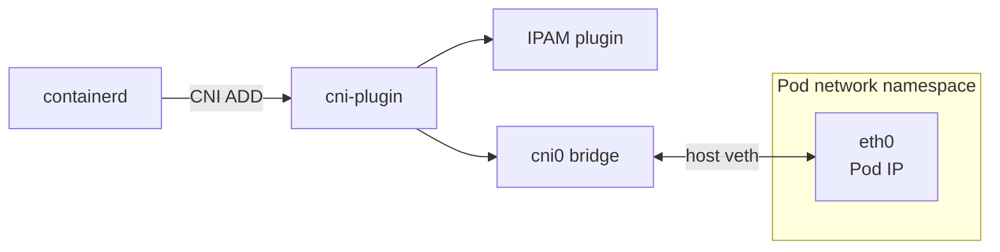
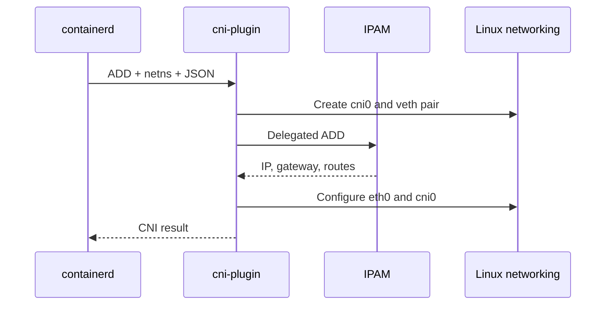
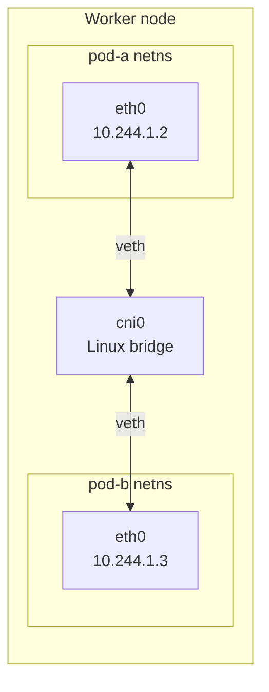
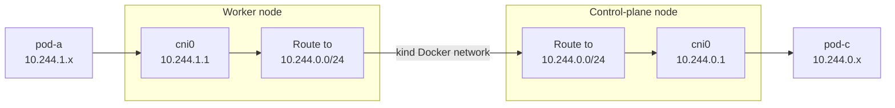

## Introduction

A Kubernetes Pod starts inside a new network namespace with no useful network interface. The container runtime then executes a **Container Network Interface (CNI) plugin** and asks it to connect that namespace to the cluster.

In this post, we will write that plugin in Bash or Go. We will start with one Pod and one fixed IP, then add IP address management, same-node Pod-to-Pod communication, and finally cross-node routing.

Every command is complete and can be pasted without replacing placeholders. The lab works on macOS or Linux with the host tools listed below. The Go implementation also requires Go 1.24 or newer.

> This is an educational bridge CNI. It implements the core `ADD`, `DEL`, `CHECK`, `STATUS`, and `VERSION` behavior, but not NetworkPolicy, encryption, observability, IPv6, or route distribution. Those are some of the reasons production CNIs are larger systems.
{: .prompt-info }

## What We Will Build

The plugin will create a Linux bridge named `cni0`. For every Pod, it will create a veth pair, move one end into the Pod network namespace as `eth0`, and attach the host end to the bridge.



The implementation stays unchanged throughout the tutorial. We add capabilities by changing only:

* the CNI configuration installed on each node;
* the routes and kernel settings configured on the hosts.

## The CNI Contract

CNI is not a daemon or a Kubernetes API. It is an executable protocol between a runtime and a plugin. The runtime:

1. creates the Pod network namespace;
2. sets environment variables such as `CNI_COMMAND`, `CNI_CONTAINERID`, `CNI_NETNS`, and `CNI_IFNAME`;
3. sends JSON configuration to the plugin on standard input;
4. expects JSON on standard output for a successful `ADD`.

The commands relevant to this plugin are:

| Command | Responsibility |
| --- | --- |
| `ADD` | Create the interface and return its addresses and routes |
| `DEL` | Remove the interface and release its addresses |
| `CHECK` | Verify that the result of `ADD` still exists |
| `STATUS` | Report whether the plugin and delegated IPAM are ready |
| `VERSION` | Report supported CNI specification versions |

The [CNI specification](https://www.cni.dev/docs/spec/) also requires repeated `DEL` calls to succeed when resources are already gone. This matters because a runtime can call `DEL` after the network namespace has disappeared.

### Why Delegate IPAM?

Creating interfaces and allocating addresses are different jobs. The CNI specification defines **IPAM delegation** so a main plugin can call another plugin for an address, gateway, and routes. Our plugin will work with both the standard `static` and `host-local` IPAM plugins.



## Prerequisites

Choose an implementation. Changing the language here also changes the implementation shown in the next section.

<!-- markdownlint-disable MD010 MD033 -->

<ul class="nav nav-tabs" id="prerequisite-language-tabs" role="tablist">
	<li class="nav-item" role="presentation">
		<button class="nav-link active" id="bash-prerequisite-tab" data-bs-toggle="tab" data-bs-target="#bash-prerequisite-pane" data-cni-language="bash" type="button" role="tab" aria-controls="bash-prerequisite-pane" aria-selected="true">Bash</button>
	</li>
	<li class="nav-item" role="presentation">
		<button class="nav-link" id="go-prerequisite-tab" data-bs-toggle="tab" data-bs-target="#go-prerequisite-pane" data-cni-language="go" type="button" role="tab" aria-controls="go-prerequisite-pane" aria-selected="false">Go</button>
	</li>
</ul>

<div class="tab-content border border-top-0 rounded-bottom px-3 pt-3 mb-4" id="prerequisite-language-content">
<div class="tab-pane fade show active" id="bash-prerequisite-pane" role="tabpanel" aria-labelledby="bash-prerequisite-tab" tabindex="0" markdown="1">

The host running the Bash implementation requires:

* Docker;
* `kind` v0.33.0 or newer;
* `kubectl`;
* `curl` and `tar`;
* either `shasum` or `sha256sum`.

The plugin itself runs inside the kind nodes. It requires Bash, `jq`, `ip`, `sysctl`, `sha256sum`, `grep`, `basename`, and `readlink`. The pinned node image used below supplies all of them; the delegated `static` and `host-local` IPAM executables are installed in section 2.

Confirm that the host commands exist:



```bash
docker version --format 'Docker {{.Server.Version}}'
kind version
kubectl version --client
command -v curl
command -v tar
command -v shasum || command -v sha256sum
```



</div>
<div class="tab-pane fade" id="go-prerequisite-pane" role="tabpanel" aria-labelledby="go-prerequisite-tab" tabindex="0" markdown="1">

The host running the Go implementation requires:

* Docker;
* `kind` v0.33.0 or newer;
* `kubectl`;
* `curl`, `tar`, and `file`;
* either `shasum` or `sha256sum`;
* Go 1.24 or newer.

Confirm that the host commands exist:



```bash
docker version --format 'Docker {{.Server.Version}}'
kind version
kubectl version --client
go version
command -v curl
command -v tar
command -v file
command -v shasum || command -v sha256sum
```



</div>
</div>

<!-- markdownlint-enable MD010 MD033 -->

## 1. Create the Plugin

Create a clean working directory:

```bash
mkdir -p "$HOME/cni-plugin-lab"
cd "$HOME/cni-plugin-lab"
```

Choose either implementation below. Both produce the same executable name and consume the same CNI configuration used throughout the rest of the tutorial.

<!-- markdownlint-disable MD010 MD033 -->

<ul class="nav nav-tabs" id="plugin-language-tabs" role="tablist">
	<li class="nav-item" role="presentation">
		<button class="nav-link active" id="bash-plugin-tab" data-bs-toggle="tab" data-bs-target="#bash-plugin-pane" data-cni-language="bash" type="button" role="tab" aria-controls="bash-plugin-pane" aria-selected="true">Bash</button>
	</li>
	<li class="nav-item" role="presentation">
		<button class="nav-link" id="go-plugin-tab" data-bs-toggle="tab" data-bs-target="#go-plugin-pane" data-cni-language="go" type="button" role="tab" aria-controls="go-plugin-pane" aria-selected="false">Go</button>
	</li>
</ul>

<div class="tab-content border border-top-0 rounded-bottom px-3 pt-3 mb-4" id="plugin-language-content">
<div class="tab-pane fade" id="go-plugin-pane" role="tabpanel" aria-labelledby="go-plugin-tab" tabindex="0" markdown="1">

<!-- markdownlint-enable MD010 -->

Create the Go module. The module versions are pinned so that the commands remain reproducible:

<!-- markdownlint-disable MD010 -->

```go
cat > go.mod <<'EOF'
module example.com/cni-plugin

go 1.24.0

require (
	github.com/containernetworking/cni v1.3.1
	github.com/containernetworking/plugins v1.9.1
	github.com/vishvananda/netlink v1.3.1-0.20250219173312-258359450bc3
)
EOF
```

Create the plugin:

```go
cat > main.go <<'EOF'
package main

import (
	"encoding/json"
	"errors"
	"fmt"
	"net"
	"runtime"
	"syscall"

	"github.com/containernetworking/cni/pkg/skel"
	"github.com/containernetworking/cni/pkg/types"
	current "github.com/containernetworking/cni/pkg/types/100"
	"github.com/containernetworking/cni/pkg/version"
	"github.com/containernetworking/plugins/pkg/ip"
	"github.com/containernetworking/plugins/pkg/ipam"
	"github.com/containernetworking/plugins/pkg/ns"
	"github.com/containernetworking/plugins/pkg/utils/buildversion"
	"github.com/vishvananda/netlink"
)

type NetConf struct {
	types.NetConf
	Bridge string `json:"bridge"`
	MTU    int    `json:"mtu"`
}

func init() {
	runtime.LockOSThread()
}

func loadConf(data []byte) (*NetConf, error) {
	conf := &NetConf{Bridge: "cni0", MTU: 1500}
	if err := json.Unmarshal(data, conf); err != nil {
		return nil, fmt.Errorf("decode network configuration: %w", err)
	}
	if conf.IPAM.Type == "" {
		return nil, errors.New("ipam.type is required")
	}
	return conf, nil
}

func ensureBridge(name string, mtu int) (*netlink.Bridge, error) {
	link, err := netlink.LinkByName(name)
	if err == nil {
		bridge, ok := link.(*netlink.Bridge)
		if !ok {
			return nil, fmt.Errorf("%q exists but is not a bridge", name)
		}
		return bridge, netlink.LinkSetUp(bridge)
	}

	attrs := netlink.NewLinkAttrs()
	attrs.Name = name
	attrs.MTU = mtu
	bridge := &netlink.Bridge{LinkAttrs: attrs}
	if err := netlink.LinkAdd(bridge); err != nil && err != syscall.EEXIST {
		return nil, fmt.Errorf("create bridge %q: %w", name, err)
	}
	link, err = netlink.LinkByName(name)
	if err != nil {
		return nil, fmt.Errorf("find bridge %q: %w", name, err)
	}
	bridge, ok := link.(*netlink.Bridge)
	if !ok {
		return nil, fmt.Errorf("%q is not a bridge", name)
	}
	return bridge, netlink.LinkSetUp(bridge)
}

func ensureGateway(bridge netlink.Link, gateway net.IP, mask net.IPMask) error {
	address := &netlink.Addr{IPNet: &net.IPNet{IP: gateway, Mask: mask}}
	if err := netlink.AddrAdd(bridge, address); err != nil && err != syscall.EEXIST {
		return fmt.Errorf("add gateway %s to %s: %w", gateway, bridge.Attrs().Name, err)
	}
	return ip.EnableIP4Forward()
}

func cmdAdd(args *skel.CmdArgs) error {
	conf, err := loadConf(args.StdinData)
	if err != nil {
		return err
	}
	bridge, err := ensureBridge(conf.Bridge, conf.MTU)
	if err != nil {
		return err
	}

	netns, err := ns.GetNS(args.Netns)
	if err != nil {
		return fmt.Errorf("open network namespace %q: %w", args.Netns, err)
	}
	defer netns.Close()

	hostNS, err := ns.GetCurrentNS()
	if err != nil {
		return fmt.Errorf("open host network namespace: %w", err)
	}
	defer hostNS.Close()

	var hostInterface, containerInterface *current.Interface
	err = netns.Do(func(_ ns.NetNS) error {
		hostVeth, containerVeth, err := ip.SetupVeth(args.IfName, conf.MTU, "", hostNS)
		if err != nil {
			return err
		}
		hostInterface = &current.Interface{Name: hostVeth.Name, Mac: hostVeth.HardwareAddr.String()}
		containerInterface = &current.Interface{
			Name:    containerVeth.Name,
			Mac:     containerVeth.HardwareAddr.String(),
			Sandbox: args.Netns,
		}
		return nil
	})
	if err != nil {
		return fmt.Errorf("create veth pair: %w", err)
	}

	success := false
	defer func() {
		if !success {
			_ = netns.Do(func(_ ns.NetNS) error { return ip.DelLinkByName(args.IfName) })
		}
	}()

	hostVeth, err := netlink.LinkByName(hostInterface.Name)
	if err != nil {
		return fmt.Errorf("find host veth %q: %w", hostInterface.Name, err)
	}
	if err := netlink.LinkSetMaster(hostVeth, bridge); err != nil {
		return fmt.Errorf("attach %s to %s: %w", hostInterface.Name, conf.Bridge, err)
	}

	ipamResult, err := ipam.ExecAdd(conf.IPAM.Type, args.StdinData)
	if err != nil {
		return fmt.Errorf("IPAM ADD: %w", err)
	}
	defer func() {
		if !success {
			_ = ipam.ExecDel(conf.IPAM.Type, args.StdinData)
		}
	}()

	result, err := current.NewResultFromResult(ipamResult)
	if err != nil {
		return fmt.Errorf("convert IPAM result: %w", err)
	}
	if len(result.IPs) == 0 {
		return errors.New("IPAM returned no addresses")
	}

	result.Interfaces = []*current.Interface{
		{Name: bridge.Attrs().Name, Mac: bridge.Attrs().HardwareAddr.String()},
		hostInterface,
		containerInterface,
	}
	for _, address := range result.IPs {
		if address.Address.IP.To4() == nil {
			return errors.New("this tutorial plugin supports IPv4 only")
		}
		address.Interface = current.Int(2)
		if address.Gateway != nil {
			if err := ensureGateway(bridge, address.Gateway, address.Address.Mask); err != nil {
				return err
			}
		}
	}

	if err := netns.Do(func(_ ns.NetNS) error {
		return ipam.ConfigureIface(args.IfName, result)
	}); err != nil {
		return fmt.Errorf("configure %s: %w", args.IfName, err)
	}

	success = true
	return types.PrintResult(result, conf.CNIVersion)
}

func cmdDel(args *skel.CmdArgs) error {
	conf, err := loadConf(args.StdinData)
	if err != nil {
		return err
	}

	if args.Netns != "" {
		err = ns.WithNetNSPath(args.Netns, func(_ ns.NetNS) error {
			err := ip.DelLinkByName(args.IfName)
			if err == ip.ErrLinkNotFound {
				return nil
			}
			return err
		})
		var missing ns.NSPathNotExistErr
		if err != nil && !errors.As(err, &missing) {
			return err
		}
	}
	return ipam.ExecDel(conf.IPAM.Type, args.StdinData)
}

func cmdCheck(args *skel.CmdArgs) error {
	conf, err := loadConf(args.StdinData)
	if err != nil {
		return err
	}
	if err := ipam.ExecCheck(conf.IPAM.Type, args.StdinData); err != nil {
		return err
	}
	if conf.RawPrevResult == nil {
		return errors.New("CHECK requires prevResult")
	}
	if err := version.ParsePrevResult(&conf.NetConf); err != nil {
		return err
	}
	result, err := current.NewResultFromResult(conf.PrevResult)
	if err != nil {
		return err
	}
	if _, err := netlink.LinkByName(conf.Bridge); err != nil {
		return fmt.Errorf("bridge %s is missing: %w", conf.Bridge, err)
	}
	return ns.WithNetNSPath(args.Netns, func(_ ns.NetNS) error {
		if err := ip.ValidateExpectedInterfaceIPs(args.IfName, result.IPs); err != nil {
			return err
		}
		return ip.ValidateExpectedRoute(result.Routes)
	})
}

func cmdStatus(args *skel.CmdArgs) error {
	conf, err := loadConf(args.StdinData)
	if err != nil {
		return err
	}
	return ipam.ExecStatus(conf.IPAM.Type, args.StdinData)
}

func main() {
	skel.PluginMainFuncs(skel.CNIFuncs{
		Add:    cmdAdd,
		Del:    cmdDel,
		Check:  cmdCheck,
		Status: cmdStatus,
	}, version.All, buildversion.BuildString("cni-plugin"))
}
EOF
```

<!-- markdownlint-enable MD010 -->

There are four important details in the code:

1. `runtime.LockOSThread()` prevents a goroutine from changing OS threads while entering a network namespace.
2. `ip.SetupVeth()` creates the virtual cable and moves its host end back to the node namespace.
3. `ipam.ExecAdd()` delegates allocation; `ipam.ConfigureIface()` applies the returned address and routes.
4. Deferred cleanup releases both the veth and the IP allocation when `ADD` fails halfway through.

Download the dependencies and compile a Linux binary for the same architecture as the Docker nodes:



```bash
go mod tidy
case "$(docker info --format '{{.Architecture}}')" in
  x86_64) NODE_GOARCH=amd64 ;;
  aarch64) NODE_GOARCH=arm64 ;;
  *) echo "Unsupported Docker architecture" >&2; exit 1 ;;
esac
CGO_ENABLED=0 GOOS=linux GOARCH="$NODE_GOARCH" go build -trimpath -o cni-plugin .
file cni-plugin
```



</div>
<div class="tab-pane fade show active" id="bash-plugin-pane" role="tabpanel" aria-labelledby="bash-plugin-tab" tabindex="0" markdown="1">

The Bash implementation uses `ip`, `jq`, `sha256sum`, and the delegated IPAM executable. These tools are already present in the pinned kind node image after the IPAM installation step below.

<!-- markdownlint-disable MD010 -->

```bash
cat > cni-plugin <<'EOF'
#!/usr/bin/env bash
set -uo pipefail

CONFIG=$(cat)
CNI_VERSION=$(jq -r '.cniVersion // "1.1.0"' <<<"$CONFIG")

fail() {
	jq -n --arg version "$CNI_VERSION" --arg message "$1" \
		'{cniVersion:$version,code:100,msg:"cni-plugin failed",details:$message}'
	exit 1
}

find_plugin() {
	local name=$1 directory
	IFS=: read -ra directories <<<"${CNI_PATH:-/opt/cni/bin}"
	for directory in "${directories[@]}"; do
		if [[ -x "$directory/$name" ]]; then
			printf '%s\n' "$directory/$name"
			return 0
		fi
	done
	return 1
}

delegate() {
	local command=$1 ipam_type ipam_plugin
	ipam_type=$(jq -er '.ipam.type' <<<"$CONFIG") || fail "ipam.type is required"
	ipam_plugin=$(find_plugin "$ipam_type") || fail "IPAM plugin $ipam_type not found"
	CNI_COMMAND=$command "$ipam_plugin" <<<"$CONFIG"
}

host_veth_name() {
	local digest
	digest=$(printf '%s' "$CNI_CONTAINERID-$CNI_IFNAME" | sha256sum)
	printf 'veth%s\n' "${digest:0:10}"
}

netns_name() {
	[[ ${CNI_NETNS:-} == /var/run/netns/* ]] || \
		fail "this Bash implementation requires CNI_NETNS under /var/run/netns"
	basename "$CNI_NETNS"
}

cmd_add() {
	[[ -n ${CNI_CONTAINERID:-} && -n ${CNI_NETNS:-} && -n ${CNI_IFNAME:-} ]] || \
		fail "ADD requires CNI_CONTAINERID, CNI_NETNS, and CNI_IFNAME"

	local bridge mtu host_veth peer netns ipam_result address gateway prefix
	bridge=$(jq -r '.bridge // "cni0"' <<<"$CONFIG")
	mtu=$(jq -r '.mtu // 1500' <<<"$CONFIG")
	host_veth=$(host_veth_name)
	peer="peer${host_veth:4}"
	netns=$(netns_name)

	if ip link show "$bridge" &>/dev/null; then
		[[ -d "/sys/class/net/$bridge/bridge" ]] || fail "$bridge exists but is not a bridge"
	else
		ip link add "$bridge" type bridge || fail "could not create bridge $bridge"
	fi
	ip link set "$bridge" mtu "$mtu" up || fail "could not enable bridge $bridge"

	ip link add "$host_veth" mtu "$mtu" type veth peer name "$peer" || \
		fail "could not create veth pair"
	trap 'ip link delete "$host_veth" 2>/dev/null || true' EXIT
	ip link set "$peer" netns "$netns" || fail "could not move veth into $CNI_NETNS"
	ip -n "$netns" link set "$peer" name "$CNI_IFNAME" || fail "could not rename Pod veth"
	ip -n "$netns" link set "$CNI_IFNAME" mtu "$mtu" || fail "could not set Pod MTU"
	ip link set "$host_veth" master "$bridge" up || fail "could not attach veth to $bridge"
	ip -n "$netns" link set lo up
	ip -n "$netns" link set "$CNI_IFNAME" up

	ipam_result=$(delegate ADD) || fail "IPAM ADD failed"
	trap 'delegate DEL >/dev/null 2>&1 || true; ip link delete "$host_veth" 2>/dev/null || true' EXIT
	address=$(jq -er '.ips[0].address' <<<"$ipam_result") || fail "IPAM returned no address"
	gateway=$(jq -er '.ips[0].gateway' <<<"$ipam_result") || fail "IPAM returned no gateway"
	[[ $address == *.* ]] || fail "this tutorial plugin supports IPv4 only"
	prefix=${address#*/}

	ip -n "$netns" address add "$address" dev "$CNI_IFNAME" || fail "could not add Pod address"
	while IFS=$'\t' read -r destination route_gateway; do
		if [[ -n $route_gateway ]]; then
			ip -n "$netns" route replace "$destination" via "$route_gateway" dev "$CNI_IFNAME"
		else
			ip -n "$netns" route replace "$destination" via "$gateway" dev "$CNI_IFNAME"
		fi
	done < <(jq -r '.routes[]? | [.dst, (.gw // "")] | @tsv' <<<"$ipam_result")

	ip address replace "$gateway/$prefix" dev "$bridge" || fail "could not configure bridge gateway"
	sysctl -qw net.ipv4.ip_forward=1 || fail "could not enable IPv4 forwarding"

	local bridge_mac host_mac pod_mac
	bridge_mac=$(cat "/sys/class/net/$bridge/address")
	host_mac=$(cat "/sys/class/net/$host_veth/address")
	pod_mac=$(ip -n "$netns" -j link show "$CNI_IFNAME" | jq -r '.[0].address')

	jq -n \
		--arg version "$CNI_VERSION" --arg bridge "$bridge" --arg bridge_mac "$bridge_mac" \
		--arg host "$host_veth" --arg host_mac "$host_mac" --arg ifname "$CNI_IFNAME" \
		--arg pod_mac "$pod_mac" --arg sandbox "$CNI_NETNS" --argjson ipam "$ipam_result" \
		'{cniVersion:$version,
			interfaces:[
				{name:$bridge,mac:$bridge_mac},
				{name:$host,mac:$host_mac},
				{name:$ifname,mac:$pod_mac,sandbox:$sandbox}
			],
			ips:($ipam.ips | map(. + {interface:2})),
			routes:($ipam.routes // []),
			dns:($ipam.dns // {})}'
	trap - EXIT
}

cmd_del() {
	local host_veth
	host_veth=$(host_veth_name)
	ip link delete "$host_veth" 2>/dev/null || true
	delegate DEL >/dev/null || fail "IPAM DEL failed"
}

cmd_check() {
	local bridge host_veth netns address destination gateway
	bridge=$(jq -r '.bridge // "cni0"' <<<"$CONFIG")
	host_veth=$(host_veth_name)
	netns=$(netns_name)
	address=$(jq -er '.prevResult.ips[0].address' <<<"$CONFIG") || fail "CHECK requires prevResult"

	delegate CHECK >/dev/null || fail "IPAM CHECK failed"
	[[ -d "/sys/class/net/$bridge/bridge" ]] || fail "bridge $bridge is missing"
	ip link show "$host_veth" &>/dev/null || fail "host veth $host_veth is missing"
	[[ $(basename "$(readlink "/sys/class/net/$host_veth/master")") == "$bridge" ]] || \
		fail "$host_veth is not attached to $bridge"
	ip -n "$netns" link show "$CNI_IFNAME" &>/dev/null || fail "Pod interface is missing"
	ip -n "$netns" -4 address show dev "$CNI_IFNAME" | grep -Fq "${address%/*}/" || \
		fail "Pod address $address is missing"
	while IFS=$'\t' read -r destination gateway; do
		if [[ -n $gateway ]]; then
			ip -n "$netns" route show "$destination" | grep -Fq "via $gateway" || \
				fail "route $destination via $gateway is missing"
		else
			ip -n "$netns" route show "$destination" | grep -q . || fail "route $destination is missing"
		fi
	done < <(jq -r '.prevResult.routes[]? | [.dst, (.gw // "")] | @tsv' <<<"$CONFIG")
}

cmd_status() {
	delegate STATUS >/dev/null || fail "IPAM STATUS failed"
}

case ${CNI_COMMAND:-} in
	ADD) cmd_add ;;
	DEL) cmd_del ;;
	CHECK) cmd_check ;;
	STATUS) cmd_status ;;
	VERSION)
		jq -n --arg version "$CNI_VERSION" \
			'{cniVersion:$version,supportedVersions:["0.4.0","1.0.0","1.1.0"]}'
		;;
	*) fail "unsupported CNI_COMMAND: ${CNI_COMMAND:-<empty>}" ;;
esac
EOF

chmod 0755 cni-plugin
```

<!-- markdownlint-enable MD010 -->

The host-side veth name is derived from the container ID and interface name. This lets `DEL` find and remove it even when the Pod network namespace has already disappeared. Failed `ADD` calls use shell traps to roll back both the veth and delegated IPAM allocation.

</div>
</div>

<script>
window.addEventListener('load', () => {
  const languageTabs = document.querySelectorAll('[data-cni-language]');

  languageTabs.forEach((tab) => {
    tab.addEventListener('shown.bs.tab', () => {
      languageTabs.forEach((matchingTab) => {
        if (
          matchingTab.dataset.cniLanguage === tab.dataset.cniLanguage
          && matchingTab.getAttribute('aria-selected') !== 'true'
        ) {
          bootstrap.Tab.getOrCreateInstance(matchingTab).show();
        }
      });
    });
  });
});
</script>

<!-- markdownlint-enable MD033 -->

## 2. Create a Cluster Without a CNI

We disable kind's default CNI because containerd must execute our binary. The node image is pinned to the digest published with [kind v0.33.0](https://github.com/kubernetes-sigs/kind/releases/tag/v0.33.0).

```bash
cat > kind.yaml <<'EOF'
kind: Cluster
apiVersion: kind.x-k8s.io/v1alpha4
name: cni-lab
networking:
  disableDefaultCNI: true
  podSubnet: 10.244.0.0/16
  serviceSubnet: 10.96.0.0/16
nodes:
- role: control-plane
  image: kindest/node:v1.37.0@sha256:a1ed56cfb0e7b93589bdf97c8cd566405a265939e3620fc4f5de89adff580ae5
- role: worker
  image: kindest/node:v1.37.0@sha256:a1ed56cfb0e7b93589bdf97c8cd566405a265939e3620fc4f5de89adff580ae5
EOF

kind delete cluster --name cni-lab
kind create cluster --config kind.yaml
```

The nodes remain `NotReady`. That is expected: there is no CNI configuration yet.

```bash
kubectl get nodes
kubectl get nodes \
  -o custom-columns=NAME:.metadata.name,PODCIDR:.spec.podCIDR
kubectl taint node cni-lab-worker cni-plugin-stage=static:NoSchedule
```

The extra taint reserves the worker for the fixed-address experiment. Without it, controllers such as CoreDNS or `local-path-provisioner` could create Pod sandboxes as soon as the worker becomes `Ready`. Every sandbox created with the static configuration would receive `10.244.1.2`, and changing the CNI file later would not update those running Pods.

Install our binary on both nodes:

```bash
for node in cni-lab-control-plane cni-lab-worker; do
  docker cp cni-plugin "$node:/opt/cni/bin/cni-plugin"
  docker exec "$node" chmod 0755 /opt/cni/bin/cni-plugin
done
```

Install the standard CNI IPAM executables. The archive and checksum are selected automatically for either an AMD64 or ARM64 Docker engine:



```bash
case "$(docker info --format '{{.Architecture}}')" in
  x86_64)
    CNI_ARCH=amd64
    CNI_SHA256=b98f74a0f8522f0a83867178729c1aa70f2158f90c45a2ca8fa791db1c76b303
    ;;
  aarch64)
    CNI_ARCH=arm64
    CNI_SHA256=56171987d3947707c3563db2f4001bccaf50fd63468611b9f3cbecb1375ee7ec
    ;;
  *) echo "Unsupported Docker architecture" >&2; exit 1 ;;
esac
curl -fL -o cni-plugins.tgz "https://github.com/containernetworking/plugins/releases/download/v1.9.1/cni-plugins-linux-${CNI_ARCH}-v1.9.1.tgz"
if command -v shasum >/dev/null; then
  echo "${CNI_SHA256}  cni-plugins.tgz" | shasum -a 256 --check
else
  echo "${CNI_SHA256}  cni-plugins.tgz" | sha256sum --check
fi
mkdir -p cni-plugins
tar -xzf cni-plugins.tgz -C cni-plugins
for node in cni-lab-control-plane cni-lab-worker; do
  docker cp cni-plugins/static "$node:/opt/cni/bin/static"
  docker cp cni-plugins/host-local "$node:/opt/cni/bin/host-local"
done
```



## 3. Start Simple: One Fixed Address

For the first call, use the standard `static` IPAM plugin on the worker. We intentionally leave the control-plane node without a CNI configuration during this stage: a fixed address is suitable for demonstrating one attachment, not for the multiple system Pods that the control plane will start.

```bash
cat > 10-cni-plugin-worker.conf <<'EOF'
{
  "cniVersion": "1.1.0",
  "name": "cni-plugin",
  "type": "cni-plugin",
  "bridge": "cni0",
  "mtu": 1500,
  "ipam": {
    "type": "static",
    "addresses": [
      {"address": "10.244.1.2/24", "gateway": "10.244.1.1"}
    ],
    "routes": [
      {"dst": "0.0.0.0/0"}
    ]
  }
}
EOF

docker cp 10-cni-plugin-worker.conf cni-lab-worker:/etc/cni/net.d/10-cni-plugin.conf
kubectl wait --for=condition=Ready node/cni-lab-worker --timeout=120s
```

Create one Pod on the worker:

<!-- markdownlint-disable MD010 -->

```bash
kubectl run fixed-ip \
  --image=registry.k8s.io/e2e-test-images/agnhost:2.53 \
	--overrides='{"spec":{"nodeSelector":{"kubernetes.io/hostname":"cni-lab-worker"},"tolerations":[{"key":"cni-plugin-stage","operator":"Equal","value":"static","effect":"NoSchedule"}],"containers":[{"name":"fixed-ip","image":"registry.k8s.io/e2e-test-images/agnhost:2.53","args":["pause"]}]}}'
kubectl wait --for=condition=Ready pod/fixed-ip --timeout=120s
kubectl get pod fixed-ip -o wide
kubectl exec fixed-ip -- ip -4 address show dev eth0
kubectl exec fixed-ip -- ip route
```

<!-- markdownlint-enable MD010 -->

The Pod has `10.244.1.2/24`, and its default route points to `10.244.1.1`. On the node, the bridge owns that gateway and the host-side veth is attached to it:

```bash
docker exec cni-lab-worker ip -4 address show dev cni0
docker exec cni-lab-worker bridge link
```

This proves the complete CNI call works, but the configuration cannot create a second Pod on the same node: both would receive the same address. Delete it before changing IPAM:

```bash
kubectl delete pod fixed-ip --wait=true
```

## 4. Add IP Address Management

The standard [`host-local` IPAM plugin](https://www.cni.dev/plugins/current/ipam/host-local/) stores allocations under `/var/lib/cni/networks/<network-name>` and prevents duplicate addresses **on one host**. It does not coordinate between hosts, so each node must receive a disjoint range.

Only the `ipam` configuration changes:

```bash
cat > 10-cni-plugin-control-plane.conf <<'EOF'
{
  "cniVersion": "1.1.0",
  "name": "cni-plugin",
  "type": "cni-plugin",
  "bridge": "cni0",
  "mtu": 1500,
  "ipam": {
    "type": "host-local",
    "ranges": [[
      {"subnet": "10.244.0.0/24", "gateway": "10.244.0.1"}
    ]],
    "routes": [
      {"dst": "0.0.0.0/0"}
    ]
  }
}
EOF

cat > 10-cni-plugin-worker.conf <<'EOF'
{
  "cniVersion": "1.1.0",
  "name": "cni-plugin",
  "type": "cni-plugin",
  "bridge": "cni0",
  "mtu": 1500,
  "ipam": {
    "type": "host-local",
    "ranges": [[
      {"subnet": "10.244.1.0/24", "gateway": "10.244.1.1"}
    ]],
    "routes": [
      {"dst": "0.0.0.0/0"}
    ]
  }
}
EOF

docker cp 10-cni-plugin-control-plane.conf cni-lab-control-plane:/etc/cni/net.d/10-cni-plugin.conf
docker cp 10-cni-plugin-worker.conf cni-lab-worker:/etc/cni/net.d/10-cni-plugin.conf
kubectl wait --for=condition=Ready nodes --all --timeout=120s
kubectl rollout restart deployment/coredns -n kube-system
kubectl rollout restart deployment/local-path-provisioner -n local-path-storage
kubectl taint node cni-lab-worker cni-plugin-stage:NoSchedule-
kubectl rollout status deployment/coredns -n kube-system --timeout=120s
kubectl rollout status deployment/local-path-provisioner -n local-path-storage --timeout=120s
```

Restarting these deployments is deliberate. CNI configuration is applied only during sandbox creation, so deleting or restarting a Pod is the supported way to attach it with the new `host-local` configuration. The taint prevented the add-ons from using the static address; the restarts also make this transition safe if a system Pod was created during an earlier or partially repeated run of the lab.

Create two Pods on the worker:

```bash
for pod in pod-a pod-b; do
  kubectl run "$pod" \
    --image=registry.k8s.io/e2e-test-images/agnhost:2.53 \
    --overrides="{\"spec\":{\"nodeSelector\":{\"kubernetes.io/hostname\":\"cni-lab-worker\"},\"containers\":[{\"name\":\"$pod\",\"image\":\"registry.k8s.io/e2e-test-images/agnhost:2.53\",\"args\":[\"pause\"]}]}}"
done
kubectl wait --for=condition=Ready pod/pod-a pod/pod-b --timeout=120s
kubectl get pods -o wide
docker exec cni-lab-worker find /var/lib/cni/networks/cni-plugin -maxdepth 1 -type f -print
```

Each Pod now receives a unique address from `10.244.1.0/24`.

## 5. Same-Node Pod-to-Pod Communication

No new code or configuration is required. Both host-side veth interfaces are bridge ports, so `cni0` forwards Ethernet frames between them.



Test the path without manually copying an IP:

```bash
POD_B_IP=$(kubectl get pod pod-b -o jsonpath='{.status.podIP}')
kubectl exec pod-a -- ping -c 3 "$POD_B_IP"
docker exec cni-lab-worker bridge fdb show br cni0
```

The bridge forwards same-subnet traffic at Layer 2. The default gateway is not involved in this packet path.

## 6. Cross-Node Pod-to-Pod Communication

Now create a Pod on the control-plane node:

```bash
kubectl run pod-c \
  --image=registry.k8s.io/e2e-test-images/agnhost:2.53 \
  --overrides='{"spec":{"nodeSelector":{"kubernetes.io/hostname":"cni-lab-control-plane"},"tolerations":[{"operator":"Exists"}],"containers":[{"name":"pod-c","image":"registry.k8s.io/e2e-test-images/agnhost:2.53","args":["pause"]}]}}'
kubectl wait --for=condition=Ready pod/pod-c --timeout=120s
kubectl get pods -o wide
```

The first cross-node ping fails because neither node has a route to the other node's Pod subnet:

```bash
POD_C_IP=$(kubectl get pod pod-c -o jsonpath='{.status.podIP}')
kubectl exec pod-a -- ping -c 2 -W 1 "$POD_C_IP" || true
```

### Install Host Routes

The kind nodes already share a Docker network. We can use each node's Docker-network IP as the next hop for the remote Pod subnet:



```bash
CONTROL_PLANE_IP=$(docker inspect -f '{{range .NetworkSettings.Networks}}{{.IPAddress}}{{end}}' cni-lab-control-plane)
WORKER_IP=$(docker inspect -f '{{range .NetworkSettings.Networks}}{{.IPAddress}}{{end}}' cni-lab-worker)

docker exec cni-lab-control-plane ip route replace 10.244.1.0/24 via "$WORKER_IP"
docker exec cni-lab-worker ip route replace 10.244.0.0/24 via "$CONTROL_PLANE_IP"
docker exec cni-lab-control-plane sysctl -w net.ipv4.ip_forward=1
docker exec cni-lab-worker sysctl -w net.ipv4.ip_forward=1
```



The packet path is now:



Verify both directions:

```bash
POD_A_IP=$(kubectl get pod pod-a -o jsonpath='{.status.podIP}')
POD_C_IP=$(kubectl get pod pod-c -o jsonpath='{.status.podIP}')
kubectl exec pod-a -- ping -c 3 "$POD_C_IP"
kubectl exec pod-c -- ping -c 3 "$POD_A_IP"
docker exec cni-lab-worker ip route get "$POD_C_IP"
docker exec cni-lab-control-plane ip route get "$POD_A_IP"
```

The original source and destination Pod IPs remain unchanged. That satisfies the Kubernetes network model without NAT for Pod-to-Pod traffic.

> These routes are intentionally configured by hand to expose the mechanism. A production CNI distributes equivalent reachability through node agents, the Kubernetes API, BGP, cloud routes, or an overlay such as VXLAN or Geneve.
{: .prompt-info }

## What Changed at Each Stage?

| Stage | Plugin binary | CNI configuration | Host configuration |
| --- | --- | --- | --- |
| One Pod | Unchanged | `static` IPAM | None |
| Multiple Pods | Unchanged | `host-local` with one subnet per node | None |
| Same-node traffic | Unchanged | Unchanged | Linux bridge created by plugin |
| Cross-node traffic | Unchanged | Unchanged | Remote Pod-subnet routes |

This separation is important. The CNI executable implements the mechanism; configuration supplies addresses and routes; the hosts provide reachability between node-local networks.

## Inspect the Lifecycle

Deleting a Pod invokes `DEL`. The Pod-side veth disappears, which also removes its peer, and `host-local` releases the allocation:

```bash
POD_B_IP=$(kubectl get pod pod-b -o jsonpath='{.status.podIP}')
kubectl delete pod pod-b --wait=true
docker exec cni-lab-worker test ! -e "/var/lib/cni/networks/cni-plugin/$POD_B_IP"
echo "IP allocation released"
```

For CNI failures, inspect kubelet and containerd on the node that owns the Pod:

```bash
docker exec cni-lab-worker journalctl -u kubelet -u containerd --since '10 minutes ago' --no-pager
```

Useful host checks are:

```bash
docker exec cni-lab-worker ip -details link show type bridge
docker exec cni-lab-worker bridge link
docker exec cni-lab-worker ip -4 route
docker exec cni-lab-worker sysctl net.ipv4.ip_forward
```

## What This Plugin Does Not Implement

Basic connectivity is only part of a production CNI. This implementation deliberately omits:

* automated Pod CIDR discovery and route distribution;
* NetworkPolicy enforcement;
* IPv6 and dual stack;
* IP masquerading for destinations that cannot route Pod CIDRs;
* MTU discovery for overlays;
* `GC` for leaked resources after catastrophic runtime failure;
* metrics, health endpoints, upgrades, and reconciliation;
* Windows networking.

It also leaves the shared bridge in place after the last Pod is deleted. That is intentional: `DEL` must not destroy a resource that other attachments may still use.

## Clean Up

```bash
kind delete cluster --name cni-lab
rm -rf "$HOME/cni-plugin-lab"
```

## Conclusion

A CNI plugin is easier to understand when reduced to its contract:

1. create a connection to the Pod network namespace;
2. obtain and apply an address;
3. return an accurate CNI result;
4. remove resources safely;
5. make every Pod subnet reachable from every node.

We built the first four in one executable and made the fifth visible as ordinary Linux routes. Production CNIs automate and harden these same fundamentals at cluster scale.

## References

* [CNI Specification 1.1.0](https://www.cni.dev/docs/spec/)
* [CNI Plugin Repository and Go Libraries](https://github.com/containernetworking/cni)
* [CNI Reference Plugins](https://github.com/containernetworking/plugins)
* [`host-local` IPAM Plugin](https://www.cni.dev/plugins/current/ipam/host-local/)
* [`static` IPAM Plugin](https://www.cni.dev/plugins/current/ipam/static/)
* [Bridge Plugin](https://www.cni.dev/plugins/current/main/bridge/)
* [Kubernetes Cluster Networking](https://kubernetes.io/docs/concepts/cluster-administration/networking/)
* [Kubernetes Network Model](https://kubernetes.io/docs/concepts/services-networking/)
* [kind Network Configuration](https://kind.sigs.k8s.io/docs/user/configuration/#networking)
* [Linux network namespaces](https://man7.org/linux/man-pages/man7/network_namespaces.7.html)
* [Linux veth devices](https://man7.org/linux/man-pages/man4/veth.4.html)
* [Linux bridge documentation](https://www.kernel.org/doc/html/latest/networking/bridge.html)
