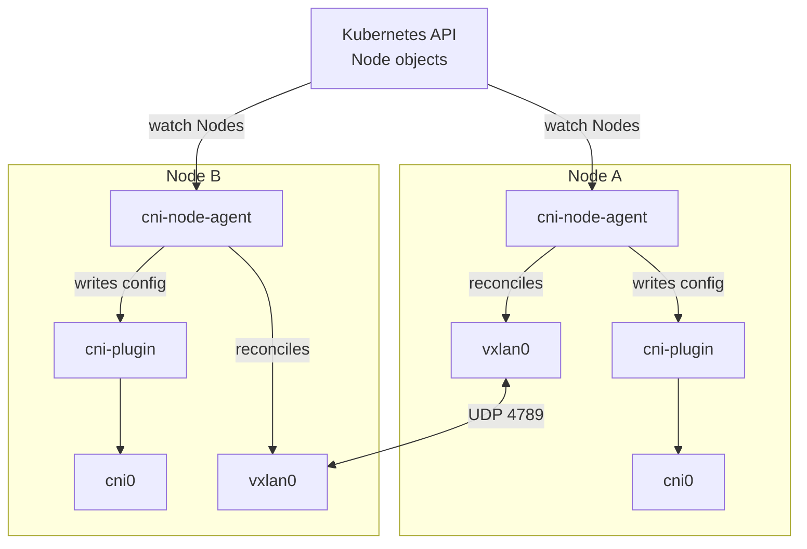
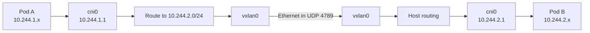

## Introduction

In [Create a Kubernetes CNI Plugin from Scratch](/posts/create-a-cni-plugin-from-scratch/), we built a bridge CNI in Bash or Go. It creates a veth pair for each Pod, delegates address allocation to `host-local`, and connects the host end to `cni0`.

We ended with one Pod CIDR per node and installed cross-node routes by hand:

```text
10.244.1.0/24 via <control-plane underlay IP>
10.244.2.0/24 via <worker underlay IP>
```

That proved the data path, but it did not produce an operable cluster network. Every node addition, removal, Pod CIDR change, or underlay address change would require an administrator to update every other node.

In this follow-on, we will replace those manual routes with a **VXLAN overlay managed by a node agent**. The agent will discover topology from Kubernetes, install the CNI files, reconcile the Linux data path, repair drift, and remove stale peer state.

The existing CNI executable does not change. Whether you chose Bash or Go in the previous article, the same binary can be reused here.

> This remains an educational IPv4 CNI. The agent demonstrates the architecture and reconciliation mechanics, but it does not implement NetworkPolicy, encryption, egress masquerading, dual stack, metrics, leader election, or zero-disruption upgrades.
{: .prompt-info }

## The New Problem

A CNI executable runs for one Pod sandbox and then exits. It is the wrong lifecycle for cluster-wide concerns:

* watching Nodes join and leave;
* discovering each node's Pod CIDR and underlay address;
* maintaining tunnels and routes;
* repairing configuration removed by an operator or reboot;
* deleting state for nodes that no longer exist.

Those tasks need a long-running control loop. Production networking systems therefore commonly separate the per-Pod CNI executable from a node-resident agent.



## Design

The Kubernetes controller manager assigns a Pod CIDR to each Node. The kubelet publishes an `InternalIP`. Together, these fields form the topology database our agent needs:

| Node field | Purpose |
| --- | --- |
| `metadata.name` | Identifies the local and remote nodes |
| `metadata.uid` | Produces a stable, unique VTEP MAC |
| `spec.podCIDR` | Selects the local IPAM range or a remote route |
| `status.addresses[InternalIP]` | Selects the VXLAN underlay endpoint |

Every agent watches all Node objects through a shared informer. On each event, and every 30 seconds as a safety resync, it computes the complete desired state.

For the local node, it:

1. creates `vxlan0` with VNI `100` and UDP destination port `4789`;
2. derives a locally administered VTEP MAC from the Node UID;
3. writes a `host-local` CNI configuration using the assigned Pod CIDR;
4. reserves the first usable address as the `cni0` gateway;
5. uses MTU `1450`, leaving 50 bytes for outer IPv4, UDP, and VXLAN headers.

For every remote node, it installs:

1. a route for the remote Pod CIDR through the remote gateway on `vxlan0`;
2. a permanent neighbor entry mapping that gateway to the remote VTEP MAC;
3. a VXLAN forwarding database entry mapping the VTEP MAC to the remote `InternalIP`.

The resulting packet path is:



This is a routed overlay. We do not join `cni0` and `vxlan0` into one large Layer 2 bridge, and we do not flood unknown Pod destinations across every VTEP. Each node-local Pod subnet remains a separate broadcast domain.

Here, "scalable" means nodes can join and leave without per-node manual commands. The full mesh still stores $N-1$ routes, neighbors, and FDB entries on each node, for $O(N^2)$ aggregate peer state. That model is practical for this lab and many moderate clusters, but very large deployments need additional control-plane engineering, aggregation, or a different route-distribution design.

## Prerequisites and Reused Artifacts

Complete the previous article through the installation of `host-local`, but do not run its cleanup section. The directory `$HOME/cni-plugin-lab` must contain:

* `cni-plugin`, built for the Docker engine's Linux architecture;
* `cni-plugins/host-local`;
* Docker, `kind`, and `kubectl` on the host.

The executable can be either implementation from the previous article. Confirm the reusable files:



```bash
cd "$HOME/cni-plugin-lab"
test -x cni-plugin
test -x cni-plugins/host-local
docker version --format '{{.Server.Version}}'
kind version
kubectl version --client
```



We will reuse the CNI data path and IPAM plugin. We will replace the hand-written per-node CNI files and manual cross-node routes.

## 1. Create the Node Agent Module

Create a separate Go module. The agent uses the Kubernetes 1.37 client libraries and the same netlink library as the Go CNI implementation. It is compiled inside Docker, so Go 1.26 is not required on the host.

<!-- markdownlint-disable MD010 -->

```bash
mkdir -p node-agent
cat > node-agent/go.mod <<'EOF'
module example.com/cni-node-agent

go 1.26.0

require (
	github.com/vishvananda/netlink v1.3.1
	golang.org/x/sys v0.47.0
	k8s.io/api v0.37.1
	k8s.io/apimachinery v0.37.1
	k8s.io/client-go v0.37.1
)
EOF
```

<!-- markdownlint-enable MD010 -->

Create the agent:

<!-- markdownlint-disable MD010 -->



```go
cat > node-agent/main.go <<'EOF'
package main

import (
	"context"
	"crypto/sha256"
	"encoding/json"
	"errors"
	"fmt"
	"log"
	"net"
	"os"
	"path/filepath"
	"sort"
	"time"

	"github.com/vishvananda/netlink"
	"golang.org/x/sys/unix"
	corev1 "k8s.io/api/core/v1"
	"k8s.io/apimachinery/pkg/util/wait"
	"k8s.io/client-go/informers"
	"k8s.io/client-go/kubernetes"
	"k8s.io/client-go/rest"
	"k8s.io/client-go/tools/cache"
)

const (
	vxlanName     = "vxlan0"
	vxlanVNI      = 100
	vxlanPort     = 4789
	overlayMTU    = 1450
	routeProtocol = 99
	configPath    = "/host/etc/cni/net.d/10-cni-plugin.conf"
)

type peer struct {
	name     string
	podCIDR  *net.IPNet
	gateway  net.IP
	underlay net.IP
	mac      net.HardwareAddr
}

type cniConfig struct {
	CNIVersion string     `json:"cniVersion"`
	Name       string     `json:"name"`
	Type       string     `json:"type"`
	Bridge     string     `json:"bridge"`
	MTU        int        `json:"mtu"`
	IPAM       ipamConfig `json:"ipam"`
}

type ipamConfig struct {
	Type   string                `json:"type"`
	Ranges [][]map[string]string `json:"ranges"`
	Routes []map[string]string   `json:"routes"`
}

func ipv4PodCIDR(node *corev1.Node) (*net.IPNet, error) {
	cidrs := node.Spec.PodCIDRs
	if len(cidrs) == 0 && node.Spec.PodCIDR != "" {
		cidrs = []string{node.Spec.PodCIDR}
	}
	for _, value := range cidrs {
		ip, network, err := net.ParseCIDR(value)
		if err == nil && ip.To4() != nil {
			network.IP = ip.To4()
			return network, nil
		}
	}
	return nil, fmt.Errorf("node %s has no IPv4 Pod CIDR", node.Name)
}

func internalIPv4(node *corev1.Node) (net.IP, error) {
	for _, address := range node.Status.Addresses {
		if address.Type == corev1.NodeInternalIP {
			if ip := net.ParseIP(address.Address).To4(); ip != nil {
				return ip, nil
			}
		}
	}
	return nil, fmt.Errorf("node %s has no IPv4 InternalIP", node.Name)
}

func firstUsable(network *net.IPNet) (net.IP, error) {
	ones, bits := network.Mask.Size()
	if bits != 32 || ones > 30 {
		return nil, fmt.Errorf("Pod CIDR %s has no usable gateway address", network)
	}
	ip := append(net.IP(nil), network.IP.To4()...)
	for index := len(ip) - 1; index >= 0; index-- {
		ip[index]++
		if ip[index] != 0 {
			break
		}
	}
	return ip, nil
}

func vtepMAC(uid string) net.HardwareAddr {
	digest := sha256.Sum256([]byte(uid))
	return net.HardwareAddr{0x02, digest[0], digest[1], digest[2], digest[3], digest[4]}
}

func desiredPeers(nodes []*corev1.Node) ([]peer, error) {
	peers := make([]peer, 0, len(nodes))
	for _, node := range nodes {
		podCIDR, err := ipv4PodCIDR(node)
		if err != nil {
			return nil, err
		}
		gateway, err := firstUsable(podCIDR)
		if err != nil {
			return nil, err
		}
		underlay, err := internalIPv4(node)
		if err != nil {
			return nil, err
		}
		peers = append(peers, peer{
			name: node.Name, podCIDR: podCIDR, gateway: gateway,
			underlay: underlay, mac: vtepMAC(string(node.UID)),
		})
	}
	sort.Slice(peers, func(i, j int) bool { return peers[i].name < peers[j].name })
	return peers, nil
}

func ensureVXLAN(local peer) (*netlink.Vxlan, error) {
	link, err := netlink.LinkByName(vxlanName)
	if err == nil {
		vxlan, ok := link.(*netlink.Vxlan)
		if !ok {
			return nil, fmt.Errorf("%s exists but is not a VXLAN device", vxlanName)
		}
		if vxlan.VxlanId != vxlanVNI || vxlan.Port != vxlanPort ||
			!vxlan.SrcAddr.Equal(local.underlay) || vxlan.Attrs().MTU != overlayMTU {
			if err := netlink.LinkDel(vxlan); err != nil {
				return nil, fmt.Errorf("replace incompatible %s: %w", vxlanName, err)
			}
			link = nil
		} else {
			if err := netlink.LinkSetHardwareAddr(vxlan, local.mac); err != nil {
				return nil, fmt.Errorf("set %s MAC: %w", vxlanName, err)
			}
			if err := netlink.LinkSetUp(vxlan); err != nil {
				return nil, fmt.Errorf("set %s up: %w", vxlanName, err)
			}
			return vxlan, nil
		}
	} else {
		var notFound netlink.LinkNotFoundError
		if !errors.As(err, &notFound) {
			return nil, fmt.Errorf("find %s: %w", vxlanName, err)
		}
	}

	attrs := netlink.NewLinkAttrs()
	attrs.Name = vxlanName
	attrs.MTU = overlayMTU
	attrs.HardwareAddr = local.mac
	vxlan := &netlink.Vxlan{
		LinkAttrs: attrs,
		VxlanId:   vxlanVNI,
		SrcAddr:   local.underlay,
		Port:      vxlanPort,
		Learning:  false,
	}
	if err := netlink.LinkAdd(vxlan); err != nil {
		return nil, fmt.Errorf("create %s: %w", vxlanName, err)
	}
	if err := netlink.LinkSetUp(vxlan); err != nil {
		return nil, fmt.Errorf("set %s up: %w", vxlanName, err)
	}
	return vxlan, nil
}

func ensureRemote(vxlan *netlink.Vxlan, remote peer) error {
	route := &netlink.Route{
		LinkIndex: vxlan.Index,
		Dst:       remote.podCIDR,
		Gw:        remote.gateway,
		Protocol:  netlink.RouteProtocol(routeProtocol),
		Flags:     int(netlink.FLAG_ONLINK),
	}
	if err := netlink.RouteReplace(route); err != nil {
		return fmt.Errorf("route %s: %w", remote.podCIDR, err)
	}

	neighbor := &netlink.Neigh{
		LinkIndex:    vxlan.Index,
		Family:       unix.AF_INET,
		State:        unix.NUD_PERMANENT,
		IP:           remote.gateway,
		HardwareAddr: remote.mac,
	}
	if err := netlink.NeighSet(neighbor); err != nil {
		return fmt.Errorf("neighbor %s: %w", remote.gateway, err)
	}

	fdb := &netlink.Neigh{
		LinkIndex:    vxlan.Index,
		Family:       unix.AF_BRIDGE,
		State:        unix.NUD_PERMANENT,
		Flags:        unix.NTF_SELF,
		IP:           remote.underlay,
		HardwareAddr: remote.mac,
	}
	if err := netlink.NeighSet(fdb); err != nil {
		return fmt.Errorf("FDB %s: %w", remote.underlay, err)
	}
	return nil
}

func cleanupRoutes(vxlan *netlink.Vxlan, desired map[string]struct{}) error {
	routes, err := netlink.RouteList(vxlan, netlink.FAMILY_V4)
	if err != nil {
		return err
	}
	for _, route := range routes {
		if int(route.Protocol) != routeProtocol || route.Dst == nil {
			continue
		}
		if _, ok := desired[route.Dst.String()]; !ok {
			stale := route
			if err := netlink.RouteDel(&stale); err != nil {
				return err
			}
		}
	}
	return nil
}

func cleanupNeighbors(vxlan *netlink.Vxlan, family int, desired map[string]struct{}) error {
	neighbors, err := netlink.NeighList(vxlan.Index, family)
	if err != nil {
		return err
	}
	for _, neighbor := range neighbors {
		if neighbor.State != unix.NUD_PERMANENT {
			continue
		}
		if family == unix.AF_BRIDGE && (neighbor.Flags&unix.NTF_SELF == 0 || neighbor.IP == nil) {
			continue
		}
		key := neighbor.IP.String()
		if family == unix.AF_BRIDGE {
			key = neighbor.HardwareAddr.String() + "@" + neighbor.IP.String()
		}
		if _, ok := desired[key]; !ok {
			stale := neighbor
			if err := netlink.NeighDel(&stale); err != nil {
				return err
			}
		}
	}
	return nil
}

func writeCNIConfig(local peer) error {
	config := cniConfig{
		CNIVersion: "1.1.0",
		Name:       "cni-plugin",
		Type:       "cni-plugin",
		Bridge:     "cni0",
		MTU:        overlayMTU,
		IPAM: ipamConfig{
			Type: "host-local",
			Ranges: [][]map[string]string{{{
				"subnet":  local.podCIDR.String(),
				"gateway": local.gateway.String(),
			}}},
			Routes: []map[string]string{{"dst": "0.0.0.0/0"}},
		},
	}
	data, err := json.MarshalIndent(config, "", "  ")
	if err != nil {
		return err
	}
	data = append(data, '\n')
	if err := os.MkdirAll(filepath.Dir(configPath), 0755); err != nil {
		return err
	}
	temporary := configPath + ".tmp"
	if err := os.WriteFile(temporary, data, 0644); err != nil {
		return err
	}
	return os.Rename(temporary, configPath)
}

func reconcile(nodeName string, nodes []*corev1.Node) error {
	peers, err := desiredPeers(nodes)
	if err != nil {
		return err
	}
	var local *peer
	for index := range peers {
		if peers[index].name == nodeName {
			local = &peers[index]
			break
		}
	}
	if local == nil {
		return fmt.Errorf("local node %s not found", nodeName)
	}

	vxlan, err := ensureVXLAN(*local)
	if err != nil {
		return err
	}
	desiredRoutes := map[string]struct{}{}
	desiredNeighbors := map[string]struct{}{}
	desiredFDB := map[string]struct{}{}
	for _, remote := range peers {
		if remote.name == nodeName {
			continue
		}
		if err := ensureRemote(vxlan, remote); err != nil {
			return err
		}
		desiredRoutes[remote.podCIDR.String()] = struct{}{}
		desiredNeighbors[remote.gateway.String()] = struct{}{}
		desiredFDB[remote.mac.String()+"@"+remote.underlay.String()] = struct{}{}
	}
	if err := cleanupRoutes(vxlan, desiredRoutes); err != nil {
		return fmt.Errorf("clean routes: %w", err)
	}
	if err := cleanupNeighbors(vxlan, unix.AF_INET, desiredNeighbors); err != nil {
		return fmt.Errorf("clean neighbors: %w", err)
	}
	if err := cleanupNeighbors(vxlan, unix.AF_BRIDGE, desiredFDB); err != nil {
		return fmt.Errorf("clean FDB: %w", err)
	}
	if err := writeCNIConfig(*local); err != nil {
		return fmt.Errorf("write CNI config: %w", err)
	}
	log.Printf("reconciled %d nodes, local Pod CIDR %s", len(peers), local.podCIDR)
	return nil
}

func main() {
	nodeName := os.Getenv("NODE_NAME")
	if nodeName == "" {
		log.Fatal("NODE_NAME is required")
	}
	config, err := rest.InClusterConfig()
	if err != nil {
		log.Fatal(err)
	}
	client, err := kubernetes.NewForConfig(config)
	if err != nil {
		log.Fatal(err)
	}

	ctx, cancel := context.WithCancel(context.Background())
	defer cancel()
	factory := informers.NewSharedInformerFactory(client, 0)
	informer := factory.Core().V1().Nodes().Informer()
	trigger := make(chan struct{}, 1)
	enqueue := func() {
		select {
		case trigger <- struct{}{}:
		default:
		}
	}
	_, err = informer.AddEventHandler(cache.ResourceEventHandlerFuncs{
		AddFunc:    func(any) { enqueue() },
		UpdateFunc: func(any, any) { enqueue() },
		DeleteFunc: func(any) { enqueue() },
	})
	if err != nil {
		log.Fatal(err)
	}
	factory.Start(ctx.Done())
	if !cache.WaitForCacheSync(ctx.Done(), informer.HasSynced) {
		log.Fatal("Node informer cache did not sync")
	}

	reconcileAll := func() {
		objects := informer.GetStore().List()
		nodes := make([]*corev1.Node, 0, len(objects))
		for _, object := range objects {
			nodes = append(nodes, object.(*corev1.Node))
		}
		if err := reconcile(nodeName, nodes); err != nil {
			log.Printf("reconcile failed: %v", err)
		}
	}

	enqueue()
	wait.UntilWithContext(ctx, func(context.Context) {
		select {
		case <-trigger:
		case <-time.After(30 * time.Second):
		}
		reconcileAll()
	}, time.Second)
}
EOF
```



<!-- markdownlint-enable MD010 -->

There are several deliberate details in this implementation:

* The informer provides event-driven discovery without polling the API on every reconciliation.
* The 30-second resync repairs local drift even when no Node object changes.
* `routeProtocol = 99` marks routes owned by this agent, so cleanup does not delete routes managed by another component.
* Permanent neighbor and FDB entries avoid ARP flooding across all VTEPs.
* The CNI configuration is written to a temporary file and renamed atomically, so containerd never reads partial JSON.
* The config is written only after the VXLAN state succeeds. A node does not become available for ordinary Pods with a half-configured overlay.

## 2. Package the CNI and Agent

The node image contains three executables:

* the unchanged `cni-plugin` from the previous article;
* the standard `host-local` IPAM plugin;
* the new long-running `cni-node-agent`.

```dockerfile
cat > Dockerfile.node-agent <<'EOF'
FROM golang:1.26.2-alpine3.22 AS build
WORKDIR /src
COPY node-agent/go.mod node-agent/main.go ./
RUN go mod tidy
RUN CGO_ENABLED=0 go build -trimpath -o /out/cni-node-agent .

FROM alpine:3.22
RUN apk add --no-cache ca-certificates
COPY --from=build /out/cni-node-agent /usr/local/bin/cni-node-agent
COPY cni-plugin /opt/cni-bundle/cni-plugin
COPY cni-plugins/host-local /opt/cni-bundle/host-local
ENTRYPOINT ["/usr/local/bin/cni-node-agent"]
EOF

docker build -f Dockerfile.node-agent -t cni-node-agent:v1 .
```

The image is node-architecture-specific because it includes the existing CNI and IPAM binaries. Build it with the same Docker engine that will run the kind nodes.

## 3. Create a Three-Node Cluster

Use three nodes so discovery is not accidentally coupled to a single peer. As before, disable kind's default CNI. The controller manager will allocate one `/24` from `10.244.0.0/16` to each Node.

```bash
cat > kind-vxlan.yaml <<'EOF'
kind: Cluster
apiVersion: kind.x-k8s.io/v1alpha4
name: cni-vxlan
networking:
  disableDefaultCNI: true
  podSubnet: 10.244.0.0/16
  serviceSubnet: 10.96.0.0/16
nodes:
- role: control-plane
  image: kindest/node:v1.37.0@sha256:a1ed56cfb0e7b93589bdf97c8cd566405a265939e3620fc4f5de89adff580ae5
- role: worker
  image: kindest/node:v1.37.0@sha256:a1ed56cfb0e7b93589bdf97c8cd566405a265939e3620fc4f5de89adff580ae5
- role: worker
  image: kindest/node:v1.37.0@sha256:a1ed56cfb0e7b93589bdf97c8cd566405a265939e3620fc4f5de89adff580ae5
EOF

kind delete cluster --name cni-vxlan
kind create cluster --config kind-vxlan.yaml
kind load docker-image cni-node-agent:v1 --name cni-vxlan
```

At this point the nodes are expected to be `NotReady`: containerd has no CNI configuration yet. Confirm that Kubernetes allocated distinct CIDRs:

```bash
kubectl get nodes -o 'custom-columns=NAME:.metadata.name,POD_CIDR:.spec.podCIDR,INTERNAL_IP:.status.addresses[0].address'
```

Do not hard-code the values printed by this command. The agent consumes the Node objects directly.

## 4. Deploy the Node Agent

The agent only reads Node objects from the API, so its ClusterRole grants exactly `get`, `list`, and `watch` on `nodes`.

It runs with host networking because it must bootstrap networking before ordinary Pod sandboxes can start. Kubernetes automatically tolerates `node.kubernetes.io/network-unavailable` for host-network DaemonSet Pods, avoiding a dependency cycle.

The main container receives `NET_ADMIN` in the host network namespace and mounts the host CNI configuration directory. An init container copies the CNI and IPAM executables into the host's CNI binary directory.

```bash
cat > cni-node-agent.yaml <<'EOF'
apiVersion: v1
kind: ServiceAccount
metadata:
  name: cni-node-agent
  namespace: kube-system
---
apiVersion: rbac.authorization.k8s.io/v1
kind: ClusterRole
metadata:
  name: cni-node-agent
rules:
- apiGroups: [""]
  resources: ["nodes"]
  verbs: ["get", "list", "watch"]
---
apiVersion: rbac.authorization.k8s.io/v1
kind: ClusterRoleBinding
metadata:
  name: cni-node-agent
roleRef:
  apiGroup: rbac.authorization.k8s.io
  kind: ClusterRole
  name: cni-node-agent
subjects:
- kind: ServiceAccount
  name: cni-node-agent
  namespace: kube-system
---
apiVersion: apps/v1
kind: DaemonSet
metadata:
  name: cni-node-agent
  namespace: kube-system
spec:
  selector:
    matchLabels:
      app: cni-node-agent
  template:
    metadata:
      labels:
        app: cni-node-agent
    spec:
      hostNetwork: true
      priorityClassName: system-node-critical
      serviceAccountName: cni-node-agent
      tolerations:
      - operator: Exists
      initContainers:
      - name: install-cni
        image: cni-node-agent:v1
        imagePullPolicy: Never
        command: ["/bin/sh", "-ec"]
        args:
        - |
          install -m 0755 /opt/cni-bundle/cni-plugin /host/opt/cni/bin/cni-plugin
          install -m 0755 /opt/cni-bundle/host-local /host/opt/cni/bin/host-local
        volumeMounts:
        - name: cni-bin
          mountPath: /host/opt/cni/bin
      containers:
      - name: agent
        image: cni-node-agent:v1
        imagePullPolicy: Never
        securityContext:
          runAsUser: 0
          capabilities:
            add: ["NET_ADMIN"]
        env:
        - name: NODE_NAME
          valueFrom:
            fieldRef:
              fieldPath: spec.nodeName
        readinessProbe:
          exec:
            command:
            - /bin/sh
            - -ec
            - test -f /host/etc/cni/net.d/10-cni-plugin.conf && test -d /sys/class/net/vxlan0
          periodSeconds: 2
        resources:
          requests:
            cpu: 20m
            memory: 32Mi
          limits:
            memory: 128Mi
        volumeMounts:
        - name: cni-conf
          mountPath: /host/etc/cni/net.d
      volumes:
      - name: cni-bin
        hostPath:
          path: /opt/cni/bin
          type: Directory
      - name: cni-conf
        hostPath:
          path: /etc/cni/net.d
          type: DirectoryOrCreate
EOF

kubectl apply -f cni-node-agent.yaml
kubectl rollout status daemonset/cni-node-agent -n kube-system --timeout=180s
kubectl wait --for=condition=Ready nodes --all --timeout=180s
```

The DaemonSet is privileged in a narrower sense than `privileged: true`: the agent receives `CAP_NET_ADMIN`, host networking, and write access to the CNI directory. This is still powerful node-level access and should be treated as part of the trusted cluster networking stack.

## 5. Inspect the Reconciled State

Every node should now have a configuration derived from its own assigned Pod CIDR:

```bash
for node in cni-vxlan-control-plane cni-vxlan-worker cni-vxlan-worker2; do
  echo "--- $node"
  docker exec "$node" cat /etc/cni/net.d/10-cni-plugin.conf
done
```

Inspect the local tunnel and remote routes:

```bash
for node in cni-vxlan-control-plane cni-vxlan-worker cni-vxlan-worker2; do
  echo "--- $node"
  docker exec "$node" ip -details link show vxlan0
  docker exec "$node" ip -4 route show protocol 99
  docker exec "$node" ip neigh show dev vxlan0
  docker exec "$node" bridge fdb show dev vxlan0
done
```

On each node, expect:

* one route for each of the other two Pod CIDRs;
* one permanent neighbor entry for each remote bridge gateway;
* one permanent FDB entry mapping each remote VTEP MAC to its underlay IP;
* VNI `100`, destination port `4789`, and MTU `1450` on `vxlan0`.

## 6. Test the Overlay End to End

Create one Pod on each node. The control-plane Pod needs a toleration for its default taint.

```bash
kubectl run pod-control \
  --image=registry.k8s.io/e2e-test-images/agnhost:2.53 \
  --overrides='{"spec":{"nodeSelector":{"kubernetes.io/hostname":"cni-vxlan-control-plane"},"tolerations":[{"operator":"Exists"}],"containers":[{"name":"pod-control","image":"registry.k8s.io/e2e-test-images/agnhost:2.53","args":["pause"]}]}}'

kubectl run pod-worker-1 \
  --image=registry.k8s.io/e2e-test-images/agnhost:2.53 \
  --overrides='{"spec":{"nodeSelector":{"kubernetes.io/hostname":"cni-vxlan-worker"},"containers":[{"name":"pod-worker-1","image":"registry.k8s.io/e2e-test-images/agnhost:2.53","args":["pause"]}]}}'

kubectl run pod-worker-2 \
  --image=registry.k8s.io/e2e-test-images/agnhost:2.53 \
  --overrides='{"spec":{"nodeSelector":{"kubernetes.io/hostname":"cni-vxlan-worker2"},"containers":[{"name":"pod-worker-2","image":"registry.k8s.io/e2e-test-images/agnhost:2.53","args":["pause"]}]}}'

kubectl wait --for=condition=Ready pod/pod-control pod/pod-worker-1 pod/pod-worker-2 --timeout=180s
kubectl get pods -o wide
```

Test every cross-node direction without manually copying addresses:

```bash
CONTROL_IP=$(kubectl get pod pod-control -o jsonpath='{.status.podIP}')
WORKER_1_IP=$(kubectl get pod pod-worker-1 -o jsonpath='{.status.podIP}')
WORKER_2_IP=$(kubectl get pod pod-worker-2 -o jsonpath='{.status.podIP}')

kubectl exec pod-control -- ping -c 3 "$WORKER_1_IP"
kubectl exec pod-control -- ping -c 3 "$WORKER_2_IP"
kubectl exec pod-worker-1 -- ping -c 3 "$CONTROL_IP"
kubectl exec pod-worker-1 -- ping -c 3 "$WORKER_2_IP"
kubectl exec pod-worker-2 -- ping -c 3 "$CONTROL_IP"
kubectl exec pod-worker-2 -- ping -c 3 "$WORKER_1_IP"
```

Verify the MTU boundary. An ICMP payload of 1422 bytes plus 8 bytes of ICMP and 20 bytes of inner IPv4 headers produces a 1450-byte inner packet. VXLAN adds 50 bytes on an IPv4 underlay, producing a 1500-byte outer packet:

```bash
kubectl exec pod-worker-1 -- ip -o link show eth0 | grep 'mtu 1450'
kubectl exec pod-worker-1 -- ping -s 1422 -c 3 "$WORKER_2_IP"
```

The interface check confirms that the CNI applied the overlay MTU, and the ping sends the largest inner IPv4 ICMP packet that fits within it. The BusyBox `ping` in the pinned `agnhost` image does not expose a don't-fragment option, so this command does not claim to test path MTU discovery. One additional payload byte would exceed the Pod interface MTU and require fragmentation or a smaller segment from the application.

## 7. Prove Reconciliation

A setup script creates state once. A controller continuously restores desired state. Delete one managed route from the first worker:

```bash
CONTROL_CIDR=$(kubectl get node cni-vxlan-control-plane -o jsonpath='{.spec.podCIDR}')
docker exec cni-vxlan-worker ip route delete "$CONTROL_CIDR"
docker exec cni-vxlan-worker ip route show "$CONTROL_CIDR"
```

Wait for the 30-second safety resync, then verify that the agent restored it:

```bash
for attempt in $(seq 1 40); do
  if docker exec cni-vxlan-worker ip route show "$CONTROL_CIDR" | grep -q vxlan0; then
    echo "Route reconciled"
    break
  fi
  sleep 1
done
docker exec cni-vxlan-worker ip route show "$CONTROL_CIDR"
kubectl logs -n kube-system \
  "$(kubectl get pod -n kube-system -l app=cni-node-agent --field-selector spec.nodeName=cni-vxlan-worker -o jsonpath='{.items[0].metadata.name}')" \
  --tail=5
```

Node additions and removals follow the event-driven path rather than waiting for the resync. When the informer observes a changed Node list, every agent recomputes routes, neighbors, and FDB entries. Entries no longer present in desired state are deleted only from the resources owned by this agent.

## Failure Boundaries

The separation between the CNI and node agent is now explicit:

| Failure | Effect |
| --- | --- |
| CNI `ADD` fails | One Pod sandbox fails; the plugin rolls back its veth and IP allocation |
| Agent cannot read Nodes | Existing data-plane state continues, but topology changes are not learned |
| Agent crashes | Existing kernel state remains; the DaemonSet restarts the agent |
| VXLAN state is deleted | Cross-node traffic fails until the next reconciliation |
| CNI config is absent | New ordinary Pods cannot start; the host-network agent can still repair it |
| Remote node disappears | Its state remains until Kubernetes removes its Node object, then reconciliation deletes it |

This design intentionally favors continuity: stopping the agent does not tear down a working data path.

## Security and Production Gaps

The agent has only read access to the Kubernetes API, but `CAP_NET_ADMIN` in the host network namespace and writable host CNI paths are highly privileged capabilities. Protect the image supply chain and restrict who can modify the DaemonSet.

Before treating this as production networking, add at least:

* health and readiness based on successful reconciliation, not only file and link existence;
* Prometheus metrics and structured event reporting;
* graceful, version-aware upgrades of the CNI binaries and configuration;
* API-server outage tests and cached-topology behavior;
* underlay interface and MTU discovery instead of fixed `1450`;
* IPv6 or dual-stack reconciliation;
* NetworkPolicy enforcement;
* egress masquerading where external networks cannot route Pod CIDRs;
* validation that Pod CIDRs do not overlap;
* collision detection for deterministic VTEP MAC addresses;
* filtering and rate-limiting Node updates so unrelated status changes do not trigger full reconciliation;
* network namespaces or test nodes for destructive reconciliation tests;
* an explicit policy for nodes with multiple eligible `InternalIP` addresses.

VXLAN provides isolation by VNI, not encryption or authentication. Anyone with access to the underlay and UDP port `4789` may be able to inject encapsulated traffic unless the underlay is separately protected.

## Clean Up

Delete workload Pods and the DaemonSet first:

```bash
kubectl delete pod pod-control pod-worker-1 pod-worker-2 --ignore-not-found
kubectl delete -f cni-node-agent.yaml --ignore-not-found
```

Deleting the DaemonSet deliberately leaves kernel state intact. For this lab, remove the owned resources before deleting the cluster:

```bash
for node in cni-vxlan-control-plane cni-vxlan-worker cni-vxlan-worker2; do
  docker exec "$node" ip link delete vxlan0 2>/dev/null || true
  docker exec "$node" rm -f /etc/cni/net.d/10-cni-plugin.conf
  docker exec "$node" rm -f /opt/cni/bin/cni-plugin /opt/cni/bin/host-local
done
kind delete cluster --name cni-vxlan
```

Remove the generated sequel files while keeping the reusable artifacts from the first article:

```bash
rm -rf node-agent Dockerfile.node-agent kind-vxlan.yaml cni-node-agent.yaml
```

## Conclusion

The original CNI plugin solved the per-Pod problem: create a veth, allocate an address, configure the namespace, and clean it up. The node agent solves the cluster problem:

1. discover node-local and remote topology from Kubernetes;
2. turn Node Pod CIDRs into local IPAM configuration;
3. turn remote Pod CIDRs into VXLAN routes, neighbors, and FDB entries;
4. continuously repair drift and remove stale state.

This separation is the important architectural step. The CNI executable stays small and synchronous, while a long-running reconciler owns shared host state. VXLAN changes how packets cross the underlay, but it does not require rewriting the Pod attachment path we already built.

## References

* [Create a Kubernetes CNI Plugin from Scratch](/posts/create-a-cni-plugin-from-scratch/)
* [Kubernetes Nodes](https://kubernetes.io/docs/concepts/architecture/nodes/)
* [Kubernetes DaemonSets](https://kubernetes.io/docs/concepts/workloads/controllers/daemonset/)
* [Kubernetes RBAC](https://kubernetes.io/docs/reference/access-authn-authz/rbac/)
* [Kubernetes Network Plugins](https://kubernetes.io/docs/concepts/extend-kubernetes/compute-storage-net/network-plugins/)
* [Linux VXLAN Documentation](https://www.kernel.org/doc/html/latest/networking/vxlan.html)
* [RFC 7348: Virtual eXtensible Local Area Network](https://datatracker.ietf.org/doc/html/rfc7348)
* [CNI Specification 1.1.0](https://www.cni.dev/docs/spec/)
