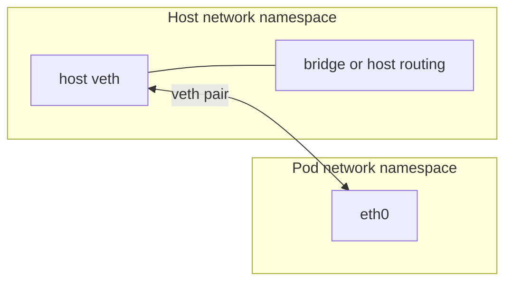
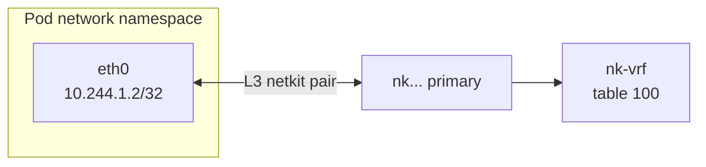
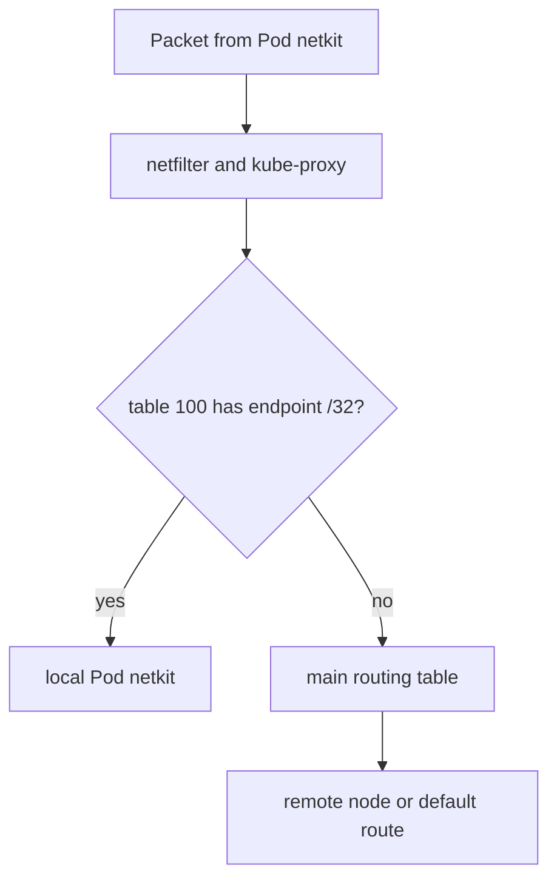
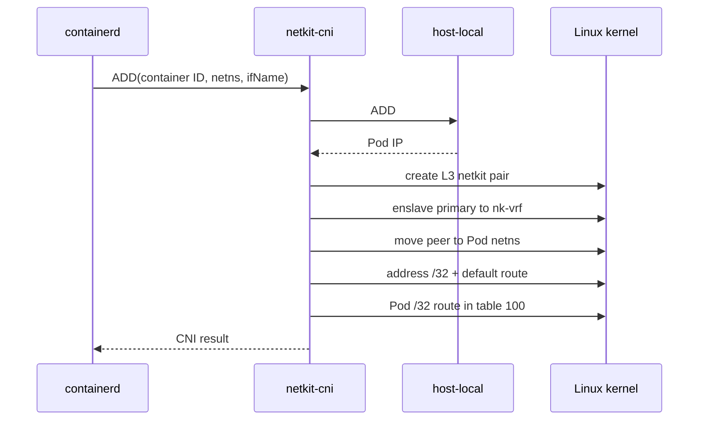
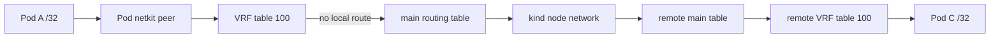

## Introduction

Most "build a CNI" tutorials eventually arrive at the same picture:

1. create a veth pair;
2. move one end into the Pod network namespace;
3. attach the host end to a bridge, or add a host route;
4. configure an address and routes.

That is a good way to learn the [Container Network Interface
(CNI)](https://www.cni.dev/docs/spec/) contract. It is not the only datapath
that contract can drive.

In this post, we will build a small CNI plugin in Go around **netkit**, the
Linux network device introduced for container networking. We will use netkit
in Layer 3 mode, put Pod-facing devices in a Linux VRF, route between three
kind nodes without an overlay or NAT, and inspect every step.

This follows two earlier posts:

* [Create a Kubernetes CNI Plugin from Scratch](/posts/create-a-cni-plugin-from-scratch/)
  introduced `ADD`, `DEL`, veth, and delegated IPAM.
* [Build a Scalable VXLAN Overlay for a Kubernetes
  CNI](/posts/build-a-scalable-vxlan-overlay-for-a-kubernetes-cni/) added a
  node agent and cross-node reconciliation.

The result here is deliberately educational. It relies on kube-proxy for
Services and does not implement network policy, encryption, BGP, or a
production-grade IPAM control plane. It does make the Pod datapath and its
trade-offs visible.

> A precise CNI detail matters from the start: the container runtime creates
> the Pod network namespace. It passes the namespace path to our plugin in
> `CNI_NETNS`; the plugin connects that existing namespace to the network.
{: .prompt-info }

## Build the Mental Model First

Before choosing devices and routes, separate four concepts that are often
collapsed into the word "CNI":

| Concept | Responsibility in this lab |
| --- | --- |
| **Network namespace** | Gives a Pod its own interfaces, routes, neighbors, and socket view |
| **CNI** | The executable contract used by the runtime to connect that namespace |
| **IPAM** | Allocates and releases a Pod address |
| **Datapath** | The Linux devices, routing tables, rules, and optional BPF programs that carry packets |

The container runtime creates the network namespace before calling us. A new
namespace has its own loopback device and networking state, but it is not
connected to the host or another node. The runtime invokes the CNI binary with
`ADD`, identifies the existing namespace through `CNI_NETNS`, and asks for an
interface named by `CNI_IFNAME`—normally `eth0`.

Our plugin delegates address allocation to the standard `host-local` IPAM
binary. CNI and IPAM answer **what lifecycle operation is requested** and
**which address belongs to the Pod**. They do not prescribe how a packet
travels after setup. That is the datapath decision.

### The Familiar Baseline: Veth

A virtual Ethernet, or **veth**, is a connected pair of Linux interfaces.
Whatever one end transmits appears as received traffic on the other end. A
container runtime or CNI commonly keeps one end in the host namespace and
moves its peer into the Pod namespace:



Veth is general purpose and widely supported. It behaves like an Ethernet
link, which makes it compatible with bridges, ARP, qdiscs, traffic control,
and existing tooling. Those same general-purpose layers are not free. Modern
BPF-based CNIs often know the destination and policy before every traditional
networking stage needs to run.

This does not make veth "slow" in every workload. It explains why a
container-specific device can expose a more suitable programming model.

## Netkit from First Principles

**Netkit** is a Linux network device designed for container networking. Like
veth, it normally exists as a pair spanning two network namespaces. Unlike
veth, the pair has distinct management roles:

* the **primary** remains visible to the host agent;
* the **peer** is the workload-facing device, normally moved into the Pod
  namespace;
* peer BPF programs can be managed through the primary from the host, so an
  agent does not need to enter every Pod namespace.

Primary and peer describe management, not one-way traffic. Both devices can
transmit and receive.

Netkit supports two modes:

| Mode | Model | Typical use |
| --- | --- | --- |
| **Layer 2** | Ethernet semantics, including MAC addresses and ARP | Compatibility with L2-oriented datapaths |
| **Layer 3** | Routed IP link with `NOARP` behavior | Route-oriented container networking |

We use Layer 3 mode. The Pod receives a `/32` address and a gateway-free
default route:

```text
10.244.1.2/32 dev eth0
default dev eth0
```

There is no imaginary gateway MAC for the Pod to discover. The peer passes
the IP packet to its primary, and Linux routing decides the next hop.

### Forward, Blackhole, and BPF

Each side has a default transmit policy:

* **forward** passes the packet to the paired device;
* **blackhole** drops it.

A BPF program can override that default with actions such as pass, drop, or
redirect. Cilium configures a peer to blackhole traffic when its required BPF
program is missing, which is a fail-closed production behavior. This lab
attaches no BPF program, so both sides must use `forward`.

That distinction is important: **netkit does not require BPF**, and replacing
veth with netkit does not automatically reproduce Cilium's datapath.
Cilium's larger gains combine netkit with endpoint BPF programs, BPF host
routing, service handling, and policy.

At the driver level, netkit is `NO_QUEUE`. Its container-oriented attachment
model and fast namespace transition create opportunities to avoid work that a
generic veth datapath performs. This article does not assign a benchmark
number to that architectural difference.

Linux 6.7 contains the initial netkit driver. Cilium documents Linux 6.8 or
newer as its supported baseline for netkit mode, so this lab uses **6.8+** as
its practical minimum too.

## Linux Routing: Tables Before VRFs

A Linux routing table is a **Forwarding Information Base (FIB)**. A route
maps a destination prefix to an output device, a next hop, or an action.
Linux chooses the most specific matching prefix:

```text
192.0.2.42/32 dev eth1
192.0.2.0/24  via 198.51.100.1
default       via 203.0.113.1
```

For `192.0.2.42`, the `/32` wins over `/24` and the default route.

Linux has multiple FIBs. Table `main` is the ordinary host routing table, but
a **policy rule** can select another table before `main`:

```text
0:    lookup local
500:  to 10.244.1.0/24 lookup 100
1000: lookup [l3mdev-table]
32766: lookup main
```

Rule priority is evaluated from the lowest number upward. Our priority-500
rule sends destinations in the local node's Pod CIDR to table 100. Remote Pod
CIDRs remain in `main`, where they point to the remote node's Internal IP.

This is policy-based routing, not NetworkPolicy. It selects a FIB; it does not
authorize traffic.

## What Is a Linux VRF?

A **Virtual Routing and Forwarding (VRF)** device creates a named Layer 3
routing domain inside one network namespace. When we create:

```bash
ip link add nk-vrf type vrf table 100
```

`nk-vrf` becomes an **L3 master device** associated with FIB table 100.
Interfaces attached with `ip link set <device> master nk-vrf` are called
slaves of that VRF.

For an incoming packet on a VRF slave, Linux marks the packet with that L3
domain and the automatically installed `l3mdev` rule selects table 100.
On output, the selected route sends the packet through a slave interface.
This gives all Pod-facing primaries one routing domain without creating a
second host network namespace.

VRF and network namespace are not synonyms:

| Network namespace | VRF |
| --- | --- |
| Isolates interfaces, routes, netfilter state, and sockets | Primarily separates Layer 3 routing tables |
| Requires moving or creating devices inside it | Keeps devices in the same namespace under an L3 master |
| Used by each Pod | Used here once per node for all Pod-facing devices |

A VRF is also not automatically a security boundary. Routes can deliberately
connect it to another routing domain, and policy must still be enforced
separately.

### Route Leaking and Socket Scope

**Route leaking** means installing controlled paths between routing domains.
In this design, a lookup that finds no matching route in table 100 continues
to the later `main` rule. Remote Pod CIDRs and ordinary destinations therefore
use the main table without crossing another virtual device. That is different
from NAT, which rewrites addresses.

Linux also scopes sockets by VRF. A socket bound to `nk-vrf` naturally uses
table 100. An unbound host socket, such as kubelet's TCP readiness prober,
normally belongs to the default routing domain. The kernel provides:

```text
net.ipv4.tcp_l3mdev_accept
net.ipv4.udp_l3mdev_accept
```

Enabling them allows unbound host services to communicate across VRF domains.
The kernel documentation warns that selection is unspecified if identically
bound VRF-aware and unbound services coexist. That is an explicit trade-off
in this educational design.

## Why Combine Netkit and VRF?

The two technologies solve different problems:

* **netkit** crosses the Pod namespace boundary and provides a
  container-oriented, BPF-ready device;
* **VRF** gives all Pod-facing host devices a dedicated, inspectable FIB;
* **policy rules** direct local Pod destinations into that FIB;
* **rule continuation** sends cross-node and non-Pod traffic to table `main`;
* **ordinary node routes** carry Pod packets between kind nodes without an
  overlay or NAT.

With those concepts in place, we can assemble the complete datapath.

## The Datapath We Will Build

Each Pod receives an L3 netkit pair:



The host-side primary is enslaved to `nk-vrf`. Linux automatically applies
the VRF's routing table to packets received from that device. The CNI adds a
`/32` route back to the Pod in table 100.

The priority-500 rule handles destinations on the local node. Table 100 has no
default route: when it does not contain a destination, policy evaluation
continues to the main table.



The resulting route ownership is small:

* table 100 contains a `/32` for every local Pod;
* a priority-500 rule sends the local Pod CIDR to table 100;
* the main table sends each remote Pod CIDR to that node's kind IP;
* the main table handles other destinations with its normal routes;
* no rule rewrites a Pod source address.

Each node also assigns `169.254.100.1/32` to `nk-vrf`. This node-local address
gives host-originated connections, including kubelet probes, a valid source.
It is reused on every node and is never routed between nodes.

Linux also scopes sockets by VRF. The agent enables `tcp_l3mdev_accept` and
`udp_l3mdev_accept` so unbound host services—including kubelet's TCP
prober—can communicate with the Pod VRF. This is convenient for the lab, but
the kernel documentation warns that socket selection is unspecified if
identically bound VRF-aware and unbound services coexist. The VRF organizes
routing here; it is not a security boundary.

## Responsibilities: CNI Binary and Node Agent

The code is in
[`github.com/srodi/netkit-cni`](https://github.com/srodi/netkit-cni).
It builds two binaries.

### `netkit-cni`

The runtime executes this binary for a Pod sandbox:



The plugin supports `ADD`, `CHECK`, and `DEL`. `ADD` rolls back the link and
IP allocation if a later operation fails. `DEL` derives the same deterministic
host interface name from the container ID, removes the pair if it still
exists, and always asks `host-local` to release the allocation. That last
step is important because a runtime may call `DEL` after the network
namespace has already disappeared.

The netkit policy is `forward` on both devices. Cilium instead configures a
peer to blackhole packets if its BPF program is absent. Our plugin has no BPF
datapath, so blackhole would correctly—and completely—stop traffic.

### `netkit-agent`

A host-networked DaemonSet runs one agent on every node. It:

1. reads Node Pod CIDRs and Internal IPs from the Kubernetes API;
2. creates `nk-vrf`, table 100, and its node-local source address;
3. reconciles remote Pod CIDR routes and the priority-500 local rule;
4. removes obsolete routes and transit links from older project versions;
5. enables IPv4 forwarding and the required l3mdev socket sysctls;
6. writes that node's CNI configuration atomically.

Separating these jobs follows an important CNI design rule: `ADD` is on the
Pod-creation latency path and should not become a miniature cluster
controller.

## Prerequisites

You need:

* a Linux kernel 6.8 or newer with `CONFIG_NETKIT`;
* Docker;
* kind;
* `kubectl`;
* Go, if you want to run the unit tests locally.

On macOS, kind nodes use the Linux kernel from the Docker Desktop VM—not the
macOS kernel. Check it rather than assuming it supports netkit:

```bash
docker run --rm --privileged --entrypoint sh alpine:3.22 \
  -c 'uname -r; ip link add nk-probe type netkit &&
      ip -details link show nk-probe &&
      ip link delete nk-probe'
```

`Operation not supported` means the VM kernel does not provide netkit. A
newer userspace `ip` command cannot add a missing kernel driver. Conversely,
the Go plugin talks to rtnetlink directly, so `iproute2` netkit syntax support
is useful for inspection but is not required by the plugin itself.

## Build and Test the Code

Clone the project and run the fast checks first:

```bash
git clone https://github.com/srodi/netkit-cni.git
cd netkit-cni

make prerequisites
make test
make build
```

The prerequisite checker validates the running kernel by creating temporary
netkit and VRF devices, then checks the required tools. The unit tests exercise
configuration validation, deterministic interface names, Pod address
conversion, and route planning without requiring root.

The repository pins the kind node image and CNI plugin release used by this
article. Create the three-node cluster and install the local binaries:

```bash
make kind-up
```

The kind configuration disables its default CNI. Nodes are initially
`NotReady`; that is expected. The privileged, host-networked `netkit-agent`
DaemonSet installs the two binaries and `host-local`, creates the node
datapath, and writes `/etc/cni/net.d/10-netkit-cni.conf`.

Wait for the result:

```bash
kubectl wait --for=condition=Ready nodes --all --timeout=180s
kubectl -n kube-system get pods -l app.kubernetes.io/name=netkit-cni -o wide
kubectl get nodes \
  -o custom-columns=NAME:.metadata.name,INTERNAL-IP:.status.addresses[0].address,PODCIDR:.spec.podCIDR
```

## Inspect the Linux State

Choose a worker:

```bash
NODE=netkit-cni-worker
```

The VRF is associated with table 100:

```bash
docker exec "$NODE" ip -details link show nk-vrf
docker exec "$NODE" ip rule show
docker exec "$NODE" ip route show table 100
```

The first VRF creation also installs the kernel's `l3mdev` rule. Pod `/32`
routes appear in table 100 as Pods are created.

List Pod devices and remote routes:

```bash
docker exec "$NODE" ip -details link show type netkit
docker exec "$NODE" ip route show table 100
docker exec "$NODE" ip route show table main proto 98
```

The host names are hashes rather than Pod names. CNI receives a container
ID, so deriving a short, deterministic name from that ID makes `DEL`
independent of Kubernetes API metadata and respects Linux's 15-character
interface-name limit.

## Test Same-Node and Cross-Node Traffic

Run the end-to-end test supplied by the project:

```bash
make e2e
```

It creates test Pods pinned across the workers and verifies:

* same-node Pod-to-Pod traffic;
* cross-node traffic in both directions;
* source addresses observed by the destination;
* local and remote ClusterIP endpoints;
* cluster DNS and a headless Service;
* netkit device type and L3 mode;
* VRF membership and expected routes.

To follow one packet manually:

```bash
kubectl get pods -o wide
kubectl exec netkit-a -- ip -4 address show dev eth0
kubectl exec netkit-a -- ip route
kubectl exec netkit-a -- ping -c 3 "$(kubectl get pod netkit-c -o jsonpath='{.status.podIP}')"
```

For a cross-node packet from `netkit-a` to `netkit-c`, the path is:



The destination observes Pod A's `10.244.x.y` address. That proves this path
does not masquerade the packet; it does not prove that no unrelated
iptables/nftables rule exists on the node.

## Where Is the Performance Benefit?

This lab demonstrates the primitive, not a publishable benchmark.

The architectural advantages are still visible:

* **No per-Pod bridge.** L3 routes connect workloads directly.
* **No Pod ARP.** A `/32` address and link route are sufficient in L3 mode.
* **No per-device qdisc queue.** The netkit driver marks devices
  `NO_QUEUE`.
* **Host-managed peer programs.** A production agent can own peer BPF
  attachments without entering every Pod namespace.
* **Programmable failure policy.** A production datapath can blackhole a
  peer when its required BPF program is missing.

Netkit alone does not remove normal FIB lookups, policy rules, netfilter, or
conntrack. Comparing this lab against a bridge CNI and attributing every
difference to netkit would be misleading: the topologies are not equivalent.

For a meaningful experiment, compare equivalent routed datapaths on the same
kernel, CPU allocation, MTU, offload settings, and workload placement.
Measure at least:

* same-node and cross-node TCP throughput;
* request/response latency at several payload sizes;
* packets per second;
* node CPU per unit of traffic;
* retransmits and drops.

Run enough iterations to report distributions, not one attractive number.
For production evidence and tuning, use Cilium's published netkit guidance
and reproduce it on your own hardware.

## Netkit and VRF: Pros and Cons

| Choice | Benefits | Costs |
|---|---|---|
| L3 netkit per Pod | No ARP, route-oriented model, BPF-ready peer, no per-Pod veth | Requires a recent kernel; ecosystem and tooling are newer |
| VRF for Pod links | Explicit routing domain, inspectable FIB, one place for domain-wide policy | Route leaking is extra state; host services need deliberate VRF treatment |
| Direct node routes | No tunnel header or overlay MTU reduction; original Pod source survives | Underlay must route Pod CIDRs or, as in kind, every node must install routes |
| `host-local` IPAM | Small, standard, easy to inspect | Coordinates only on one node; requires disjoint node CIDRs |
| Forward policy without BPF | Keeps the tutorial focused on Linux routing | No network policy, identity, load balancing, or fail-closed enforcement |

## How This Relates to Cilium and Calico

The CNI contract does not dictate the datapath.

**Cilium** can use netkit in L3 or L2 mode and recommends L3. Its netkit mode
requires BPF host routing. Cilium attaches endpoint programs, implements
policy and service handling, and can choose tunneling or native routing.
That is much more than this lab's `forward` policy and Linux routes.

**Calico** is a useful comparison because its documented datapath is also
route-oriented: a host route points to each local workload, and remote
workload routes point to other nodes. Depending on configuration, Calico can
use iptables or eBPF and can distribute routes with BGP or program routes for
encapsulated and unencapsulated pools. The mental model resembles our FIB,
but the control plane and policy system are production systems.

The shared CNI call—`ADD this interface to this namespace`—does not tell you
whether the resulting packet crosses veth, netkit, a bridge, BPF programs, a
VRF, VXLAN, native routes, or several of them.

## What This CNI Does Not Implement

Do not deploy this project as a production cluster network. It omits:

* Kubernetes NetworkPolicy;
* Service load balancing and kube-proxy replacement;
* route distribution beyond watching Kubernetes Nodes;
* IPv6 and dual stack;
* overlapping tenant address spaces;
* encryption;
* MTU discovery;
* high-scale route aggregation;
* upgrades across mixed veth/netkit nodes;
* garbage collection for every possible runtime crash sequence;
* production hardening of the privileged node installer.

The DaemonSet can modify host routes, interfaces, sysctls, and CNI files.
Treat that as node-root-equivalent access even though the code is small.

## Clean Up

```bash
make kind-down
```

Deleting the kind cluster removes the node containers and all netkit, VRF,
route, CNI, and IPAM state inside them.

## Conclusion

Building a CNI around netkit changes the questions worth asking.

With veth, tutorials naturally focus on bridges, MAC addresses, and ARP.
With L3 netkit, the useful center of gravity becomes routes, programmable
peer behavior, and the boundary between a workload routing domain and the
host.

Our plugin remains small:

* containerd supplies the CNI request and existing namespace;
* `host-local` allocates one address;
* netkit connects the namespace;
* a VRF selects the Pod FIB;
* the node agent reconciles cross-node routes;
* Linux forwards the original packet without NAT.

That is enough to understand the primitive. It is also enough to see why
real CNIs add BPF policy, service translation, route distribution,
observability, recovery, and years of operational engineering around the
same deceptively small CNI contract.

## References

* [CNI Specification 1.1](https://www.cni.dev/docs/spec/)
* [CNI Plugins and `host-local`](https://www.cni.dev/plugins/current/ipam/host-local/)
* [Linux netkit driver source](https://git.kernel.org/pub/scm/linux/kernel/git/torvalds/linux.git/tree/drivers/net/netkit.c)
* [iproute2 netkit implementation](https://git.kernel.org/pub/scm/network/iproute2/iproute2.git/tree/ip/iplink_netkit.c)
* [Linux VRF documentation](https://docs.kernel.org/networking/vrf.html)
* [Cilium performance tuning: netkit device mode](https://docs.cilium.io/en/stable/operations/performance/tuning/#netkit-device-mode)
* [Cilium routing concepts](https://docs.cilium.io/en/stable/network/concepts/routing/)
* [Calico data path](https://docs.tigera.io/calico/latest/reference/architecture/data-path)
* [kind networking configuration](https://kind.sigs.k8s.io/docs/user/configuration/#networking)
