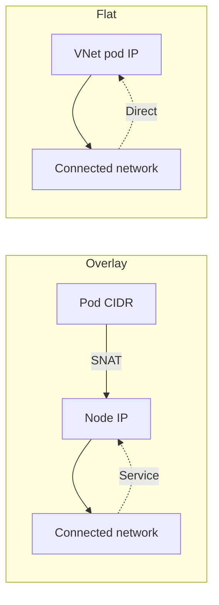
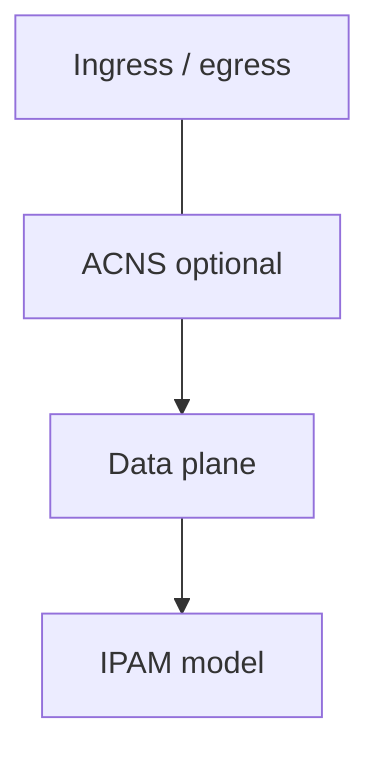
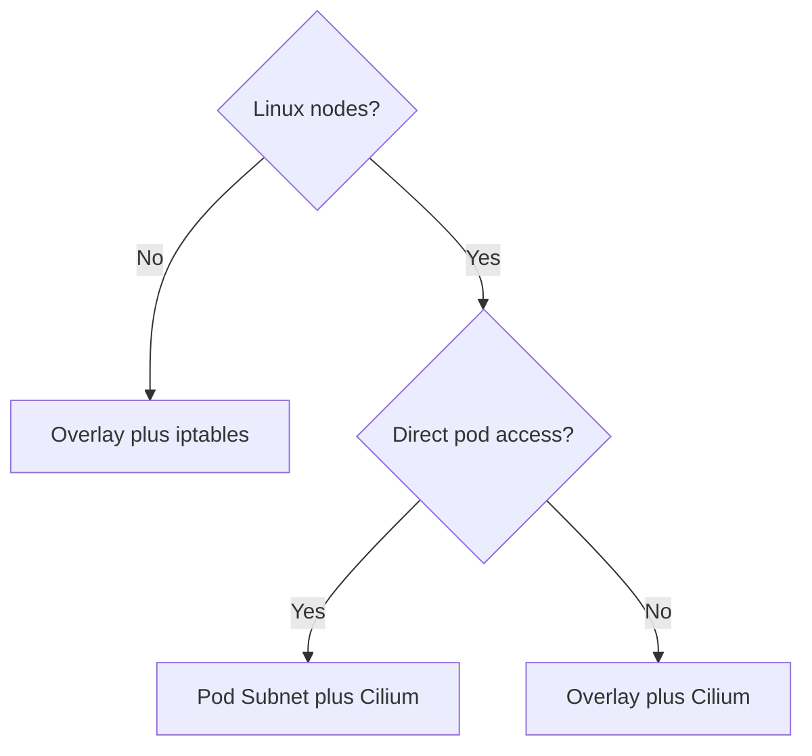

Two teams create AKS clusters on the same day. One discovers that its on-premises services can address pods directly. The other sees only node or load-balancer addresses. Both clusters are working as designed.

The difference starts with two decisions: where pod IP addresses come from, and which data plane moves and filters packets. After this page, you should be able to choose both deliberately, understand what AKS Automatic selects for you, and know when Advanced Container Networking Services (ACNS) adds value.

> **Version scope:** verified on 9 October 2026 against the [AKS Cilium compatibility table](https://learn.microsoft.com/en-us/azure/aks/azure-cni-powered-by-cilium#supported-kubernetes-and-cilium-versions), covering Kubernetes 1.31-1.36 and its corresponding Cilium 1.16.19-1.19.6 minimums. Commands assume Azure CLI 2.86.0 or later, which covers the current [AKS Automatic requirement](https://learn.microsoft.com/en-us/azure/aks/automatic/quick-automatic-managed-network#before-you-begin). The principal Microsoft Learn pages used here were updated between 22 May and 17 September 2026.
{: .prompt-info }

> **TL;DR for leaders**
>
> - Start with **Azure CNI Overlay powered by Cilium** for most Linux platforms.
> - Choose **Azure CNI Pod Subnet powered by Cilium** only when systems outside the cluster must address pod IPs directly.
> - Use the Azure iptables data plane when you require Windows node pools; [Cilium on AKS is Linux-only](https://learn.microsoft.com/en-us/azure/aks/azure-cni-powered-by-cilium#limitations).
> - Choose **AKS Automatic** when you want Azure to [preconfigure Overlay, Cilium, LocalDNS, managed egress, ingress, and operational safeguards](https://learn.microsoft.com/en-us/azure/aks/azure-cni-powered-by-cilium#aks-automatic-clusters).
> - Add **ACNS**, a [paid suite](https://learn.microsoft.com/en-us/azure/aks/container-network-security-fqdn-filtering-concepts#pricing), when you need managed network observability or advanced Cilium security, performance, and multi-cluster capabilities.
>
> IP addressing determines reachability and capacity. The data plane determines how traffic is forwarded, observed, and secured. The second choice is the deeper platform decision because visibility, policy, service routing, and performance all meet in the kernel datapath.

## Why the choice matters

Networking choices become application dependencies.

Your IP address management model determines how many VNet addresses a cluster consumes, whether connected networks can initiate traffic directly to pods, and which source address those networks observe. A poor initial subnet plan can limit upgrades or growth, while [overlay networking separates pod capacity from VNet address consumption](https://learn.microsoft.com/en-us/azure/aks/concepts-network-cni-overview#networking-models-in-aks).

The data plane implements service routing and network-policy enforcement. With Cilium, [eBPF programs loaded into the Linux kernel](https://learn.microsoft.com/en-us/azure/aks/azure-cni-powered-by-cilium) perform that work and provide the foundation for richer observability and security. Changing IPAM or data-plane modes later is not always a routine setting change, so treat them as platform architecture.

## One terminology choice

Microsoft documentation calls a network in which pods receive VNet addresses a **flat network**. The common industry term is **underlay**: pod addresses belong to, and are routed by, the underlying network.

I will use **flat network** from here because it matches the [AKS networking documentation](https://learn.microsoft.com/en-us/azure/aks/concepts-network-cni-overview#flat-networks).

## Decision 1: IPAM and network model

IP address management, or IPAM, answers a simple question: **where does a pod IP come from?**



*Takeaway: overlay hides pod addresses behind nodes or services; flat networking makes pod addresses part of the connected private network.*

| Option | Pod IP source | Outside-cluster reachability | Egress identity | Typical fit and scale |
|---|---|---|---|---|
| **Azure CNI Overlay — recommended** | Separate pod CIDR | Not directly; use a Service or ingress | Node IP through SNAT | Most clusters; conserves VNet space and supports the largest documented standard scale |
| **Azure CNI Pod Subnet** | Dedicated VNet pod subnet | Direct from connected networks | Pod IP across connected VNets; configured outbound method for internet | Workloads requiring direct private pod reachability |
| Azure CNI Node Subnet — legacy | Node VNet subnet | Direct in the cluster VNet | Node IP outside that VNet | Existing designs or a required AKS-managed VNet |
| Kubenet — legacy | Separate pod CIDR | Not directly | Node IP through SNAT and user-defined routes | Existing clusters only; [retires on **31 March 2028**](https://learn.microsoft.com/en-us/azure/aks/concepts-network-legacy-cni) |

[Azure CNI Overlay supports up to **5,000 nodes and 200,000 pods per cluster**](https://learn.microsoft.com/en-us/azure/aks/plan-pod-networking#ip-address-management-ipam-options). Those are independent documented limits, not values to multiply. Pod Subnet instead scales within planned VNet address space and lets node and pod subnets grow independently.

Overlay is therefore the [default recommendation](https://learn.microsoft.com/en-us/azure/aks/plan-pod-networking#aks-pod-networking-recommendations). Select Pod Subnet when direct addressing from peered VNets, VPN-connected networks, or ExpressRoute is an explicit requirement—not merely because "flat" sounds simpler.

## Decision 2: the data plane

[IPAM and the data plane are independent decisions](https://learn.microsoft.com/en-us/azure/aks/concepts-network-cni-overview#networking-models-in-aks). Azure CNI Powered by Cilium works with [Overlay, Pod Subnet, and legacy Node Subnet IPAM](https://learn.microsoft.com/en-us/azure/aks/azure-cni-powered-by-cilium#ip-address-management-ipam-with-azure-cni-powered-by-cilium).

| Data plane | Implementation | Policy and visibility | Choose it when |
|---|---|---|---|
| **Azure CNI Powered by Cilium — recommended for Linux** | eBPF in the Linux kernel | Built-in Cilium policy; foundation for Cilium observability and ACNS | Building a Linux platform or needing advanced networking |
| Azure iptables | Linux networking and iptables | Kubernetes NetworkPolicy; Calico is available for Windows policy | Windows nodes are required or compatibility dictates it |

This is the central design point: **visibility, security, and performance originate in the same datapath**. IPAM decides the address plan, but the data plane is where packets are forwarded, allowed, denied, translated, and measured.

Cilium is not ACNS. [Cilium provides the managed data plane and standard policy capabilities](https://learn.microsoft.com/en-us/azure/aks/azure-cni-powered-by-cilium), while [ACNS is an optional paid feature suite](https://learn.microsoft.com/en-us/azure/aks/advanced-container-networking-services-overview) layered above it.

## Optional layer: ACNS

ACNS is a paid suite [enabled with `--enable-acns`](https://learn.microsoft.com/en-us/azure/aks/use-advanced-container-networking-services#create-a-new-aks-cluster-with-advanced-container-networking-services). Its current feature boundaries matter:

| ACNS area | Current status | Data-plane requirement | What it adds |
|---|---|---|---|
| Observability | **GA** | Cilium or non-Cilium | Metrics and network-flow visibility; non-Cilium collection uses the Retina-based observability path |
| Security | **GA**, except Cilium mTLS **(preview)** | Cilium only | FQDN filtering, L7 policy, WireGuard, and optional mTLS **(preview)** |
| Performance **(preview)** | **Preview** | Cilium only | eBPF Host Routing through `BpfVeth` |
| Connectivity **(preview)** | **Preview** | Cilium only | Cross-cluster networking **(preview)** through Fleet and managed Cilium Cluster Mesh |

[Container Network Observability works on both Cilium and non-Cilium data planes](https://learn.microsoft.com/en-us/azure/aks/advanced-container-networking-services-overview#container-network-observability). Security and [Performance **(preview)**](https://github.com/Azure/AKS/blob/master/CHANGELOG.md) require Cilium. [Cross-cluster networking **(preview)**](https://learn.microsoft.com/en-us/azure/aks/cross-cluster-networking-fleet-use-cases#architecture-and-capabilities) additionally requires ACNS and Azure Kubernetes Fleet Manager.

[Retina is the open-source, cloud-agnostic Kubernetes observability project](https://github.com/microsoft/retina/blob/v1.2.9/README.md); this article references release **v1.2.9** rather than assuming that upstream HEAD describes the managed AKS deployment.

> ACNS being enabled does not automatically activate every feature. For example, [WireGuard](https://learn.microsoft.com/en-us/azure/aks/container-network-security-wireguard-encryption-concepts) and [eBPF Host Routing **(preview)**](https://learn.microsoft.com/en-us/azure/aks/how-to-enable-ebpf-host-routing) require additional configuration, while [FQDN filtering is enabled by default](https://learn.microsoft.com/en-us/azure/aks/use-advanced-container-networking-services#create-a-new-aks-cluster-with-advanced-container-networking-services) with ACNS on supported Cilium clusters.
{: .prompt-info }

## Cluster mode: Automatic or Standard

[AKS Automatic preconfigures Azure CNI Overlay powered by Cilium, LocalDNS, a managed NAT gateway for egress, and the application-routing add-on for ingress](https://learn.microsoft.com/en-us/azure/aks/azure-cni-powered-by-cilium#aks-automatic-clusters). It also [manages system capacity, scaling, upgrades, and several security defaults](https://learn.microsoft.com/en-us/azure/aks/intro-aks-automatic).

AKS Standard exposes the choices. That is useful when you need Pod Subnet, Windows nodes, an established network architecture, or detailed lifecycle control.



*Takeaway: IPAM supplies addresses, the data plane handles packets, ACNS adds managed capabilities, and ingress or egress connects the stack to other networks.*

## Which one for me?



*Takeaway: for Standard clusters, operating system and direct pod reachability usually determine the answer.*

> **Decision box**
>
> **Want the most managed starting point:** choose **AKS Automatic**.  
> **Building a general-purpose Linux platform:** choose **Standard + Overlay + Cilium**.  
> **Need direct private access to pod IPs:** choose **Standard + Pod Subnet + Cilium**.  
> **Need Windows nodes:** choose **Standard + Overlay + Azure iptables**.  
> Add [`--enable-acns`](https://learn.microsoft.com/en-us/azure/aks/use-advanced-container-networking-services#create-a-new-aks-cluster-with-advanced-container-networking-services) when the paid observability or advanced Cilium feature set is required.
{: .prompt-tip }

### AKS Automatic

```bash
az aks create \
  --resource-group "$RESOURCE_GROUP" \
  --name "$CLUSTER_NAME" \
  --sku automatic \
  --enable-hosted-system
```

### Standard, Overlay, and Cilium

```bash
az aks create \
  --resource-group "$RESOURCE_GROUP" \
  --name "$CLUSTER_NAME" \
  --network-plugin azure \
  --network-plugin-mode overlay \
  --network-dataplane cilium
```

### Standard, Pod Subnet, and Cilium

```bash
az aks create \
  --resource-group "$RESOURCE_GROUP" \
  --name "$CLUSTER_NAME" \
  --network-plugin azure \
  --vnet-subnet-id "$NODE_SUBNET_ID" \
  --pod-subnet-id "$POD_SUBNET_ID" \
  --network-dataplane cilium
```

### Standard, Overlay, and Azure iptables

```bash
az aks create \
  --resource-group "$RESOURCE_GROUP" \
  --name "$CLUSTER_NAME" \
  --network-plugin azure \
  --network-plugin-mode overlay
```

These are networking skeletons, not complete production baselines. Add identity, private-cluster, outbound, monitoring, availability-zone, and policy settings required by your platform.

## Common misconceptions

**"Azure CNI means pods always receive VNet IPs."**  
No. [Azure CNI Overlay assigns pod addresses from a separate CIDR](https://learn.microsoft.com/en-us/azure/aks/concepts-network-cni-overview#overlay-networks).

**"Cilium requires overlay."**  
No. [Cilium works with Overlay, Pod Subnet, and Node Subnet](https://learn.microsoft.com/en-us/azure/aks/azure-cni-powered-by-cilium#ip-address-management-ipam-with-azure-cni-powered-by-cilium).

**"Cilium and ACNS are the same product choice."**  
No. [Cilium is the data plane](https://learn.microsoft.com/en-us/azure/aks/azure-cni-powered-by-cilium); [ACNS is the optional paid suite](https://learn.microsoft.com/en-us/azure/aks/advanced-container-networking-services-overview) above it.

**"Flat networking removes the need for capacity planning."**  
It does the opposite: [pod addresses consume routable VNet space](https://learn.microsoft.com/en-us/azure/aks/concepts-network-cni-overview#flat-networks), so growth and upgrade capacity must be planned.

## Honest limits

[Azure CNI Powered by Cilium is available only for Linux, not Windows](https://learn.microsoft.com/en-us/azure/aks/azure-cni-powered-by-cilium#limitations).

A Kubernetes [`NetworkPolicy` `ipBlock` cannot select pod or node IPs](https://learn.microsoft.com/en-us/azure/aks/azure-cni-powered-by-cilium#why-is-traffic-being-blocked-when-the-networkpolicy-has-an-ipblock-that-allows-the-ip-address) with Azure CNI Powered by Cilium. Use pod and namespace selectors for in-cluster identities instead.

[Network policies are not applied to pods using `spec.hostNetwork: true`](https://learn.microsoft.com/en-us/azure/aks/azure-cni-powered-by-cilium#limitations), because those pods use the host identity rather than individual endpoint identities.

High-churn labels can create many Cilium identities. The [documented identity limit is **65,535**](https://learn.microsoft.com/en-us/azure/aks/azure-cni-powered-by-cilium#limitations), so platforms running label-heavy batch workloads should review identity-relevant labels.

[Cilium mTLS **(preview)** requires Kubernetes **1.34 or later**, Cilium **1.18 or later**, preview registration, and explicit configuration](https://learn.microsoft.com/en-us/azure/aks/azure-cni-powered-by-cilium#which-cilium-features-does-azure-cni-powered-by-cilium-support-which-features-require-advanced-container-networking-services).

## What to ask your platform team

- Do any connected systems need to initiate traffic directly to pod IPs?
- Which address ranges cover nodes, pods, services, upgrades, and future clusters?
- Is the platform Linux-only, or is Windows a requirement?
- Which component enforces NetworkPolicy and records flow evidence?
- Is ACNS cost justified by the observability, security, Performance **(preview)**, or Connectivity **(preview)** capabilities we will actually enable?
- Is changing IPAM or the data plane included in the cluster migration plan?

## Summary

Choose networking in layers.

First choose IPAM: Overlay for most clusters, Pod Subnet for direct pod reachability, and legacy options only for specific existing constraints. Then choose the data plane: Cilium for new Linux platforms, or Azure iptables where Windows or compatibility requires it.

The durable platform decision is the datapath. That is where forwarding, service routing, policy, visibility, and performance converge. ACNS can extend those capabilities, but it does not replace sound IP planning or a deliberate data-plane choice.

## What's Next

A later post will follow a packet through these layers: pod interface, service translation, policy enforcement, overlay or flat routing, SNAT, and the observability points available along the path.

## References

All sources were accessed on **9 October 2026**.

### Microsoft Learn

- [Plan Pod Networking for Azure Kubernetes Service workloads](https://learn.microsoft.com/en-us/azure/aks/plan-pod-networking)
- [Azure Kubernetes Service CNI networking overview](https://learn.microsoft.com/en-us/azure/aks/concepts-network-cni-overview)
- [Configure Azure CNI Powered by Cilium in AKS](https://learn.microsoft.com/en-us/azure/aks/azure-cni-powered-by-cilium)
- [Advanced Container Networking Services overview](https://learn.microsoft.com/en-us/azure/aks/advanced-container-networking-services-overview)
- [Enable Advanced Container Networking Services on AKS clusters](https://learn.microsoft.com/en-us/azure/aks/use-advanced-container-networking-services)
- [Cilium mutual TLS authentication and encryption with ACNS](https://learn.microsoft.com/en-us/azure/aks/container-network-security-cilium-mutual-tls-concepts)
- [Cross-cluster networking use cases with Azure Kubernetes Fleet Manager](https://learn.microsoft.com/en-us/azure/aks/cross-cluster-networking-fleet-use-cases)
- [Introduction to Azure Kubernetes Service Automatic](https://learn.microsoft.com/en-us/azure/aks/intro-aks-automatic)
- [Quickstart: Create an AKS Automatic cluster](https://learn.microsoft.com/en-us/azure/aks/automatic/quick-automatic-managed-network)
- [AKS legacy Container Networking Interfaces](https://learn.microsoft.com/en-us/azure/aks/concepts-network-legacy-cni)

### Release notes and upstream documentation

- [Azure Kubernetes Service release notes](https://github.com/Azure/AKS/blob/master/CHANGELOG.md)
- [Retina v1.2.9 README](https://github.com/microsoft/retina/blob/v1.2.9/README.md)
- [Kubernetes Network Policies](https://kubernetes.io/docs/concepts/services-networking/network-policies/)
- [Cilium 1.18 Network Policy](https://docs.cilium.io/en/v1.18/network/kubernetes/policy/)
